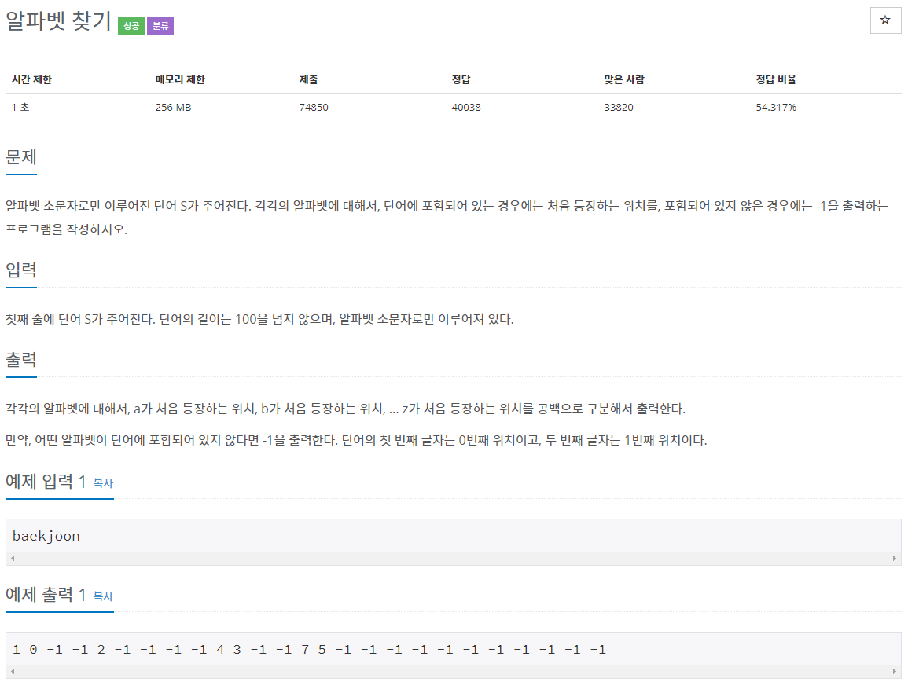

# 문제


## 풀이

### 답 1
```java
import java.util.Scanner;

public class N10809 {

	public static void main(String[] args)  {

		Scanner sc = new Scanner(System.in);
		String S = sc.next();		

		for (char ch = 'a'; ch <= 'z'; ch++) {
			System.out.print(S.indexOf(ch) + " ");
		}		
	}
}
```

character a~z까지 입력한 S의 indexOf(ch)를 출력

---
### 답 2
arr을 -1로 초기화 후 S의 문자의 위치를 arr배열에 저장 후 출력

( indexOf는 존재x시 -1을 반환 // -97(ascii 'a') ****)

```java
import java.util.Scanner;
import java.util.Arrays;

public class Main{
    public static void main(String[] args){
        Scanner in = new Scanner(System.in);
        
        String S = in.next();
        int arr[] = new int[26];
        
        Arrays.fill(arr, -1);
        
        for(int i = 0; i<s.length();i++){
        	if(arr[S.charAt(i)- 97] == -1)
        	arr[S.charAt(i)- 97] = i;
           
        }
        
        for(int i =0;i<arr.length;i++) {
        	System.out.print(arr[i]+" ");
        }
        
        in.close();
    }
}
```