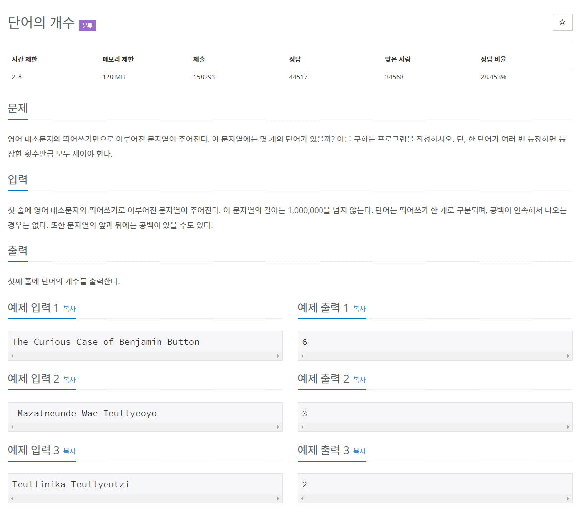

# 문제


## 풀이
```java
import java.io.BufferedReader;
import java.io.IOException;
import java.io.InputStreamReader;

public class N1152 {

	public static void main(String[] args) throws IOException {
		
		BufferedReader br = new BufferedReader(new InputStreamReader(System.in));
		String[] str = br.readLine().split(" ");
		System.out.println(str.length);
	}

}
```

이렇게 코드를 짯더니 2번째 예제 ( Mazatneunde Wae Teullyeoyo)에서 문자열 앞에 " " 공백도 배열요소로 인식되어 숫자 4가 나왔다.

그래서 배열에서 요소 삭제하는 방법들 중 arraylist를 사용하였다.

```java
import java.io.*;
import java.util.*;

public class N1152 {	

	public static void main(String[] args) throws IOException {

		BufferedReader br = new BufferedReader(new InputStreamReader(System.in));
		String[] str = br.readLine().split(" ");
		List<String> list = new ArrayList<String>(Arrays.asList(str));		
		list.remove("");
		System.out.println(list.size());
	}

}
```

## 다양한 방법 사용

1. 다른 배열 사용
2. arraylist 사용
3. ASCII코드 번호 사용
	```java
	int cnt = 0;
			int pre_str = 32; // ASCII 코드에서 Space(" ")을 의미
			int str;

			while (true) {
				str = System.in.read();

				// 입력받은 문자가 Space(" ")이면
				if (str == 32) {
					// 이전의 문자가 Space(" ")가 아니면
					if (pre_str != 32)
						cnt++;
				}

				// 입력받은 문자가 개행일때 ('\n')
				else if (str == 10) {
					// 이전의 문자가 Space(" ")가 아니면
					if (pre_str != 32)
						cnt++;
					break;
				}

				pre_str = str;

			}

			System.out.println(cnt);
	```

4. java.utill.scanner의 useDelimiter, tokens사용 // java.utill.stream의 count사용

	```java
	public class Main {
		public static void main(String[] $) {
	System.out.println(new java.util.Scanner(System.in)
	.useDelimiter("\\s+").tokens().count());
		}
	}
	```

	> [https://www.geeksforgeeks.org/remove-an-element-at-specific-index-from-an-array-in-java/](https://www.geeksforgeeks.org/remove-an-element-at-specific-index-from-an-array-in-java/)