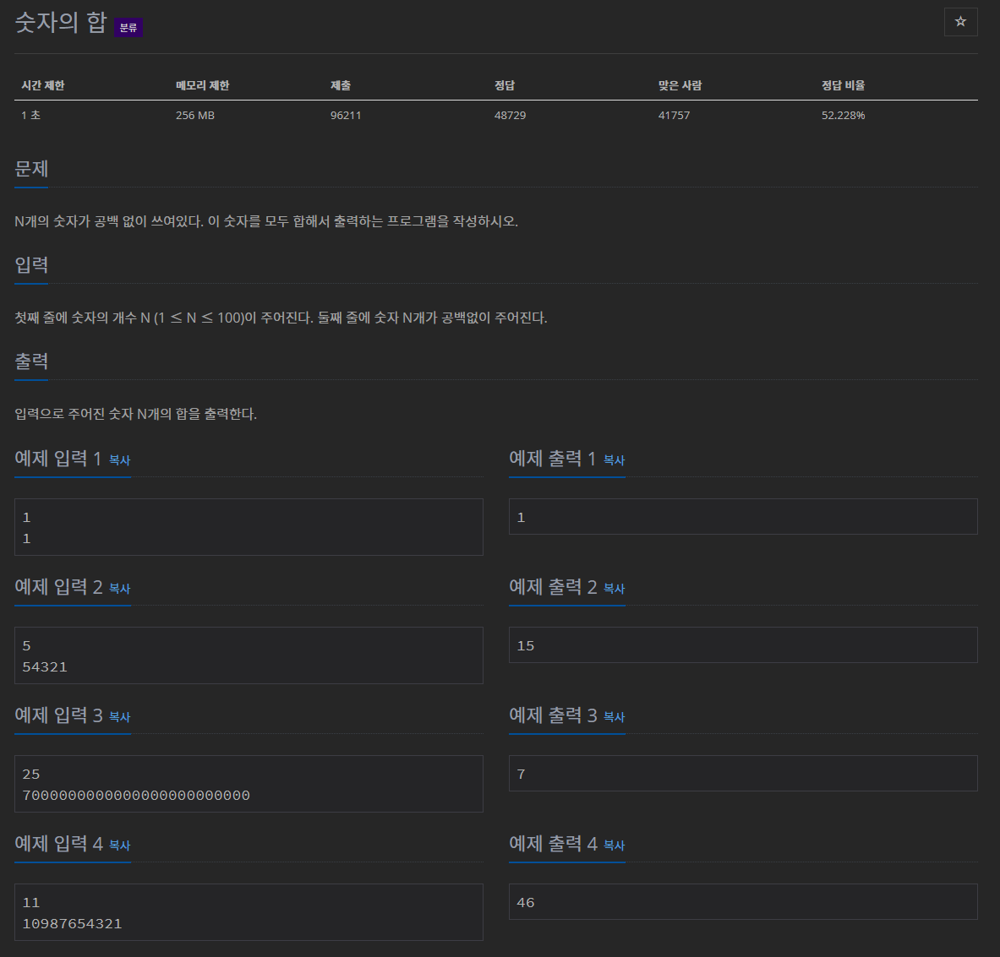

# 문제


## 풀이

1. 숫자의 개수를 N으로 받고 숫자들을 String으로 하나의 문자열로 받은 뒤
2. charAt(i)+""로 파싱하여 숫자 배열로 바꿔줬다
3. 배열 인자들을 다 더해준 값인 sum을 출력.

```java
import java.io.BufferedReader;
import java.io.IOException;
import java.io.InputStreamReader;

public class N11720 {

	public static void main(String[] args) throws IOException {
		BufferedReader br = new BufferedReader(new InputStreamReader(System.in));
		int N = Integer.parseInt(br.readLine());
		String numbers = br.readLine();
		int[] numbersArr = new int[N];
		int sum = 0;
		for (int i = 0; i < N; i++) {
			numbersArr[i] = Integer.parseInt(numbers.charAt(i)+"");
			sum += numbersArr[i];
		}		
		System.out.println(sum);
	}
}
```

파싱과 charAt을 이해해야 풀수 있는 문제였다.

더할 숫자리스트를 하나의 문자열로 받은 뒤 String형태에서 쪼개고 다시 integer.parseInt해주는게 핵심이다.