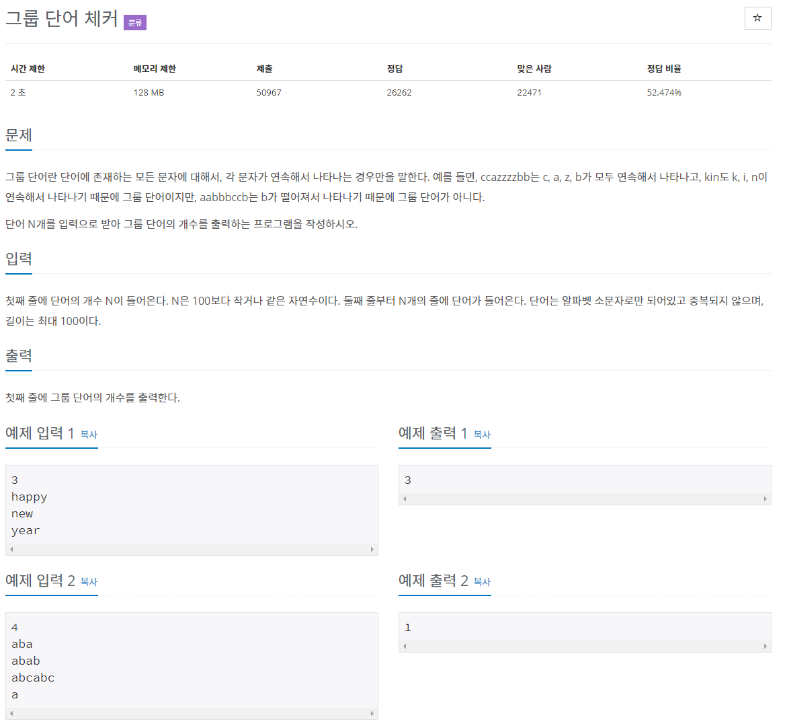

# 문제

## 풀이
### 답 1
```java
import java.io.BufferedReader;
import java.io.IOException;
import java.io.InputStreamReader;

public class Main {

	public static void main(String[] args) throws IOException {

		BufferedReader br = new BufferedReader(new InputStreamReader(System.in));

		int N = Integer.parseInt(br.readLine());
		String[] str = new String[N];
		int count = N;

		// N개의 단어를 검사
		for (int i = 0; i < N; i++) {
			str[i] = br.readLine();
			boolean chkStr = true;
			
			// 단어검사 : 두 번째 문자 부터 검사 (1부터)
			for (int j = 1; j < str[i].length(); j++) {
				
				// 한 자리 앞의 문자와 같지 않으면
				if (str[i].charAt(j - 1) != str[i].charAt(j)) {
					// 문자검사 : 2자리 뒤의 문자부터 끝까지 비교
					for (int k = j + 1; k < str[i].length(); k++) {
						// 비교문자(j-1)와 k번째 문자가 같으면 -- 하고 chkStr에 false, 반복문 종료
						if (str[i].charAt(j-1) == str[i].charAt(k)) {
							count--;
							chkStr = false;
							break;
						}
					}
				}
				// chkStr=false면 단어검사 반복문 종료.
				if (!chkStr)
					break;
			}
		}
		System.out.println(count);

	}
}
```
### 답 2
```java
import java.io.BufferedReader;
import java.io.IOException;
import java.io.InputStreamReader;

public class N1316 {
	public static void main(String[] args) throws IOException {
		BufferedReader br = new BufferedReader(new InputStreamReader(System.in));

		int N = Integer.parseInt(br.readLine());
		String[] str = new String[N];
		int count = N;

		// N개의 단어를 입력받고 각각 알파벳체크 boolean을 만듦
		for (int i = 0; i < N; i++) {
			str[i] = br.readLine();
			boolean[] AlphabetChk = new boolean[26];

			// 각 단어의 두 번째 문자부터 마지막 두 번째 문자까지 검사
			for (int j = 1; j < str[i].length(); j++) {		
				
				// j-1 번째 문자가 0일 때 true로
				if ((j - 1) == 0) {
					AlphabetChk[str[i].charAt(j - 1) - 'a'] = true;
				}
				
				// j-1, j번째 문자가 같지 않을 때
				if (str[i].charAt(j - 1) != str[i].charAt(j)) {
					int charLocation = str[i].charAt(j) - 'a';  // str[i].charAt(j) - 'a' 는 j번째 문자의 위치(a와의 거리) 
					
					// j번째 문자가 true이면(첫 번째 문자와 같으면) count-1, 아니면 j번째 문자에 해당하는 알파벳체크인자를 true로
					if (AlphabetChk[charLocation]) {
						count--;
						break;
					}
					AlphabetChk[charLocation] = true;
				}
			}
		}
		System.out.println(count);
	}
}
```