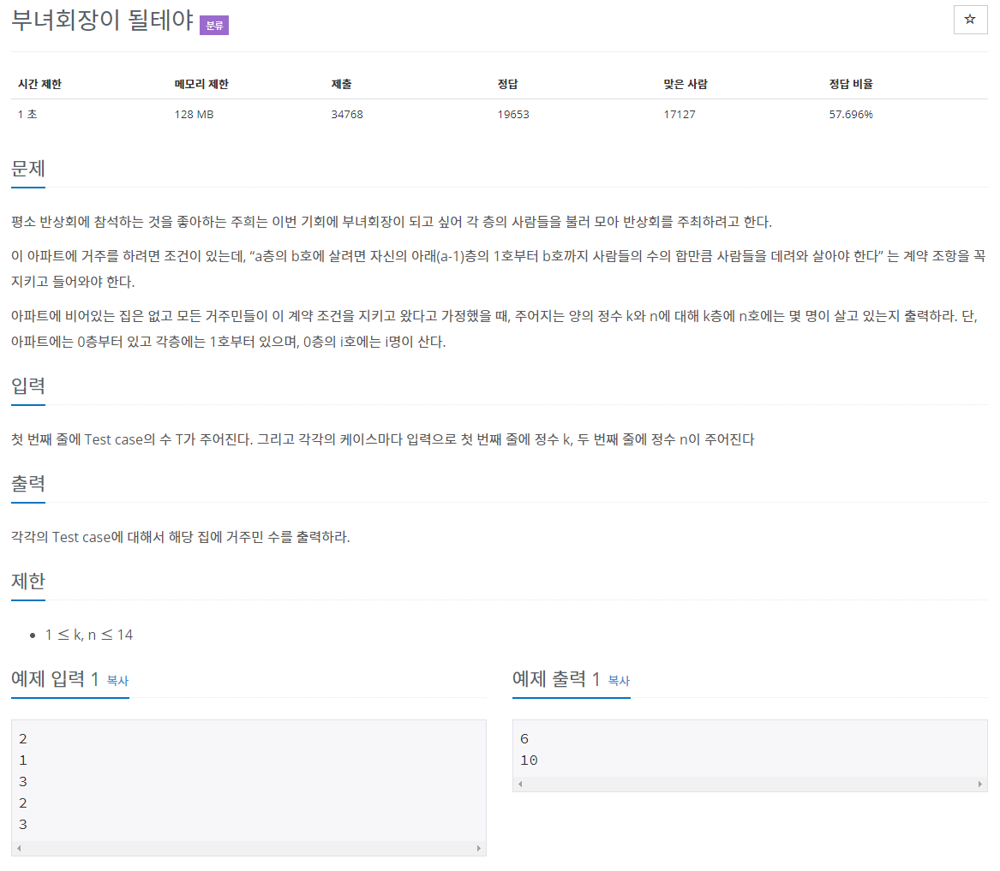

# 문제


## 알고리즘 풀이

이중배열을 활용하는 문제. 아파트를 이중배열로 구성한다. 

```java
int[][] array = new int[3][3];
int[][] array;
array = new int[3][3];
```

```java
이중배열 선언 및 초기화
선언
초기화
```

먼저 기준이 되는 0층과 각층의 1호부터 선언한다. 0층은 i호수의 인원이 i명이고 각층의 1호는 1명.

```java
int[][] arr = new int[15][16];
for (int i = 0; i <= 14; i++) {
		arr[i][1] = 1;
		arr[0][i + 1] = i + 1;
}
```

k층의 n호의 인원수는 k층의 n-1호 인원수 + k-1층의 n호 인원수로 계산된다.

따라서 k층의 n호의 인원수는 다음과 같이 표현할 수 있다.

```java
arr[k][n] = arr[k][n-1] + arr[k-1][n];
```

k층은 k-1층의 인원수를 기준으로 계산되므로

각 호수의 인원수를 낮은 층부터 순서대로 계산해야 된다. (0층 -> 1층 -> 2층...)

```java
for (int i = 1; i <= k; i++) {
		for (int j = 1; j <= n; j++) {
				arr[i][j] = arr[i][j - 1] + arr[i - 1][j];
		}
}
```

이제 입출력 코드만 추가하면 된다.

```java
import java.io.*;

public class Main {

	public static void main(String[] args) throws NumberFormatException, IOException {
		BufferedReader br = new BufferedReader(new InputStreamReader(System.in));
		BufferedWriter bw = new BufferedWriter(new OutputStreamWriter(System.out));
		StringBuilder sb = new StringBuilder();

		int T = Integer.parseInt(br.readLine());

		int[][] arr = new int[15][16];
		for (int i = 0; i <= 14; i++) {
			arr[i][1] = 1;
			arr[0][i + 1] = i + 1;
		}

		for (int a = 0; a < T; a++) {
			int k = Integer.parseInt(br.readLine());
			int n = Integer.parseInt(br.readLine());

			for (int i = 1; i <= k; i++) {
				for (int j = 1; j <= n; j++) {
					arr[i][j] = arr[i][j - 1] + arr[i - 1][j];
				}
			}
			sb.append(arr[k][n] + "\n");
		}
		bw.write(String.valueOf(sb));
		bw.flush();
	}

}
```