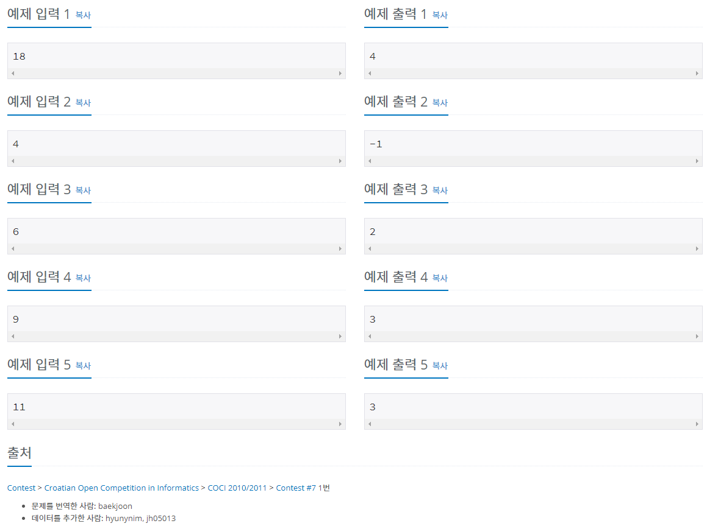

## 입출력

입력은 bufferReader, InputStreamReader

출력은 sysout

## 알고리즘

1, 2, 4, 7 만 -1을 출력하면 되므로 if문으로 빼주었다.

또 5로 나누었을 때는 N / 5로 출력하고 

5로 나누었을 때 나머지가 1, 2, 3, 4인 경우를 나누어 계산하도록 if문을 짰다.

1, 2, 4의 경우

N에서 5를 뺸 수를 5로 나눈 나머지(2)를 3으로 나눠보고 나눠 떨어질 때까지 5를 빼서 구할 수 있는데

각각 나머지(2)가 6, 12, 9일 때 최소 봉투 값을 구할 수 있다. 

따라서 완성된 코드는 다음과 같다.

```java
package basicMath1;

import java.io.*;

public class N2839 {
	public static void main(String[] args) throws IOException {

		BufferedReader br = new BufferedReader(new InputStreamReader(System.in));
		int N = Integer.parseInt(br.readLine());

		if (N == 1 || N == 2 || N == 4 || N == 7) { // 1,2,4,7 은 -1 출력
			System.out.println("-1");
		} else {
			if (N % 5 == 0) { // 5로 나눠 떨어지면
				System.out.println(N / 5);

			} else { // 5로 나눠 떨어지지 않을 때
				if (N % 5 == 1) { // 5로 나눈 나머지가 1이면
					System.out.println( (N-6)/5 + 2 );				
				}
				if (N % 5 == 2) { // 5로 나눈 나머지가 2이면
					System.out.println( (N-12)/5 + 4);
				}
				if (N % 5 == 3) { // 5로 나눈 나머지가 3이면
					System.out.println( N / 5 + 1 );
				}
				if (N % 5 == 4) { // 5로 나눈 나머지가 4이면
					System.out.println( (N-9)/5 + 3 );
				}

			}
		}	
		
	}
}
```

## 타인의 답

```java
public class Main {

    public static void main(String[] args) throws Exception {

        int X, N = 0;
        while ((X = System.in.read()) > 13) N = 10 * N + X - 48;

        if (N == 4 || N == 7) X = -1;
        else switch (N % 5) {
            case 0: X = N / 5; break;
            case 1: case 3: X = N / 5 + 1; break;
            case 2: case 4: X = N / 5 + 2; break;
        }

        System.out.print(X);

    }

}
```

이 코드의 경우 switch문을 사용해서 N을 5로 나눈 나머지가 0/ 1, 3 / 2, 4 이렇게 3 가지로 나누어서 계산을 했다. 나머지가 0일 경우 답은 N/5가 되고 1 또는 3일 경우 N/5 +1이 되고 , 2 또는 4일 경우 N/5 +2가 된다.  내 코드랑 다른데 생각해보니 내 코드,

```java
	if (N % 5 == 1) { // 5로 나눈 나머지가 1이면
					System.out.println( (N-6)/5 + 2 );				
				}
				if (N % 5 == 2) { // 5로 나눈 나머지가 2이면
					System.out.println( (N-12)/5 + 4);
				}
				if (N % 5 == 3) { // 5로 나눈 나머지가 3이면
					System.out.println( N / 5 + 1 );
				}
				if (N % 5 == 4) { // 5로 나눈 나머지가 4이면
					System.out.println( (N-9)/5 + 3 );
				}
```

여기서`(N-6)/5 + 2` 은 `N / 5 + 1` 코딩적으로 같고 `(N-12)/5 + 4` 은 `(N-9)/5 + 3` 은 `N/5+2`로 같다. 

그런데 타인의 답의 코드는 1, 2 를 입력했을 경우 각각 1, 2가 나오는데 1과 2 는 정확하게 배달할 수 없기에 -1이 출력되어야 하지만 이상하게 백준 사이트에서 채점하면 맞았다고 나온다.

결론적으로 봤을 때 알고리즘은 예외상황(입력값이 1, 2, 4, 7일 때)을 -1출력하도록 하고 N을 5로 나눈 나머지가 0, 1, 2, 3, 4인 상황을 구분하여 계산하되 프로그래밍적으로 통일이 가능했고 switch문이 if else문 보다 더 코딩적으로 깔끔하게 나오는 알고리즘이었다.