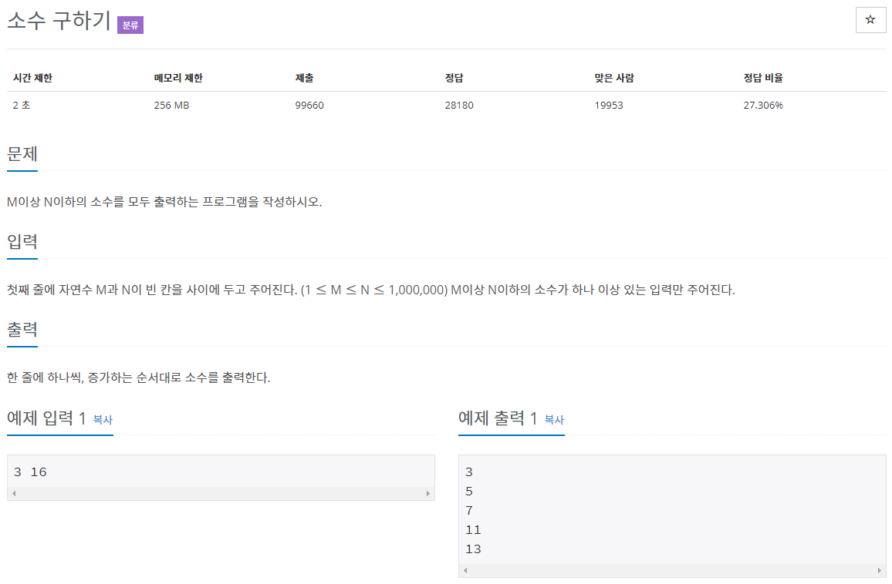

# 문제



문제 소개에 "에라토스테네스의 체로 풀어 봅시다."라고 써있다 앞서 있었던 소수찾기와 소수(합과 최솟값을 구하는 문제)와 같은 문제.

# 풀이

```java
import java.io.*;
import java.util.ArrayList;

public class Main { // 소수 구하기
	// 에라토스테네스의 체
	public static void main(String[] args) throws IOException {

		// 입력
		BufferedReader br = new BufferedReader(new InputStreamReader(System.in));
		String[] strArr = br.readLine().split(" ");
		int M = Integer.parseInt(strArr[0]);
		int N = Integer.parseInt(strArr[1]);

		// 블리언 ArrayList로 구현
		ArrayList<Boolean> primeList;
		// N + 1 만큼 할당 (0 ~ N)
		primeList = new ArrayList<Boolean>(N);
		
		// 0, 1은 소수아님 처리
		primeList.add(0, false);
		primeList.add(1, false);
		
		// 2 ~ N까지 소수 처리
		for (int i = 2; i <= N; i++)
			primeList.add(i, true);
		
		// 2 부터 ~ i*i <= N
		// 각각의 배수들 false 처리
		for (int i = 2; (i * i) <= N; i++) {
			if (primeList.get(i) == true) { // 중복처리 배제
				for (int j = i * i; j <= N; j += i)
					primeList.set(j, false);
				// i*i 미만은 이미 처리되었으므로 j의 시작값은 i*i로 최적화할 수 있다.
			}
		}
		// 데이터 저장
		StringBuffer sb = new StringBuffer();
		// 출력
		for (int i = M; i <= N; i++) {
			if (primeList.get(i) == true) {
				sb.append(i + "\n");
			}
		}
		System.out.println(sb);
		
	}
}
```

저번 소수 문제에서  sum, min을 구하는 코드를 지우고 출력만 다르게 했다.