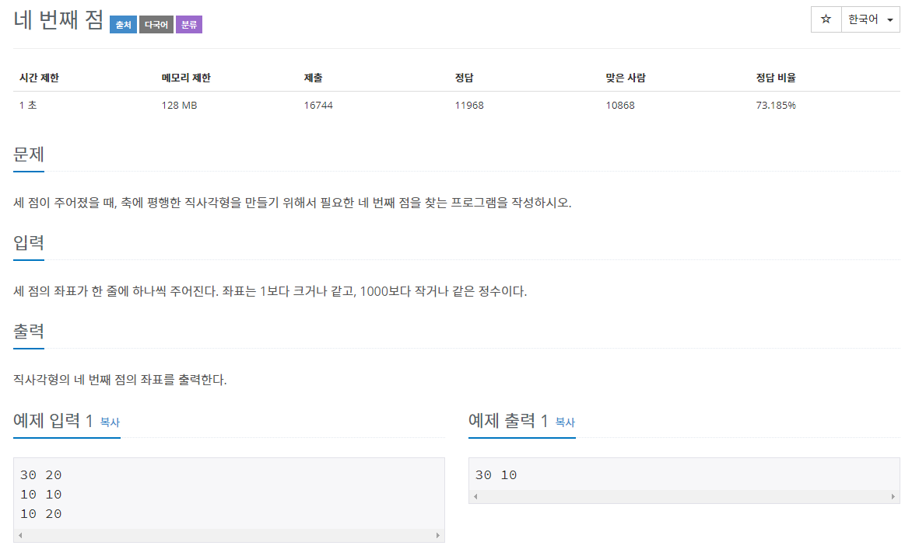

# 문제



# 풀이

```java
package basicMath2;

import java.io.BufferedReader;
import java.io.IOException;
import java.io.InputStreamReader;

public class N3009 { // 네 번째 점

	public static void main(String[] args) throws IOException {

		BufferedReader br = new BufferedReader(new InputStreamReader(System.in));
		String[] firstLine = br.readLine().split(" ");
		String[] secondLine = br.readLine().split(" ");
		String[] thirdLine = br.readLine().split(" ");
		//dot1x~dot4y까지 4점의 좌표를 선언
		int dot1x = Integer.parseInt(firstLine[0]);
		int dot1y = Integer.parseInt(firstLine[1]);
		int dot2x = Integer.parseInt(secondLine[0]);
		int dot2y = Integer.parseInt(secondLine[1]);
		int dot3x = Integer.parseInt(thirdLine[0]);
		int dot3y = Integer.parseInt(thirdLine[1]);
		int dot4x = 0;
		int dot4y = 0;

		// dot1y와 dot2y가 같으면 dot3y가 dot4같음 경우의 수 3(반복)
		if (dot1y == dot2y) {
			dot4y = dot3y;
			//dot4x좌표 경우의 수 3(반복)
			if (dot1x == dot2x) {
				dot4x = dot3x;
			} else if (dot1x == dot3x) {
				dot4x = dot2x;
			} else {
				dot4x = dot1x;
			}
		} else if (dot1y == dot3y) {
			dot4y = dot2y;
			if (dot1x == dot2x) {
				dot4x = dot3x;
			} else if (dot1x == dot3x) {
				dot4x = dot2x;
			} else {
				dot4x = dot1x;
			}
		} else if (dot2y == dot3y) {
			dot4y = dot1y;
			if (dot1x == dot2x) {
				dot4x = dot3x;
			} else if (dot1x == dot3x) {
				dot4x = dot2x;
			} else {
				dot4x = dot1x;
			}
		}
		System.out.println(dot4x+" "+dot4y);
		
	}

}
```

각 점의 좌표를 BufferReader와 String배열과 split을 이용해 입력

dot1x와 dot2x의 좌표를 비교해 같으면 dot3x가 dot4x와 같다 라는 명제를 이용해 경우의 수 3만큼 반복하였고 y좌표도 그렇게 구하였다.

# 타인의 답

```java
import java.io.BufferedReader;
import java.io.IOException;
import java.io.InputStreamReader;
import java.util.StringTokenizer;

public class Main {
    public static void main(String[] args) throws IOException {
        BufferedReader br = new BufferedReader(new InputStreamReader(System.in));
        StringBuilder sb = new StringBuilder();

        sb.append(br.readLine()).append(" ").append(br.readLine()).append(" ").append(br.readLine());

        StringTokenizer st = new StringTokenizer(sb.toString(), " ");

        sb.delete(0, sb.length());

        int x1 = Integer.parseInt(st.nextToken());
        int y1 = Integer.parseInt(st.nextToken());
        int x2 = Integer.parseInt(st.nextToken());
        int y2 = Integer.parseInt(st.nextToken());
        int x3 = Integer.parseInt(st.nextToken());
        int y3 = Integer.parseInt(st.nextToken());

        if(x1 == x2){
            sb.append(x3).append(" ");
        } else if (x1 == x3){
            sb.append(x2).append(" ");
        } else if(x2 == x3){
            sb.append(x1).append(" ");
        }
        if(y1 == y2){
            sb.append(y3);
        } else if (y1 == y3){
            sb.append(y2);
        } else if(y2 == y3){
            sb.append(y1);
        }

        System.out.println(sb);
    }
}
```

StringTokenizer와 StringBuilder를 입출력하는데 사용하였고 x좌표와 y좌표를 분리해서 비교하여 더 짧아 보기 좋고, 성능도 좋은 코드를 완성하였다. 

`sb.delete(0, sb.length());`

를 넣어야 처음 입력받을때 사용했던 sb.append가 출력결과에 영향을 주지 않게 된다.

# 새로 짠 코드

```java
import java.io.BufferedReader;
import java.io.IOException;
import java.io.InputStreamReader;
import java.util.StringTokenizer;

public class test { // 네 번째 점

	public static void main(String[] args) throws IOException {

		BufferedReader br = new BufferedReader(new InputStreamReader(System.in));
		StringBuilder sb = new StringBuilder();
		sb.append(br.readLine()).append(" ").append(br.readLine()).append(" ").append(br.readLine());
		StringTokenizer st = new StringTokenizer(sb.toString(), " ");
		sb.delete(0, sb.length());
		
		// dot1x~dot4y까지 4점의 좌표를 선언
		int dot1x = Integer.parseInt(st.nextToken());
		int dot1y = Integer.parseInt(st.nextToken());
		int dot2x = Integer.parseInt(st.nextToken());
		int dot2y = Integer.parseInt(st.nextToken());
		int dot3x = Integer.parseInt(st.nextToken());
		int dot3y = Integer.parseInt(st.nextToken());

		// dot4x좌표 경우의 수 3(반복)
		if (dot1x == dot2x) {
			sb.append(dot3x).append(" ");
		} else if (dot1x == dot3x) {
			sb.append(dot2x).append(" ");
		} else {
			sb.append(dot1x).append(" ");
		}
		// dot4y
		if (dot1y == dot2y) {
			sb.append(dot3y);
		} else if (dot1y == dot3y) {
			sb.append(dot2y);
		} else if (dot2y == dot3y) {
			sb.append(dot1y);
		}

		System.out.println(sb);

	}

}
```