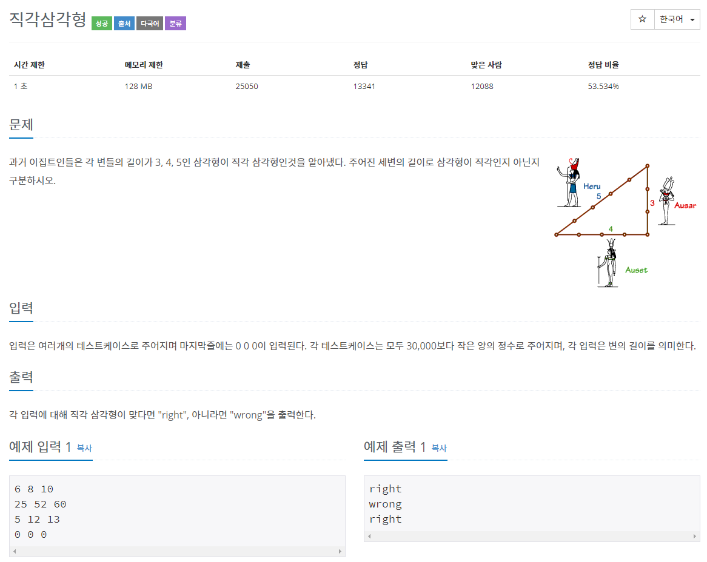

# 문제



# 풀이

```java
package basicMath2;

import java.io.BufferedReader;
import java.io.IOException;
import java.io.InputStreamReader;

public class N4153 { // 직각삼각형

	public static void main(String[] args) throws IOException {
		BufferedReader br = new BufferedReader(new InputStreamReader(System.in));
		StringBuilder sb = new StringBuilder();
		while (true) {
			String[] str = br.readLine().split(" ");
			// 세변의 길이 x, y, z
			int x = Integer.parseInt(str[0]);
			int y = Integer.parseInt(str[1]);
			int z = Integer.parseInt(str[2]);
			// 0이 입력되면 종료
			if (x == 0) {
				break;
			}
			// 정렬
			int temp = 0;
			if (y > x && y > z) {
				temp = y;
				y = x;
				x = temp;
			} else if (z > x && z > y) {
				temp = z;
				z = x;
				x = temp;
			}
			// 직각삼각형 구분
			if (x * x == y * y + z * z) {
				sb.append("right").append("\n");
			} else {
				sb.append("wrong").append("\n");
			}
		}
		System.out.println(sb);
	}
}
```

세변의 길이를 x, y, z에 담고 임시 변수(temp)를 이용해 x, y, z를 크기 비교후 정렬했다. 그리고 x의 제곱과 y의 제곱+ z의 제곱을 비교해 같으면 right을 append 아니면 wrong을 append했다.

# 타인의 답

```java
import java.util.*;
import java.io.*;

public class Main {
    public static void main(String[] args) throws IOException {
        BufferedReader br = new BufferedReader(new InputStreamReader(System.in));
         while (true) {
            // Inputs
            String rawInput = br.readLine();
            if (rawInput.equals("0 0 0")) {
                break;
            }
            String[] line = rawInput.split(" ");
            
            int[] nums = new int[3];
            nums[0] = Integer.parseInt(line[0]);
            nums[1] = Integer.parseInt(line[1]);
            nums[2] = Integer.parseInt(line[2]);
        
            // Sort inputs
            Arrays.sort(nums);
            boolean isRightAngled = nums[2] * nums[2]
																		== (nums[1] * nums[1]) + (nums[0] * nums[0]);
            String text = isRightAngled ? "right" : "wrong";
            System.out.println(text);   
        }
    }
}
```

.equals("0 0 0")을 이용해 반복문 break

배열과 Arrays.sort함수를 이용해 세 변의 길이를 저장 및 정렬

boolean 변수와 삼항연산자를 이용해 비교