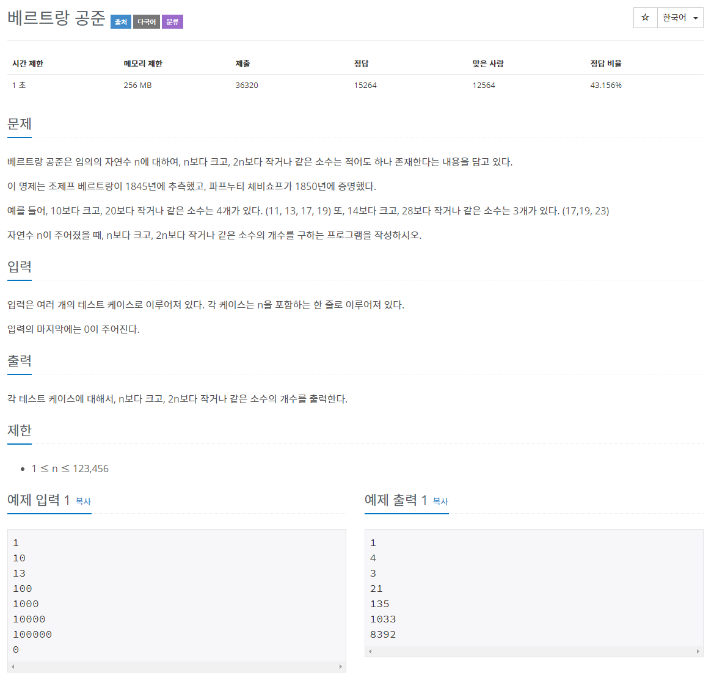

# 문제



## 베르트랑 공준

베르트랑 공준(영어: Bertrand's postulate), 베르트랑-체비쇼프 정리(영어: Bertrand-Chebyshev theorem), 혹은 베르트랑 가설은 정수론에서 소수들의 분포에 관한 정리다. 

이에 따르면, 두 자연수 n과 2n 사이에 적어도 하나의 소수가 존재한다.

## **정의**

**베르트랑 공준**은 다음과 같다. 임의의 정수 n ≥ 2에 대하여, n<p<2n인 소수 p가 항상 존재한다.

>### 출처 [https://ko.wikipedia.org/wiki/베르트랑_공준](https://ko.wikipedia.org/wiki/%EB%B2%A0%EB%A5%B4%ED%8A%B8%EB%9E%91_%EA%B3%B5%EC%A4%80)

# 풀이

```java
import java.io.*;
import java.util.ArrayList;

public class Main { // 베르트랑 공준

	public static void main(String[] args) throws IOException {

    // 입력
		BufferedReader br = new BufferedReader(new InputStreamReader(System.in));
		StringBuffer sb = new StringBuffer();

		int n = 1;
		
		// n = 0 이면 종료
		while (n != 0) {
			n = Integer.parseInt(br.readLine());

			if (n == 0) {
				break;
			}

			// ArrayList로 구현
			ArrayList<Boolean> primeList;
			// range+1만큼 할당
			primeList = new ArrayList<Boolean>(2 * n + 1);
			// 0번째와 1번째를 소수 아님으로 처리
			primeList.add(false);
			primeList.add(false);
			// 2 ~ 2*n 까지 소수로 설정
			for (int i = 2; i <= 2 * n; i++)
				primeList.add(i, true);
			// 2 부터 ~ i*i <= 2*n
			// 각각의 배수들을 지워간다.
			for (int i = 2; (i * i) <= 2 * n; i++) {
				if (primeList.get(i)) { // 중복처리 배제
					for (int j = i * i; j <= 2 * n; j += i)
						primeList.set(j, false);
					// i*i 미만은 이미 처리되었으므로 j의 시작값은 i*i로 최적화할 수 있다.
				}
			}
			// count
			int count = 0;
			for (int i = n+1; i <= 2 * n; i++) {
				if (primeList.get(i)) {
					count++;
				}
			}
			sb.append(count).append("\n");
		}
		// 출력
		br.close();
		System.out.println(sb);
	}

}
```

```java
import java.io.*;

public class Main { // 베르트랑 공준

	public static void main(String[] args) throws IOException {

		BufferedReader br = new BufferedReader(new InputStreamReader(System.in));
		StringBuffer sb = new StringBuffer();

		// 123456*2+1
		boolean[] primeList = new boolean[246913];
		// 0번째와 1번째를 소수 아님으로 처리
		primeList[0] = primeList[1] = true;
		// 2 부터 ~ i*i <= primeList.size()
		// 각각의 배수들을 지워간다.
		for (int i = 2; (i * i) <= primeList.length; i++) {
			if (primeList[i])
				continue;
			for (int j = i * i; j <= primeList.length; j += i)
				primeList[j] = true;
			// i*i 미만은 이미 처리되었으므로 j의 시작값은 i*i로 최적화할 수 있다.
		}

		// n입력 받고 count 저장
		int n = 1;
		while (n != 0) {
			n = Integer.parseInt(br.readLine());
			// n = 0 이면 종료
			if (n == 0) {
				break;
			}
			// count
			int count = 0;
			for (int i = n + 1; i <= 2 * n; i++) {
				if (!primeList[i]) {
					count++;
				}
			}
			sb.append(count).append("\n");
		}
		// 출력
		br.close();
		System.out.println(sb);
	}

}
```

일반 boolean배열은 초기값이 false고 그것을 이용해 소수를 설정하는 코드를 줄였다.

arrayList<boolean>의 초기값은 null이다.

arrayList는 설정한 길이보다 초과된 데이터를 입력시 자동으로 배열이 늘어난다는 장점이 있다.