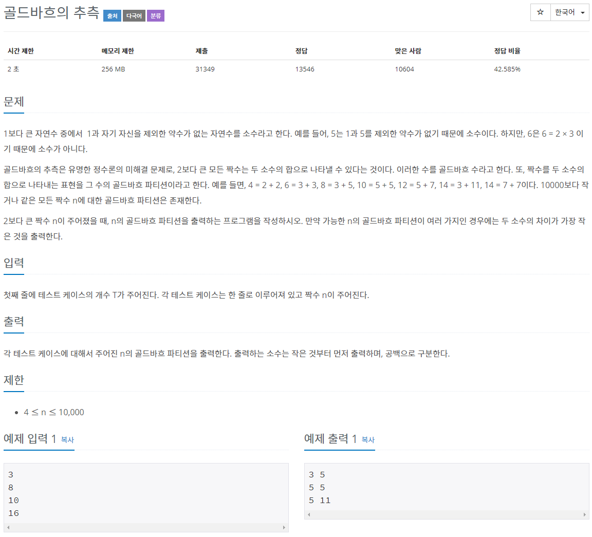
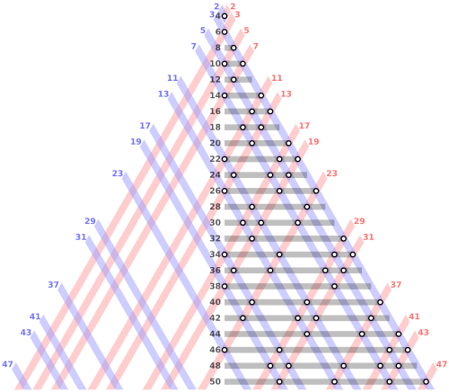

# 문제



## 골드바흐 넘버

예를 들어, 50까지의 짝수는

4 = 2+2

6 = 3+3

8 = 3+5

10 = 3+7 = 5+5

12 = 5+7

14 = 3+11 = 7+7

16 = 3+13 = 5+11

18 = 5+13 = 7+11

20 = 3+17 = 7+13

22 = 3+19 = 5+17 = 11+11

24 = 5+19 = 7+17 = 11+13

26 = 3+23 = 7+19 = 13+13

28 = 5+23 = 11+17

30 = 7+23 = 11+19 = 13+17

32 = 3+29 = 13+19

34 = 3+31 = 5+29 = 11+23 = 17+17

36 = 5+31 = 7+29 = 13+23 = 17+19

38 = 7+31 = 19+19

40 = 3+37 = 11+29 = 17+23

42 = 5+37 = 11+31 = 13+29 = 19+23

44 = 3+41 = 7+37 = 13+31

46 = 3+43 = 5+41 = 17+29 = 23+23

48 = 5+43 = 7+41 = 11+37 = 17+31 = 19+29

50 = 3+47 = 7+43 = 13+37 = 19+31

위와 같이, 두 개의 소수의 합으로 표현할 수 있다. 그러나 모든 짝수에서 가능한지는 아직까지 해결하지 못하고 있다.



> 출처: https://ko.wikipedia.org/wiki/%EA%B3%A8%EB%93%9C%EB%B0%94%ED%9D%90%EC%9D%98_%EC%B6%94%EC%B8%A1

# 풀이

```java
package basicMath2;

import java.io.*;
import java.util.ArrayList;

public class N9020 { // 골드바흐의 추측

	static int range = 10000;
	static ArrayList<Boolean> primeList = new ArrayList<Boolean>(range + 1);

	// T(테스트케이스 개수), n(테스트케이스)입력
	public static void main(String[] args) throws IOException {
		primeNumber(range);
		BufferedReader br = new BufferedReader(new InputStreamReader(System.in));
		int T = Integer.parseInt(br.readLine());
		int n = 0;
		for (int i = 0; i < T; i++) {
			n = Integer.parseInt(br.readLine());
			System.out.println(goldBachPartition(n));
		}

	}

	// 골드바흐 파티션 구하기
	public static StringBuffer goldBachPartition(int num) {
		StringBuffer sb = new StringBuffer();
		int min = 0;
		for (int i = 2; i <= num / 2; i++) {
			if (primeList.get(i) && primeList.get(num - i)) {
				min = i;
			}
		}
		return sb.append(min).append(" ").append(num - min);
	}

	// 소수 구하기
	public static void primeNumber(int range) {
		primeList.add(false);
		primeList.add(false);
		for (int i = 2; i <= range; i++)
			primeList.add(i, true);
		for (int i = 2; (i * i) <= range; i++) {
			if (primeList.get(i)) {
				for (int j = i * i; j <= range; j += i)
					primeList.set(j, false);
			}
		}
	}
}
```

에라토스테네스의 체를 사용하여 소수를 범위만큼 구해놓고 

각 테스트케이스 숫자(num)를 입력했을 때 num/2부터 2까지 i와 num-i가 소수면 출력하도록 하였다.

## 타인의 답

```java
import java.io.BufferedReader;
import java.io.IOException;
import java.io.InputStreamReader;

public class Main { // 골드바흐의 추측

	public static void main(String[] args) throws IOException {
		BufferedReader br = new BufferedReader(new InputStreamReader(System.in));
		int T = Integer.parseInt(br.readLine());
		boolean[] primeList = new boolean[10001];
		primeList[1] = true;
		int idx = 0;
		StringBuilder sb = new StringBuilder();
		for (int i = 2; i <= 100; i++) {
			idx = 2;
			while (i * idx <= 10000) {
				if (primeList[i * idx] == false)
					primeList[i * idx] = true;
				idx++;
			}
		}

		for (int tc = 1; tc <= T; tc++) {
			int n = Integer.parseInt(br.readLine()); // 4 <= n <= 10000
			for (int i = n / 2; i >= 2; i--) {
				if (primeList[i] == false && primeList[n - i] == false) {
					sb.append(i).append(" ").append((n - i)).append("\n");
					break;
				}
			}
		}
		System.out.println(sb);

	}

}
```