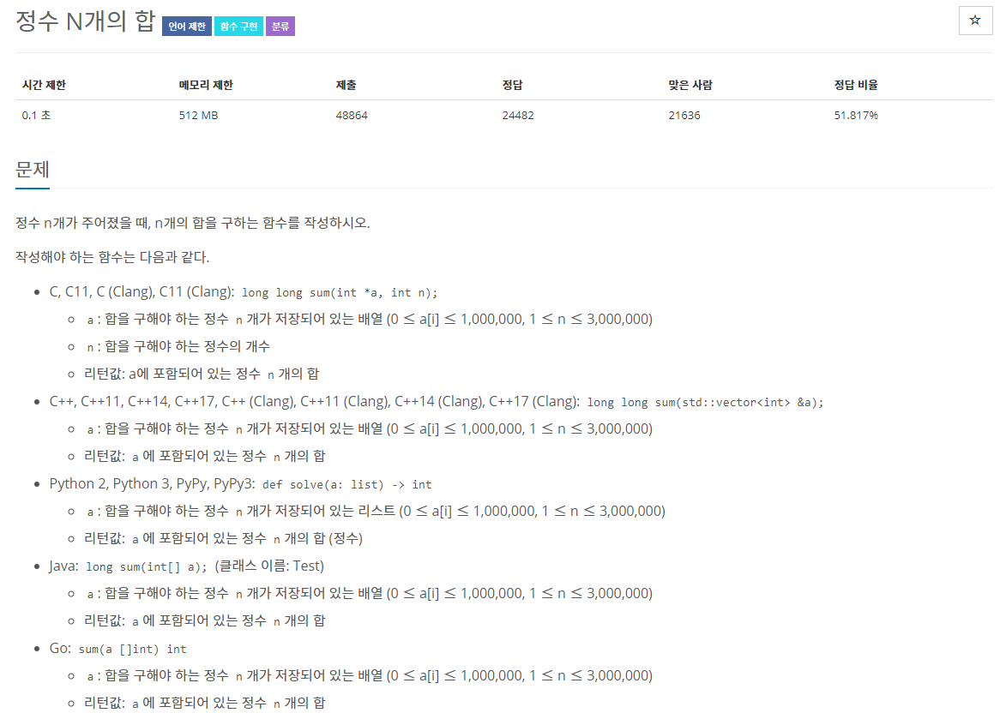

# 문제

## 풀이
### 답안 제출 칸 

* 언어 :  java8

```java
public class Test {
	long sum(int[] a) {
		long ans = 0;
		return ans;
	}
}
```
### long 데이터타입
long 은 정수를 표현하는 데이터타입의 일종으로 int보다 더 큰 수를 할당할 수 있다. 

크기는 16bytes (64bits) 이다.

int의 범위보다 큰 수를 할당해야할 때 숫자 마지막에 L을 붙여야 하는 약속이 있다.

---

```java
public class Test {

	static long sum(long[] a) {
		long ans = 0;
		for (int i = 0; i < a.length; i++) {
			ans += a[i];
		}
//		for (int i : a)
//			s += i;
		return ans;
	}

}
```