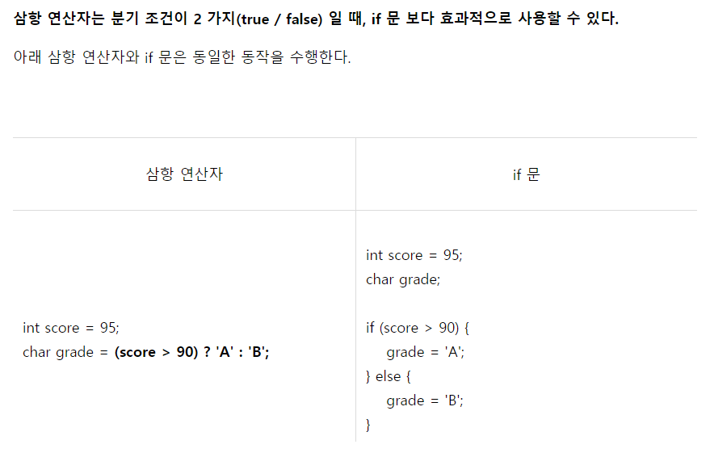

# 1330 두 수 비교하기
## 문제
두 정수 A와 B가 주어졌을 때, A와 B를 비교하는 프로그램을 작성하시오.
## 입력
첫째 줄에 A와 B가 주어진다. A와 B는 공백 한 칸으로 구분되어져 있다.
## 출력
첫째 줄에 다음 세 가지 중 하나를 출력한다.
* A가 B보다 큰 경우에는 '>'를 출력한다.
* A가 B보다 작은 경우에는 '<'를 출력한다.
* A와 B가 같은 경우에는 '=='를 출력한다.
제한
* -10,000 ≤ A, B ≤ 10,000
## 예제 입력 1 복사
```
1 2
```
## 예제 출력 1 복사
```
<
```
## 예제 입력 2 복사
```
10 2
```
## 예제 출력 2 복사
```
>
```
## 예제 입력 3 복사
```
5 5
```
## 예제 출력 3 복사
```
==
```

>출처: <https://www.acmicpc.net/problem/1330> 

# 풀이

### 답1)
```java
package BAEKJOON;

import java.util.Scanner;

public class N1330 {

	public static void main(String[] args) {
		Scanner sc = new Scanner(System.in);
		
		int A, B;
		A = sc.nextInt(); 
		B = sc.nextInt();
		
		if (A > B) {
			System.out.println(">");
		} else if (A < B) {
			System.out.println("<");			
		} else {
			System.out.println("==");			
		} 
		
		
	}

}
```

### 답2)
```java
package BAEKJOON;

import java.io.BufferedReader;
import java.io.IOException;
import java.io.InputStreamReader;

public class Main {

	public static void main(String[] args) throws IOException {

		BufferedReader br = new BufferedReader(new InputStreamReader(System.in));
		String[] nums = br.readLine().split(" ");
		int A = Integer.parseInt(nums[0]);
		int B = Integer.parseInt(nums[1]);

		if (A > B) {
			System.out.println(">");
		} else if (A < B) {
			System.out.println("<");
		} else {
			System.out.println("==");
		}
	}

}
```

## 숏코딩)
```java
import java.util.Scanner;

public class Main {

	public static void main(String[] args) {
		Scanner sc = new Scanner(System.in);
		int A = sc.nextInt();
		int B = sc.nextInt();
		System.out.println((A>B)?">":(A<B)?"<":"==");
	}
}
```

## 추가학습)

### 삼항연산자
`A?B:C` 
* 피연산자를 3개 가지는 조건연산자
```
조건식?값또는연산식:값또는연산식
```
* 조건식(피연산자1)에따라 참이면 피연산자2, 거짓이면 피연산자3.



> https://wikidocs.net/81929


### `(A>B)  ?  ">"  :  (A<B)  ?  "<"  :  "=="`
* 중첩(이중)삼항연산자 <간단한 조건문 대용>
* 이 중첩삼항연산식을 해석해보면 먼저 피연산자1`(A>B)`, A가 B보다 클때(true) 피연산자2인 `>`를 출력하고 아니면(false) 피연산자3이자 새로운 삼항연산식`(A<B)`의 참 거짓 유무에 따라서 `<`과 `==`를 출력한다.
