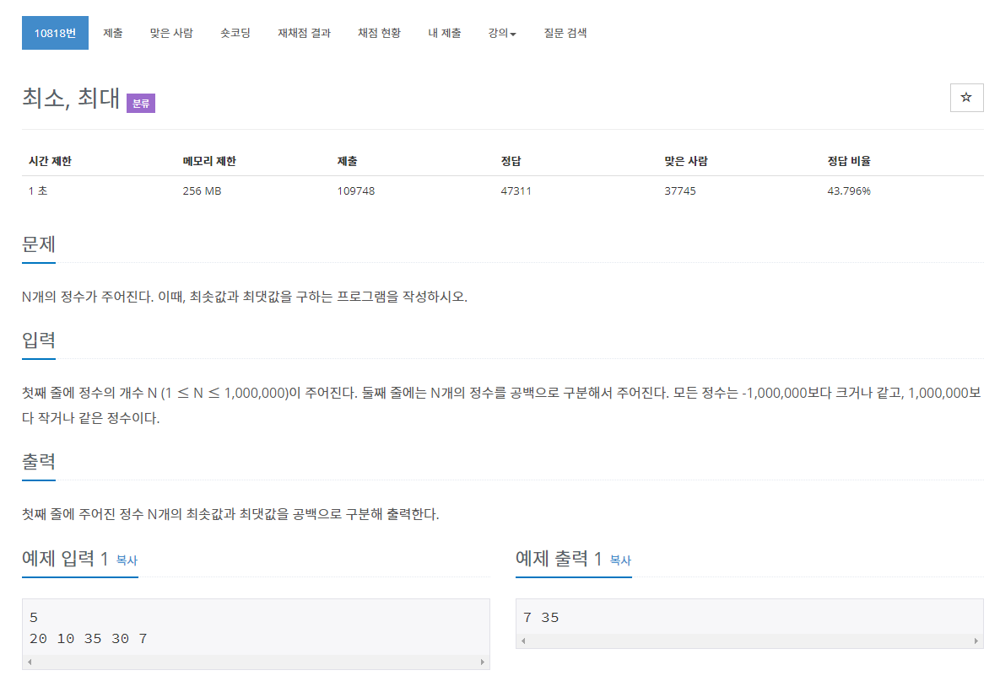

# 문제


N개의 정수 중 최솟값과 최댓값을 구하는 문제.

## 풀이
첫째 줄에 정수의 개수 입력, 둘째 줄에 n개의 정수를 공백으로 구분해 입력

```java
package oneDimensionalArray;
import java.io.BufferedReader;
import java.io.IOException;
import java.io.InputStreamReader;
import java.util.Arrays;
import java.util.StringTokenizer;

public class N10818 {

	public static void main(String[] args) throws NumberFormatException, IOException {
		BufferedReader br = new BufferedReader(new InputStreamReader(System.in));
		int N = Integer.parseInt(br.readLine());

		String[] strArray = br.readLine().split(" ");
		int[] intArray = new int[N];

		for (int i = 0; i < N; i++) {
			intArray[i] = Integer.parseInt(strArray[i]);
		}
		Arrays.sort(intArray);
		System.out.println(intArray[0] + " " + intArray[N - 1]);
		System.out.println(intArray.length);
	}

}
```