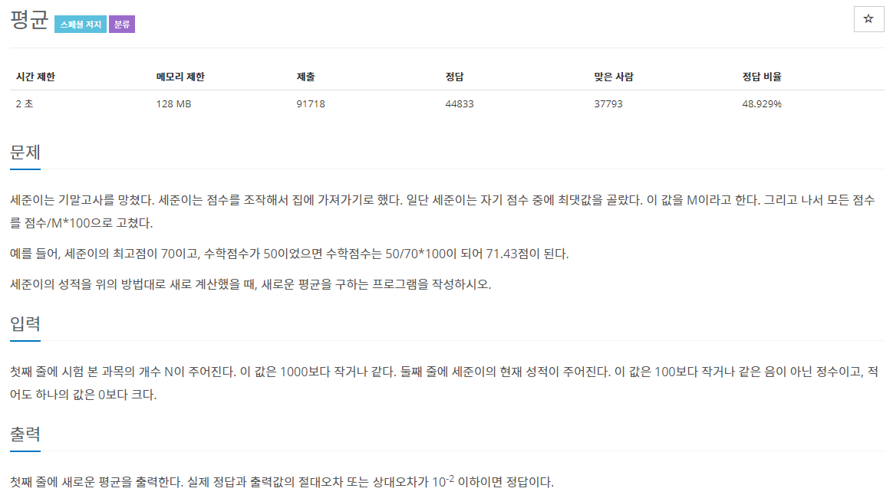
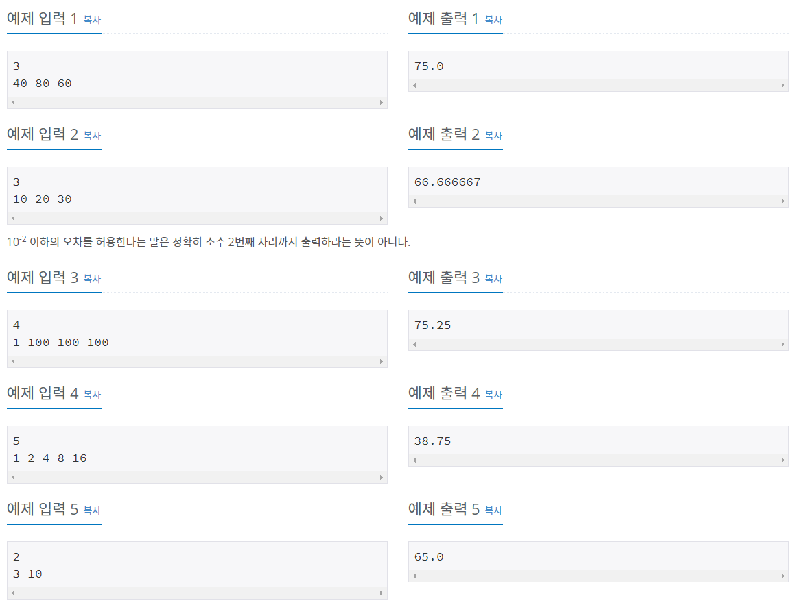

# 문제



## 풀이
### 답 1
```java
import java.io.BufferedReader;
import java.io.IOException;
import java.io.InputStreamReader;

public class N1546 {

	public static void main(String[] args) throws NumberFormatException, IOException {
		BufferedReader br = new BufferedReader(new InputStreamReader(System.in));
		int N = Integer.parseInt(br.readLine());
		double[] arr = new double[N];
		String[] strArray = br.readLine().split(" ");
		double avg = 0;
		double sum = 0 ;
		double max = 0;
		for (int i = 0; i < N; i++) {
			arr[i] = Integer.parseInt(strArray[i]);
		}		
		for (int i = 0; i < N; i++) {
			sum += arr[i];	
			if (max < arr[i]) {
				max = arr[i]; 
			}
		}
		avg = (sum) / N;	
		for (int i = 0; i < N; i++) {
			arr[i] = arr[i]/max*100;
		}
		double avgNew ;
		double sumNew = 0 ;
		for (int i = 0; i < N; i++) {
			sumNew += (arr[i]);
		}
		avgNew = sumNew/N ;
		
		System.out.println(avgNew);

	}

}
```
### 답 2
```java
import java.io.BufferedReader;
import java.io.IOException;
import java.io.InputStreamReader;

public class Main {

	public static void main(String[] args) throws NumberFormatException, IOException {
		BufferedReader br = new BufferedReader(new InputStreamReader(System.in));
		int N = Integer.parseInt(br.readLine());
		double[] arr = new double[N];
		String[] strArray = br.readLine().split(" ");
		
		double sum = 0 ;
		double max = 0;		
		double avgNew ;
		for (int i = 0; i < N; i++) {
			arr[i] = Integer.parseInt(strArray[i]);
			if (max < arr[i]) {
				max = arr[i]; 
			}			
			sum += (arr[i]);
		}		
		avgNew = sum/max*100/N ;
		
		System.out.println(avgNew);

	}

}
```