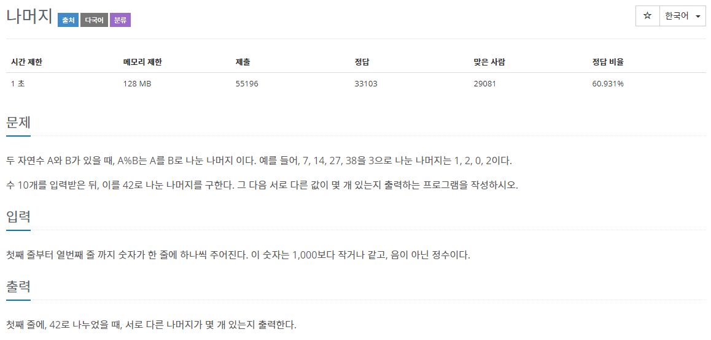
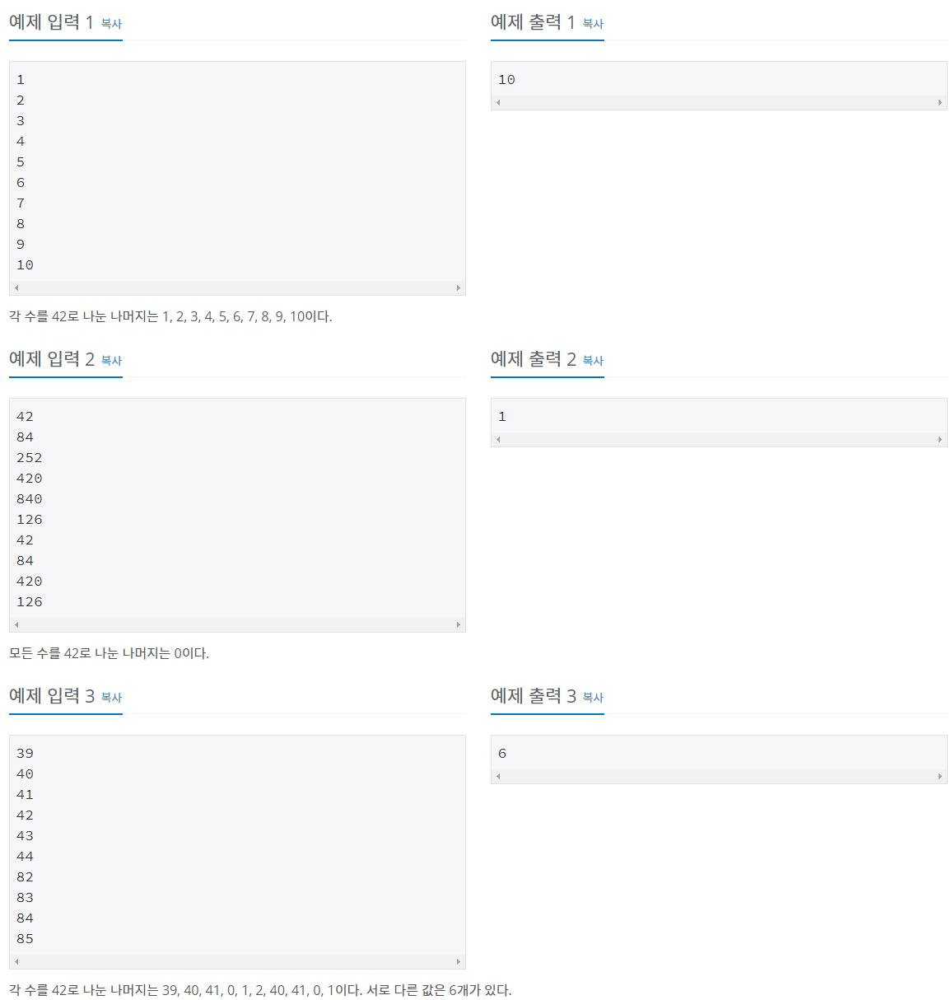

# 문제




* 10개의 수를 입력하고 입력한 수들의 나머지 종류의 개수를 구하는 문제

## 풀이
## HashSet 사용

* 중복저장이 안된다는(종류의 개수를 구할 때 활용. 

* 이 문제의 경우 나머지값 종류의 개수) 특성과 순서를 저장하지 않는다는 특성을 활용해 서로 다른 나머지 값이 몇 개 있는지 구할 수 있다.

## HashSet이란?

(hash는 고정된 길이의 암호화된 문자열로 바꿔버리는 것. set은 집합)

- Set interface를 참조하는 클래스. 세트의 반복 순서를 보장하지 않는다. (시간이 지나도 순서가 일정하게 유지 된다는 보장이 없다.) null 허용.
- 이 클래스는 기본 작업 (추가, 제거, 포함 및 크기 조정)에 대해 일정한 time performance을 제공하며 hash 함수가 버킷간에 요소를 적절하게 분산한다고 가정하여 동작. 따라서 반복 성능이 중요한 경우 초기 용량을 너무 높게 (또는 부하 계수가 너무 낮게) 설정하지 않는 것이 매우 중요.
- 동기화 되지 않음. (외부적으로 동기화 되어야 함.)

Set을 상속받았기 때문에 중복 요소가 없고(equals로 같다고 정의되는) Null값은 최대 한 개가 포함된다. 

### 사용 예시 )

```java
HashSet<Integer> hs= new HashSet<Integer>();

hs.add(E e);

hs.size(); 

hs.clear();

hs.remove(Object o);

hs.toArray(T[] a);
```

## 코드)

```java
import java.util.HashSet;
import java.util.Scanner;

public class Main {
	public static void main(String[] args)  {
		Scanner sc = new Scanner(System.in);
		HashSet<Integer> hs = new HashSet<Integer>();
		for (int i = 0; i < 10; i++) {
			hs.add(sc.nextInt());
		}		
		System.out.println(hs.size());
	}
}
```