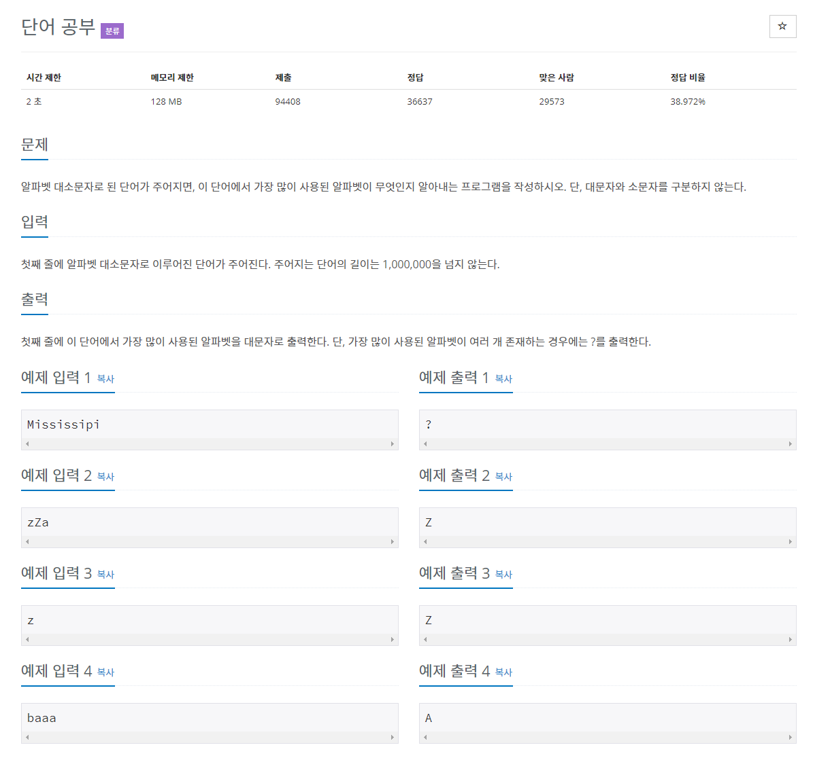

# 문제 
### 단어공부


```java
.toUpperCase() // 대소문자 구별 x  

int[] count = new int[26]; // 알파벳 카운트 배열

count[str.charAt(i) - 'A']++; // str문자열 각 문자 횟수 카운트
```

`count[str.charAt(i) - 'A']++;` 은  `str.charAt(i) - 'A'`에 의해 인덱싱 된 배열안의 값을 증가시킨다.

즉 , `str.charAt(i) - 'A'` 로 각 문자의 발생 횟수를 계산하고 (문자열의 임의 문자에서 문자 'A'를 빼면 배열에서 문자의 인덱스를 얻을 수 있다. - java에서 char는 short과 같이 취급해서 char로 계산 가능)

## 풀이
```java
import java.util.Scanner;

public class N1157 {

	public static void main(String[] args) {
		Scanner sc = new Scanner(System.in);
		String str = sc.nextLine().toUpperCase();
		sc.close();
		
		int[] count = new int[26];
		int max = 0;
		char output = 0;

		for (int i = 0; i < str.length(); i++) {
			count[str.charAt(i) - 'A']++; // str의 i번째 문자의 횟수를 arr[]에 ++

			if (max < count[str.charAt(i) - 'A']) {
				max = count[str.charAt(i) - 'A'];
				output = str.charAt(i);
				
			} else if (max == count[str.charAt(i) - 'A']) {
				output = '?';
			}
		}		
		System.out.println(output);
		
	}
}
```

---

# 참고 링크

>[https://developer-mac.tistory.com/48](https://developer-mac.tistory.com/48)

>[https://stackoverflow.com/questions/8118802/what-exactly-does-arrays-charati-a-do](https://stackoverflow.com/questions/8118802/what-exactly-does-arrays-charati-a-do)