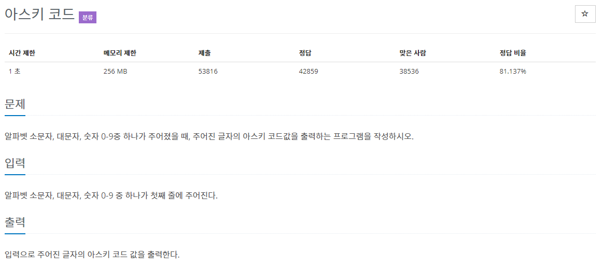
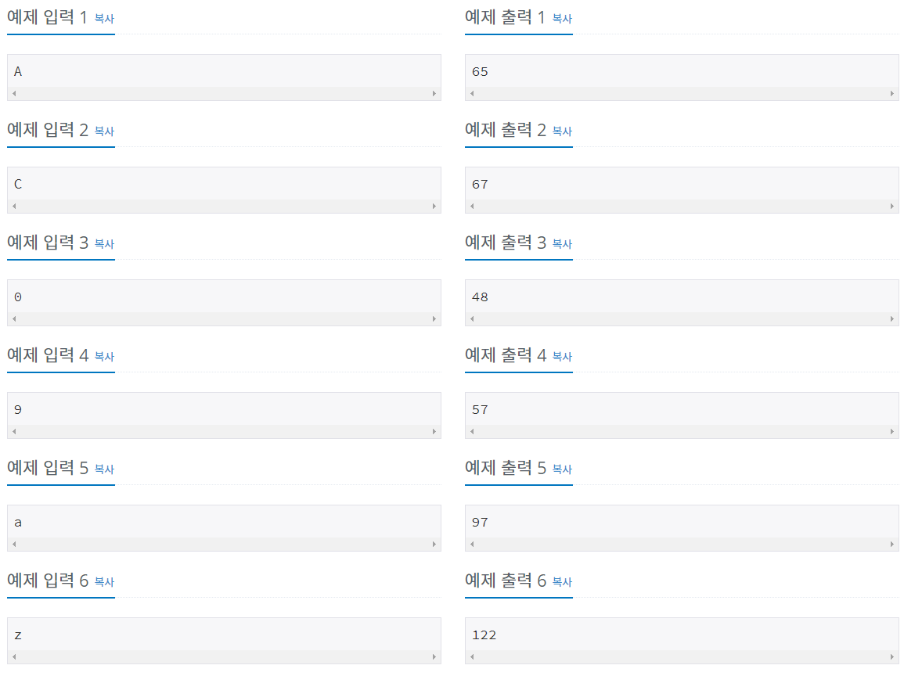

# 문제




## 풀이

charAt(0); 하면 아스키값이 나온다.

```java
import java.io.BufferedReader;
import java.io.IOException;
import java.io.InputStreamReader;

public class N11654 {
	
	static int numberRange = 9;
	
	public static void main(String[] args) throws IOException {
		BufferedReader br = new BufferedReader(new InputStreamReader(System.in));	
		char input = br.readLine().charAt(0);
		int asciiValue = (int)input;
		System.out.println(asciiValue);
	}
	
}

	// fast-program
//import java.io.IOException;
//
//public class N11654 {
//    public static void main(String[] args) throws IOException {
//        int asciiValue = System.in.read();
//        System.out.print(asciiValue);
//    }
//}

	// short-coding
//class N11654 {
//	public static void main(String[] args) throws Exception {
//		System.out.print(System.in.read());
//	}
//}
```

`System.in.read();` 로 입력값을 받고 System.out.print로 출력하면 아스키 코드가 나왔다.

`System.in.read()`는 입력값을 ascii코드로 변환해서 read하고 IOException 또는 Exception throw가 필요하다.

## IOException과 Exception의 차이?

IOException는 Exception의 하위 클래스

결과적으로는 Exception을 쓰면 IOException 또한 작동한다

하지만 Exception을 쓰면 다른 모든 타입의 exception들도 작동하기 때문에 문제발생 가능성 있다

따라서 IOException을 쓰는게 더 선호 된다

## ASCII 란?

### 개요
**미국정보교환표준부호**: American Standard Code for Information Interchange), 또는 줄여서 ASCII, **아스키**)는 영문 알파벳을 사용하는 대표적인 문자 인코딩이다. 아스키는 컴퓨터와 통신 장비를 비롯한 문자를 사용하는 많은 장치에서 사용되며, 대부분의 문자 인코딩이 아스키에 기초를 두고 있다.

### 구성
아스키는 7비트 인코딩으로, 33개의 출력 불가능한 제어 문자들과 공백을 비롯한 95개의 출력 가능한 문자들로 총 128개로 이루어진다.  출력 가능한 문자들은 52개의 영문 알파벳 대소문자와, 10개의 숫자, 32개의 특수 문자, 그리고 하나의 공백 문자로 이루어진다.

### 확장
아스키가 널리 사용되면서 다양한 아스키 기반의 확장 인코딩들이 등장했으며, 이들을 묶어서 아스키라고 부르기도 한다. 대표적으로 7비트 인코딩을 유지한 ISO/IEC 646과, 원래 아스키 코드 앞에 비트 0을 넣어 8비트 인코딩을 만든 IBM 코드 페이지와 ISO 8859가 있다. 이 인코딩들은 언어군에 따라 같은 숫자에 서로 다른 문자가 배당된 경우가 많다.

>출처 : [https://ko.wikipedia.org/wiki/ASCII](https://ko.wikipedia.org/wiki/ASCII)

```java
public char charAt(int index)
Returns the char value at the specified index. An index ranges from 0 to length() - 1. The first char value of the sequence is at index 0, the next at index 1, and so on, as for array indexing.
If the char value specified by the index is a surrogate, the surrogate value is returned.

Specified by:
charAt in interface CharSequence
Parameters:
index - the index of the char value.
Returns:
the char value at the specified index of this string. The first char value is at index 0.
Throws:
IndexOutOfBoundsException - if the index argument is negative or not less than the length of this string.
```
>출처: 이클립스 자바 documentation 기능