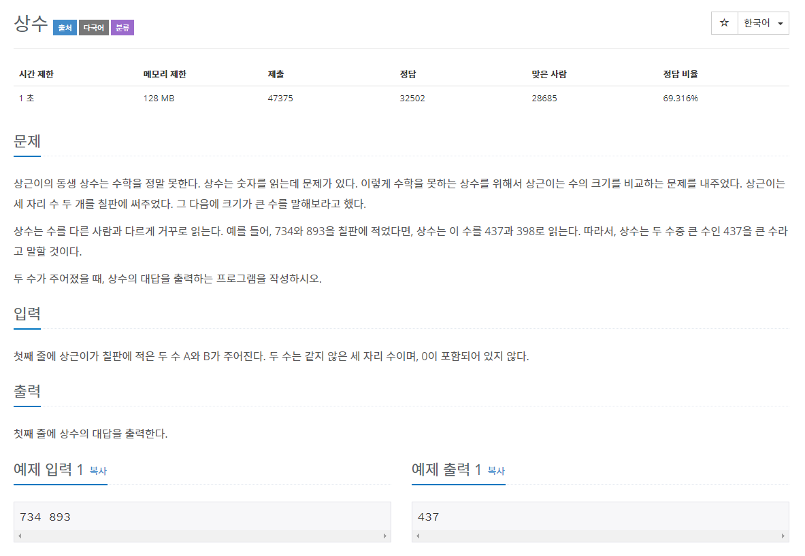

# 문제




## 풀이
```java
import java.io.IOException;

public class N2908 {

	public static void main(String[] args) throws IOException {

		int A = 0, B = 0;
		A += System.in.read() - 48;
		A += (System.in.read() - 48) *10;
		A += (System.in.read() - 48) *100;
		System.in.read();
		B += System.in.read() - 48;
		B += (System.in.read() - 48) *10;
		B += (System.in.read() - 48) *100;
		
		System.out.println(A > B ? A : B);		
	}

}
```