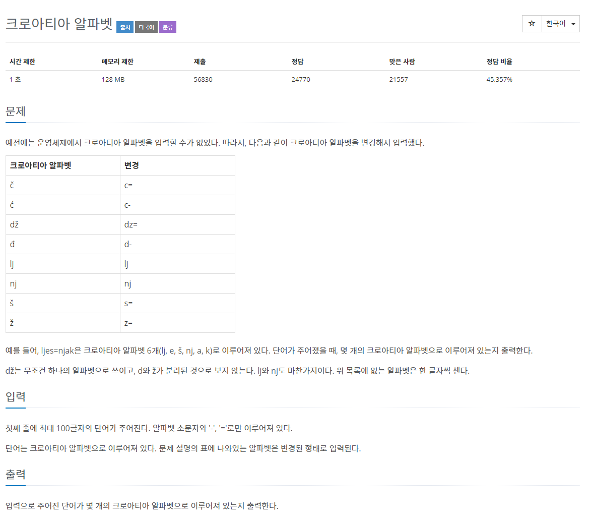
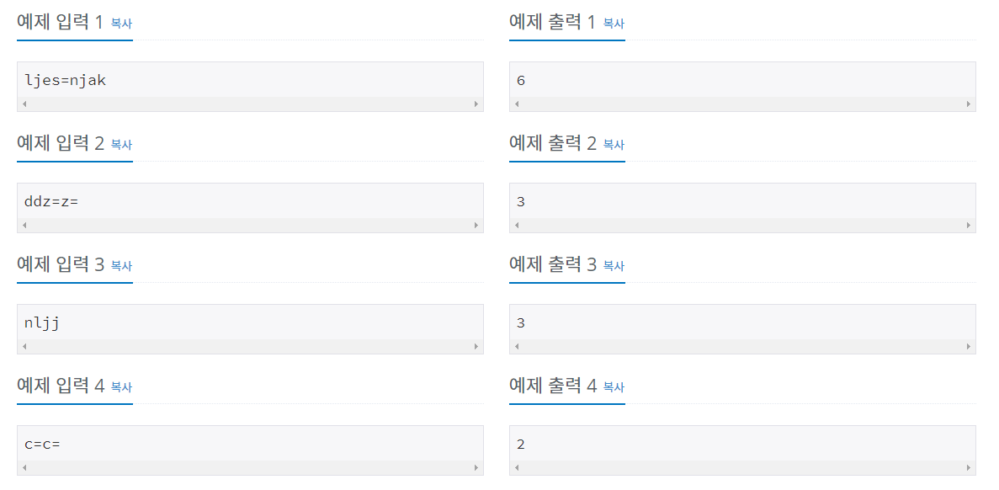

# 문제



## 풀이
### 답 1
```java
import java.io.BufferedReader;
import java.io.IOException;
import java.io.InputStreamReader;

public class N2941 {

	public static void main(String[] args) throws IOException {

		BufferedReader br = new BufferedReader(new InputStreamReader(System.in));
		String str = br.readLine();

		String[] croatiaAlphabet = { "c=", "c-", "dz=", "d-", "lj", "nj", "s=", "z=" };

		for (String Alphabet : croatiaAlphabet) {
			str = str.replaceAll(Alphabet, "*");
		}
		System.out.println(str.length());
	}

}
```
### 답 2
```java
import java.io.BufferedReader;
import java.io.IOException;
import java.io.InputStreamReader;

public class N2941 {
	public static void main(String[] args) throws IOException {
		BufferedReader br = new BufferedReader(new InputStreamReader(System.in));
		String str = br.readLine();
		
		int len = str.length();
		int count = 0;

		for (int i = 0; i < len; i++) {
			char c1 = str.charAt(i);			

			if (c1 == 'c' && i < len - 1) {
				if (str.charAt(i + 1) == '=' || str.charAt(i + 1) == '-') {
					i++;
				} 
			} else if (c1 == 'd' && i < len - 1) {
				if (str.charAt(i + 1) == '-') {
					i++;
				} else if (str.charAt(i + 1) == 'z' && i < len - 2) {
					if (str.charAt(i + 2) == '=') {
						i += 2;
					}
				}
			} else if (c1 == 'l' && i < len - 1) {
				if (str.charAt(i + 1) == 'j') {
					i++;
				}
			} else if (c1 == 'n' && i < len - 1) {
				if (str.charAt(i + 1) == 'j') {
					i++;
				}
			} else if (c1 == 's' && i < len - 1) {
				if (str.charAt(i + 1) == '=') {
					i++;
				}
			} else if (c1 == 'z' && i < len - 1) {
				if (str.charAt(i + 1) == '=') {
					i++;
				}
			}
			count++;
		}
		System.out.println(count);

	}

}
```