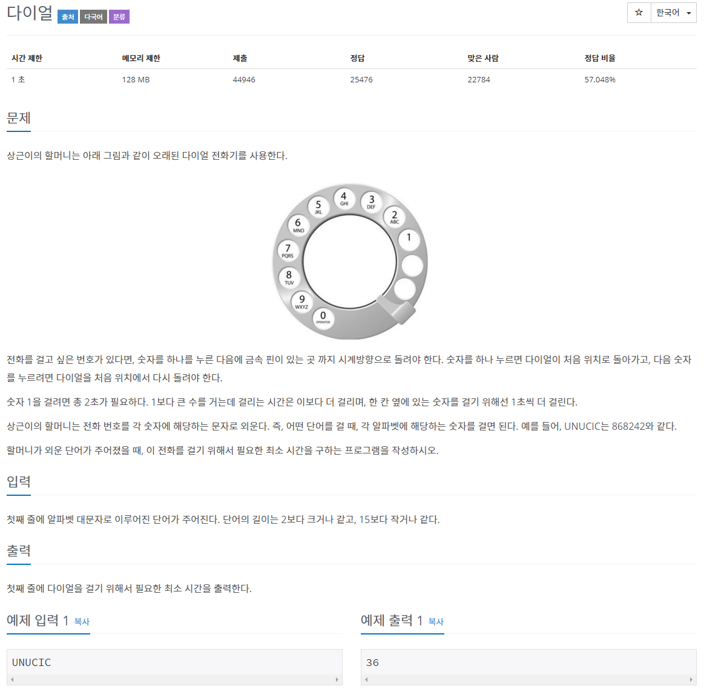
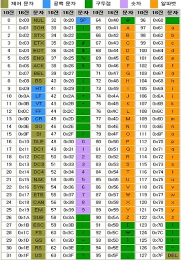

# 문제 


## 풀이
```java
import java.io.BufferedReader;
import java.io.IOException;
import java.io.InputStreamReader;

public class N5622 {

	public static void main(String[] args) throws IOException {

		BufferedReader br = new BufferedReader(new InputStreamReader(System.in));

		int sum = 0;
		String[] str = br.readLine().split("");

		for (int i = 0; i < str.length; i++) {		
			if (str[i].equals("A") || str[i].equals("B") || str[i].equals("C")) {
				sum += 3;
			} else if (str[i].equals("D") ||str[i].equals("E") ||str[i].equals("F")) {
				sum += 4;
			} else if (str[i].equals("G") ||str[i].equals("H") ||str[i].equals("I")) {
				sum += 5;
			} else if (str[i].equals("J") || str[i].equals("K") || str[i].equals("L")) {
				sum += 6;
			} else if (str[i].equals("M") || str[i].equals("N") || str[i].equals("O")) {
				sum += 7;
			} else if (str[i].equals("P") || str[i].equals("Q") || str[i].equals("R") || str[i].equals("S")) {
				sum += 8;
			} else if (str[i].equals("T") || str[i].equals("U") || str[i].equals("V")) {
				sum += 9;
			} else if (str[i].equals("W") || str[i].equals("X") || str[i].equals("Y") || str[i].equals("Z")) {
				sum += 10;
			}
		}
		System.out.println(sum);

	}

}
```

아스키 코드를 이용



65~90까지가 A~Z

```java
import java.io.IOException;

class Main {
    public static void main(String[] args) throws IOException {
		int sum = 0;
		int input = System.in.read(); 
		while(input > 64 && input < 91) {
			if(input < 68) sum += 3;
			else if(input < 71) sum += 4;
			else if(input < 74) sum += 5;
			else if(input < 77) sum += 6;
			else if(input < 80) sum += 7;
			else if(input < 84) sum += 8;
			else if(input < 87) sum += 9;
			else sum += 10;
			
			input = System.in.read();
		}
		System.out.println(sum);
	}
}
```