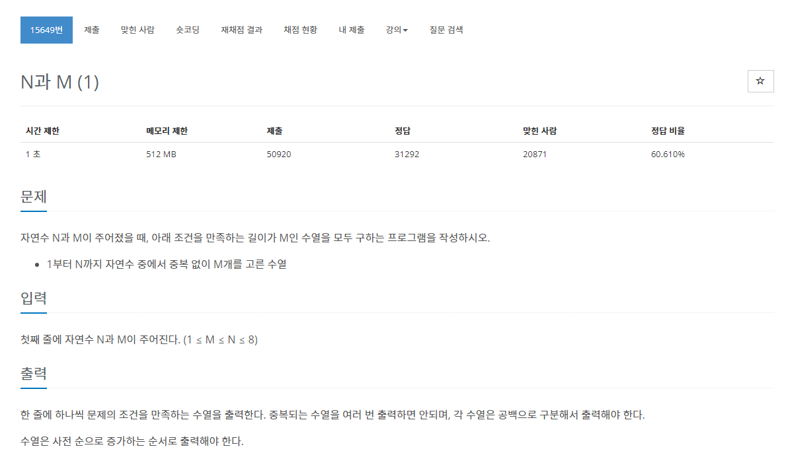
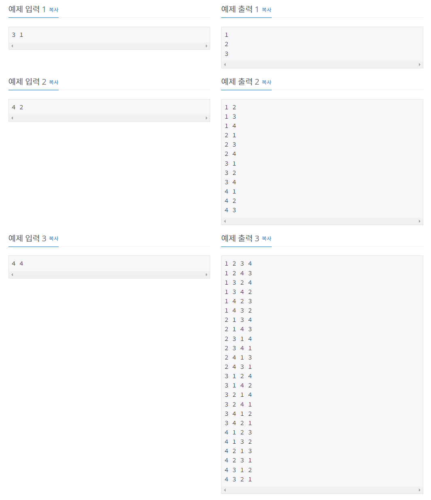

> 백준 알고리즘 - '단계별로 풀어보기'를 기준으로 학습, 정리하였습니다.(https://www.acmicpc.net/)
# 단계 
## 백트래킹
모든 경우의 수를 찾아보지만 그중에서도 가능성 있는 경우의 수를 찾아보는 방법
* DFS : 깊이 우선 탐색
* BFS : 너비 우선 탐색

# N15649 N과 M(1)

## 문제
  


## 알고리즘
1부터 N까지 자연수 중에서 중복없이 M개를 고른 길이가 M인 수열을 모두 구한다.
* 수열 : 나열 순서를 고려하고 중복이 허용되는 자연수의 집합
### 예제
1. 1부터 3까지 자연수 중에서 중복 없이 1개를 고른 수열
   * 답 : 1부터 3까지 각각의 자연수(3개)
   ```
   1
   2
   3
   ```
2. 1부터 4까지 자연수 중에서 중복 없이 2개를 고른 수열 
   * 답 : 1부터 4까지 2개씩 고른 수열
   * 4 * (4-1) = 12개
3. 1부터 4까지 자연수 중에서 중복없이 4개를 고른 수열
   * 답 : 1부터 4까지 4개씩 고른 수열
   * 4 * 6 = 24개
   * 입력값 [4 3] 도 24개의 결과가 나온다.

## 풀이
```java
package backtracking;

import java.util.Scanner;

public class N15649 { // N과 M(1)

	public static int[] arr;
	public static boolean[] visit;
	
	
	public static void main(String[] args) {
		
		Scanner sc = new Scanner(System.in);
		
		int N = sc.nextInt();
		int M = sc.nextInt();
		
		arr = new int[M];
		visit = new boolean[N];
		dfs(N, M, 0);
		
	}
	
	public static void dfs(int N, int M, int depth) {
		if(depth == M) {
			for (int val : arr) {
				System.out.print(val + " ");
			}
			System.out.println();
			return;
		}
		
		for (int i = 0; i < N; i++) {
			if(!visit[i]) {
				visit[i] = true;
				arr[depth] = i + 1;
				dfs(N, M, depth + 1);
				visit[i] = false;
			}
		}		
	}
}
```
1. Scanner로 입력값 N, M 을 입력받는다.
2. int 배열과 boolean 배열을 N개의 크기만큼 선언한다.
3. 파라미터로 N, M, depth를 받는 dfs함수를 만든다
    * depth 변수는 DFS탐색을 위한 깊이 변수로 0부터 시작하여 다음 노드 탐색을 위해 depth를 1씩 증가시키면서 재귀 탐색한다.
    * 자식노드 방문이 끝나면 방문노드를 false로 바꿔줘야 한다.
4. DFS탐색중 depth가 M이면(범위의 최대값, 재귀탐색이 끝나면) arr배열에 저장된 값을 백트래킹하며 출력한다.

## 파이썬 풀이
```py
```