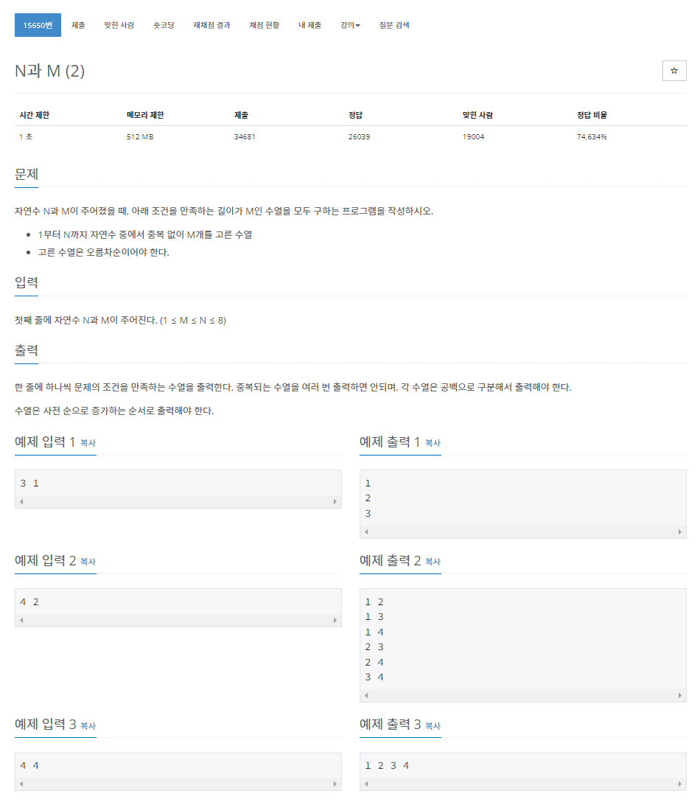

> 백준 알고리즘 - '단계별로 풀어보기'를 기준으로 학습, 정리하였습니다.(https://www.acmicpc.net/)
# 단계 
## 백트래킹
모든 경우의 수를 찾아보지만 그중에서도 가능성 있는 경우의 수를 찾아보는 방법
* DFS : 깊이 우선 탐색
* BFS : 너비 우선 탐색

# N15650 N과 M(2)

## 문제


## 알고리즘
1부터 N까지 자연수 중에서 중복없이 M개를 고른 길이가 M인 수열을 '오름차순으로' 모두 구한다.  
N과 M(1)문제에서 오름차순만 추가된 문제이다.  


### 예제
1. 1부터 3까지 자연수 중에서 중복 없이 1개를 고른 수열
   * 답 : 1부터 3까지 각각의 자연수(3개)
   ```
   1
   2
   3
   ```
2. 1부터 4까지 자연수 중에서 중복 없이 2개를 고른 수열 
   * 답 : 1부터 4까지 2개씩 고른 수열(6개)
    ```
    1 2
    1 3
    1 4
    2 3
    2 4
    3 4
    ```
3. 1부터 4까지 자연수 중에서 중복없이 4개를 고른 수열
   * 답 : 1부터 4까지 4개씩 고른 수열(1개)
    ```
    1 2 3 4
    ```

## 풀이
```java
package backtracking;

import java.io.BufferedReader;
import java.io.InputStreamReader;
import java.util.StringTokenizer;
import java.io.IOException;
 
public class N15650 {
 
	public static int[] arr;
	public static int N, M;
	public static StringBuilder sb = new StringBuilder();
 
	public static void main(String[] args) throws IOException {
 
		BufferedReader br = new BufferedReader(new InputStreamReader(System.in));
		StringTokenizer st = new StringTokenizer(br.readLine());
 
		N = Integer.parseInt(st.nextToken());
		M = Integer.parseInt(st.nextToken());
 
		arr = new int[M];
        
		dfs(1, 0);
		System.out.println(sb);
 
	}
 
	public static void dfs(int at, int depth) {
 
		if (depth == M) {
			for (int val : arr) {
				sb.append(val).append(' ');
			}
			sb.append('\n');
			return;
		}
        
		for (int i = at; i <= N; i++) {
 
			arr[depth] = i;
			dfs(i + 1, depth + 1);
 
		}
	}
}

```
1. BufferedReader와 StringTokenizer를 사용하여 값을 입력받고 문자열 분리
2. StringBuilder를 main, dfs 함수 모두에서 접근해야 하므로 public static으로 선언한다.
3. 파라미터로 at, depth를 받는 dfs함수를 만든다
    * at 변수는 현재 위치를 의미하며 재귀의 반복문의 시작을 의미한다. (1씩 증가시키며 차례로 재귀 반복)
4. DFS탐색중 depth가 M이면(범위의 최대값, 재귀탐색이 끝나면) arr배열에 저장된 값을 백트래킹하며 sb로 출력한다.

## 파이썬 풀이
```py
```