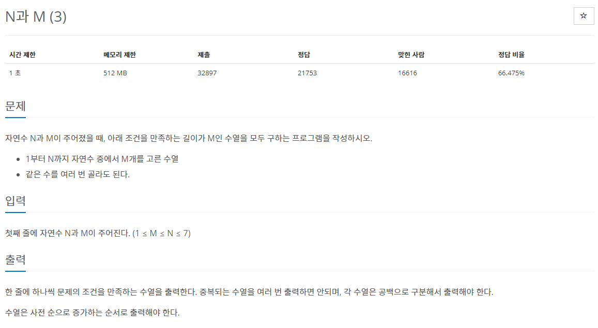
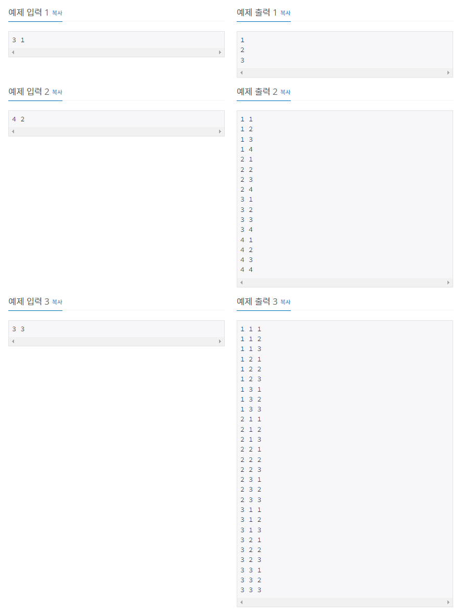

> 백준 알고리즘 - '단계별로 풀어보기'를 기준으로 학습, 정리하였습니다.(https://www.acmicpc.net/)
# 단계 
## 백트래킹
모든 경우의 수를 찾아보지만 그중에서도 가능성 있는 경우의 수를 찾아보는 방법
* DFS : 깊이 우선 탐색
* BFS : 너비 우선 탐색

# N15651 N과 M(3)

## 문제
  


## 알고리즘
1부터 N까지 자연수 중에서 M개를 고르되 같은 수를 여러 번 골라도 되는 길이가 M인 수열을 모두 구한다.
* 1부터 N까지 M의 길이로 조합할 수 있는 조합을 오름차순으로 나열하면 된다.
### 문제의 조건
1. 1 ~ N 까지의 수를 조합
2. M 개를 선택하여 조합
3. 중복해서 조합 가능
### 예제2
예제2번을 보면 1부터 4까지 자연수 중에서 2개를 고른 수열을 구한다. 같은 수를 여러 번 골라도 된다.
```
1 1
1 2
1 3
1 4
...
4 1
4 2
4 3
4 4
```
* 수열 내에서 같은 수가 중복 가능하므로
1 1 부터 4 4 까지 총 16개의 수열이 출력된다.
### DFS로 구현
1부터 중복이 가능한 조합으로 4개를 뽑는다고 가정하면 가장 첫 번째 탐색 루트는 1-1-1-1이다.  
그 다음은 1-1-1-2이고 이런 식으로 마지막(가장 깊은)노드까지 들어가 마지막 노드부터 탐색하고 더이상 탐색할 자식 노드가 없으면 부모 노드로 돌아가(백트래킹) 다음 자식노드를 탐색한다.
* 탐색과정
```java
void DFS(int depth) {
    /*
    깊이가 최대 깊이일 경우 더이상 탐색할 자식노드는 없으므로 return한다.
    */
    if(depth == M) {
        return;
    }
    /*
    깊이를 1씩 증가시키면서 DFS를 재귀호출한다.
    */
    for(int i = 1; i <= N; i++) {
        // 만약 추가 조건이 있다면 반복문 안에 추가한다.
        DFS(depth + 1);
    }
}
```
* 위의 탐색과정에 입출력의 과정 등을 추가한다.

## 풀이
```java
package backtracking;

import java.io.BufferedReader;
import java.io.InputStreamReader;
import java.util.StringTokenizer;
import java.io.IOException;
 
public class N15651 { // N과 M(3)
	
	public static int[] arr;
	public static int N, M;
	public static StringBuilder sb = new StringBuilder();
 
	public static void main(String[] args) throws IOException {
 
		BufferedReader br = new BufferedReader(new InputStreamReader(System.in));
 
		StringTokenizer st = new StringTokenizer(br.readLine());
 
		N = Integer.parseInt(st.nextToken());
		M = Integer.parseInt(st.nextToken());
 
		arr = new int[M];
		dfs(0);
		System.out.println(sb);
	}
 
	public static void dfs(int depth) {
 
		if (depth == M) {
			for (int i = 0; i < M; i++) {
				sb.append(arr[i]).append(' ');
			}
			sb.append('\n');
			return;
		}
 
		for (int i = 1; i <= N; i++) {
			arr[depth] = i;
			dfs(depth + 1);
		}
	} 
}
```
중복을 고려하지 않아도 되서 N과 M(1)문제보다 쉽게 코딩할 수 있다.
* 중복을 찾기 위한 boolean배열 등이 필요 없다.
* System.out.print()으로 출력하게 되면 시간초과

### 과정
1. BufferedReader와 StringTokenizer를 사용하여 값을 입력받고 문자열 분리
2. StringBuilder를 main, dfs 함수 모두에서 접근해야 하므로 public static으로 선언한다.
3. 재귀호출함수인 dfs함수를 만든다(파라미터로 depth만 받으면 된다.)
4. DFS탐색중 depth가 M이면(범위의 최대값, 재귀탐색이 끝나면) arr배열에 저장된 값을 
백트래킹하며 StringBuilder로 출력한다.

## 파이썬 풀이
```py
```