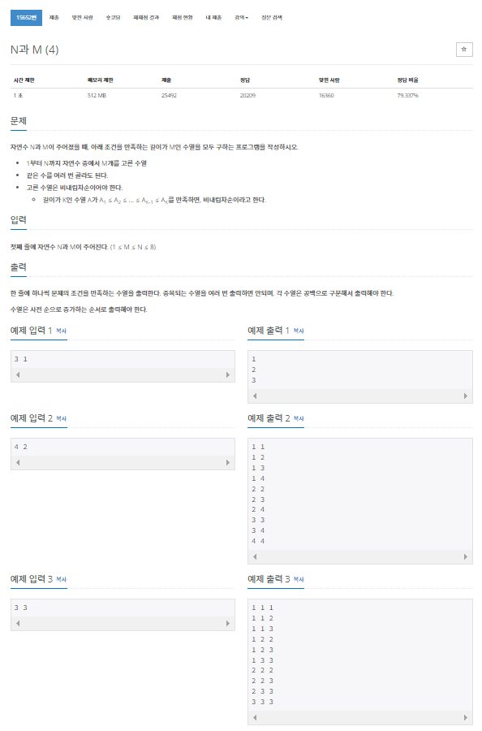

> 백준 알고리즘 - '단계별로 풀어보기'를 기준으로 학습, 정리하였습니다.(https://www.acmicpc.net/)
# 단계 
## 백트래킹
모든 경우의 수를 찾아보지만 그중에서도 가능성 있는 경우의 수를 찾아보는 방법
* DFS : 깊이 우선 탐색
* BFS : 너비 우선 탐색

# N15652 N과 M(4)

## 문제


## 알고리즘
1부터 N까지 자연수 중에서 M개를 고르되 길이가 M인 수열을 모두 구한다.

### 문제의 특이점
N과 M(2) 문제(중복 없이 오름차순)와 유사하다. 다만 비내림차순인 수열을 출력해야 하며 수를 고를 시 중복을 허용한다.

### 비내림차순
각각의 원소가 바로 앞에 있는 원소보다 크거나 같은 순서를 의미한다.
* 오름차순은 계속 수가 증가하는 개념이다.
* 정렬 알고리즘의 출력은 비내림차순이다.
* 오름차순은 값이 같은 것을 포함하지 않으므로 비내림차순이라고 표현한 것.
* 사실 많은 경우에서 오름차순(ascending order)이라는 단어로 통칭해서 사용하지만 몇몇의 경우 비내림차순이라는 단어가 더 정확하다고 생각해 해당 용어를 선호한다.

## 풀이
```java
package backtracking;

import java.io.BufferedReader;
import java.io.InputStreamReader;
import java.io.IOException;
import java.util.StringTokenizer;

public class N15652 { // N과 M(4)

	public static int N, M;
	public static int[] arr;
	public static StringBuilder sb = new StringBuilder();

	public static void main(String[] args) throws IOException {

		BufferedReader br = new BufferedReader(new InputStreamReader(System.in));
		StringTokenizer st = new StringTokenizer(br.readLine(), " ");
		
		N = Integer.parseInt(st.nextToken());
		M = Integer.parseInt(st.nextToken());
		
		arr = new int[M];

		dfs(1, 0);
		System.out.println(sb);

	}

	public static void dfs(int at, int depth) {

		if (depth == M) {
			for (int val : arr) {
				sb.append(val).append(' ');
			}
			sb.append('\n');
			return;
		}

		for (int i = at; i <= N; i++) {
			arr[depth] = i;
			dfs(i, depth + 1);
		}
		
	}
	
}
```
* N과 M(2) 문제의 코드와 거의 같다.
* dfs함수의 재귀함수 코드 부분
  * `dfs(i + 1, depth + 1);`를
  * `dfs(i, depth + 1);`으로 바꿔준다.
* 같은 수 중복이 허용되므로 i+1을 i로만 수정하면 된다.

### 과정
1. BufferedReader와 StringTokenizer를 사용하여 값을 입력받고 문자열 분리
2. StringBuilder를 main, dfs 함수 모두에서 접근해야 하므로 public static으로 선언한다.
3. 재귀호출함수인 dfs함수를 만든다.
4. DFS탐색중 depth가 M이면(범위의 최대값, 재귀탐색이 끝나면) arr배열에 저장된 값을 
백트래킹하며 StringBuilder로 출력한다.

## 파이썬 풀이
```py
```