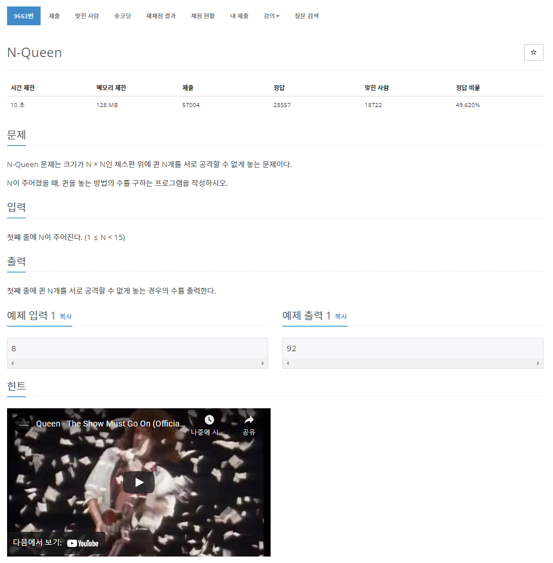

> 백준 알고리즘 - '단계별로 풀어보기'를 기준으로 학습, 정리하였습니다.(https://www.acmicpc.net/)
# 단계 
## 백트래킹
모든 경우의 수를 찾아보지만 그중에서도 가능성 있는 경우의 수를 찾아보는 방법
* DFS : 깊이 우선 탐색
* BFS : 너비 우선 탐색

# N9663 N-Queen

## 문제

* N x N 크기의 체스판 위에 퀸이 서로 공격할 수 없게 배치하는 경우의 수를 구하는 문제.
* 백준 사이트에서 백트래킹의 대표적인 문제라고 한다.
### 여덞 퀸 문제
* 8x8크기의 체스판에 퀸을 8개 배치하는 문제.  
* 1848년, 막스 베첼이 제안한 퍼즐 문제.
* 이 문제를 일반화하면 N 퀸 문제가 된다.
* 구성적인 해법 : N이 2,3인 경우를 제외하고 해를 찾을 수 있다.
* 12개의 기본 형태가 있다.(근본해라고 한다.)
  * 여덞 퀸의 경우 총 92개의 해가 있다.

> [여덟 퀸 문제 - 위키피디아](https://ko.wikipedia.org/wiki/%EC%97%AC%EB%8D%9F_%ED%80%B8_%EB%AC%B8%EC%A0%9C)  
> [여덟 퀸 문제 - 나무위키](https://namu.wiki/w/%EC%97%AC%EB%8D%9F%20%ED%80%B8%20%EB%AC%B8%EC%A0%9C)


## 알고리즘
* N 퀸 문제는 백트래킹 방법으로 해결한다.
```py
def n_queens (i, col):
    n = len(col) -1
    if (promising(i, col)):
        if (i == n):
            print(col[1: n+1])
        else:
            for j in range(1, n+1):
                col[i+1] = j
                n_queens(i+1, col)

def promising (i, col):
    k = 1
    flag = True
    while (k < i and flag):
        if (col[i] == col[k] or abs(col[i] - col[k]) == (i - k)):
            flag = False
        k += 1
    return flag
```

## 풀이
```java
```

### 과정
1. 

## 파이썬 풀이
```py
```