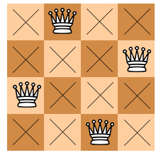

> 백준 알고리즘 - '단계별로 풀어보기'를 기준으로 학습, 정리하였습니다.(https://www.acmicpc.net/)
# 단계 
## 백트래킹
모든 경우의 수를 찾아보지만 그중에서도 가능성 있는 경우의 수를 찾아보는 방법
* DFS : 깊이 우선 탐색
* BFS : 너비 우선 탐색

# N9663 N-Queen

## 문제

* N x N 크기의 체스판 위에 퀸이 서로 공격할 수 없게 배치하는 경우의 수를 구하는 문제.
* 백준 사이트에서 백트래킹의 대표적인 문제라고 한다.
### 여덞 퀸 문제
* 8x8크기의 체스판에 퀸을 8개 배치하는 문제.  
* 1848년, 막스 베첼이 제안한 퍼즐 문제.
* 이 문제를 일반화하면 N 퀸 문제가 된다.
* 구성적인 해법 : N이 2,3인 경우를 제외하고 해를 찾을 수 있다.
* 12개의 기본 형태가 있다.(근본해라고 한다.)
  * 여덞 퀸의 경우 총 92개의 해가 있다.

> [여덟 퀸 문제 - 위키피디아](https://ko.wikipedia.org/wiki/%EC%97%AC%EB%8D%9F_%ED%80%B8_%EB%AC%B8%EC%A0%9C)  
> [여덟 퀸 문제 - 나무위키](https://namu.wiki/w/%EC%97%AC%EB%8D%9F%20%ED%80%B8%20%EB%AC%B8%EC%A0%9C)


## 알고리즘
>  https://st-lab.tistory.com/118

st-lab 티스토리의 풀이를 알아보자.

* N 퀸 문제는 백트래킹 방법으로 해결한다.
* 퀸은 가로,세로,대각선으로 움직일 수 있다.
* 따라서 4x4의 체스판에서 4개의 퀸을 배치할 수 있다.  


* 위의 조건에 따라서 재귀호출을 어떻게 할 지, 퀸을 놓을 수 있는 조건을 어떻게 할지를 정해서 코드를 짠다.
    1. 조건문 - 같은 행과 열에 퀸이 있는지 검사, 대각선상에 퀸이 있는지 검사
    ```java
	for (int i = 0; i < col; i++) {
		// 해당 열의 행과 i열의 행이 일치할경우 (같은 행에 존재할 경우) 
		if (arr[col] == arr[i]) {
			return false;
		} 
		
		/*
		 * 대각선상에 놓여있는 경우
		 * (열의 차와 행의 차가 같을 경우가 대각선에 놓여있는 경우다)
		 */
		else if (Math.abs(col - i) == Math.abs(arr[col] - arr[i])) {
			return false;
		}
	}
    ```
    2. 재귀호출 함수 작성
    ```java
    public static void nQueen(int depth) {
	// 행을 다 체우면 카운트를 1 증가시키고 리턴시킨다.
        if (depth == N) {
            count++;
            return;
        }
    
        for (int i = 0; i < N; i++) {
            arr[depth] = i;
            // Possibility() 해당 열에서 i 번째 행에 놓을 수 있는지를 검사하는 함수
            if (Possibility(depth)) {
                nQueen(depth + 1);
            }
        }
    }
    ```

## 코드 풀이
```java
import java.io.BufferedReader;
import java.io.InputStreamReader;
import java.io.IOException;
 
public class Main {
 
	public static int[] arr;
	public static int N;
	public static int count = 0;
 
	public static void main(String[] args) throws IOException {
 
		BufferedReader br = new BufferedReader(new InputStreamReader(System.in));
		N = Integer.parseInt(br.readLine());
		arr = new int[N];
 
		nQueen(0);
		System.out.println(count);
 
	}
 
	public static void nQueen(int depth) {
		// 모든 원소를 다 채운 상태면 count 증가 및 return 
		if (depth == N) {
			count++;
			return;
		}
 
		for (int i = 0; i < N; i++) {
			arr[depth] = i;
			// 놓을 수 있는 위치일 경우 재귀호출
			if (Possibility(depth)) {
				nQueen(depth + 1);
			}
		}
 
	}
 
	public static boolean Possibility(int col) {
 
		for (int i = 0; i < col; i++) {
			// 해당 열의 행과 i열의 행이 일치할경우 (같은 행에 존재할 경우) 
			if (arr[col] == arr[i]) {
				return false;
			} 
			
			/*
			 * 대각선상에 놓여있는 경우
			 * (열의 차와 행의 차가 같을 경우가 대각선에 놓여있는 경우다)
			 */
			else if (Math.abs(col - i) == Math.abs(arr[col] - arr[i])) {
				return false;
			}
		}
		
		return true;
	}
}
```
* 열은 서로 다른 위치이므로 동일한 행에 위치하는지 대각선상에 위치하는지를 재귀적으로 검사하면서 조건에 부합하면 재귀를 호출하고 아닐 경우 다음 반복문으로 넘어가는 식으로 문제를 해결한다.
* 2차원 배열을 써서 해결 가능 하다.

### 과정
1. 

## 파이썬 풀이
> https://namu.wiki/w/%EC%97%AC%EB%8D%9F%20%ED%80%B8%20%EB%AC%B8%EC%A0%9C

파이썬 구현 소스 코드(백트래킹으로 N 퀸 문제 해결)
```py
def n_queens (i, col):
    n = len(col) -1
    if (promising(i, col)):
        if (i == n):
            print(col[1: n+1])
        else:
            for j in range(1, n+1):
                col[i+1] = j
                n_queens(i+1, col)

def promising (i, col):
    k = 1
    flag = True
    while (k < i and flag):
        if (col[i] == col[k] or abs(col[i] - col[k]) == (i - k)):
            flag = False
        k += 1
    return flag
```