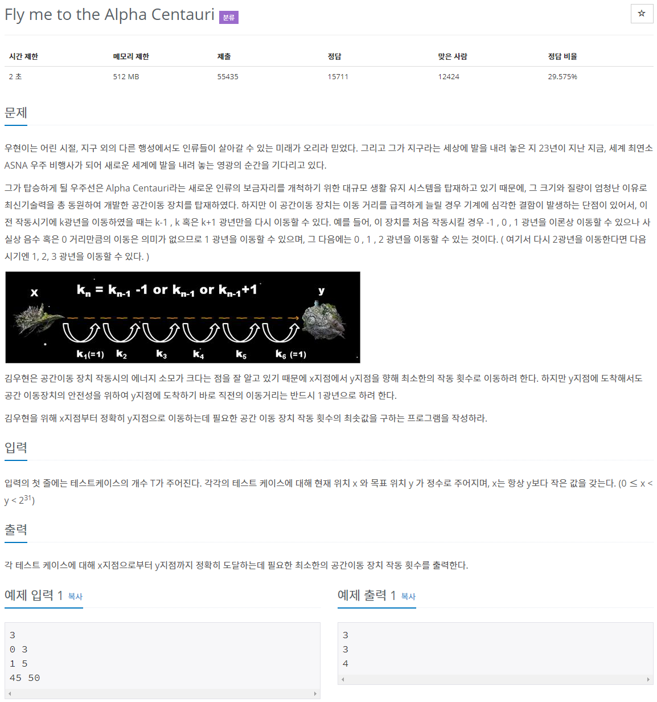

# 문제



최초 장치 작동시 이동거리와 마지막 장치 작동시 이동거리는 1이고 장치 작동 거리는 1씩 증가하거나 1씩 감소 하거나 0으로 변동 없을 수 있다. 느린 자동차를 천천히 가속했다가 천천히 감속하는 느낌이다. (서서히 빨라졌다가 서서히 느려진다) 거리마다 최소 장치 작동 횟수를 구해보면 다음과 같다.

참고한 답 1

```java
import java.util.Scanner;
 
public class Main {
	public static void main(String[] args) {
    
		Scanner in = new Scanner(System.in);
 
		int T = in.nextInt();	// 테스트 케이스 
		
		for(int i = 0; i < T; i++) {
        
			int X = in.nextInt();
			int Y = in.nextInt();
			
			int distance = Y - X;	// 거리
			
			int max = (int)Math.sqrt(distance);	// 소수점 버림
            
			if(max == Math.sqrt(distance)) {
				System.out.println(max * 2 - 1);
			}
			else if(distance <= max * max + max) {
				System.out.println(max * 2);
			}
			else {
				System.out.println(max * 2 + 1);
			}
			
		}
	}
}
```

> 출처 [https://st-lab.tistory.com/79](https://st-lab.tistory.com/79)

3개의 경우에 따라 다르게 계산.

1. 제곱수 일 때 : max * 2 - 1
2. distance ≤ ( max × max ) + max 일 때 : (max * 2)
3. else 나머지 : max * 2 + 1

## 참고한 답 2

```java
public class Baekjoon1011 {
 
    static StringTokenizer st;
    public static void main(String[] args) throws IOException {
        BufferedReader br = new BufferedReader(new InputStreamReader(System.in));
        BufferedWriter bw = new BufferedWriter(new OutputStreamWriter(System.out));
        st = new StringTokenizer(br.readLine());
        
        int t = Integer.parseInt(st.nextToken());
        for(int i=0; i<t; i++) {
            st = new StringTokenizer(br.readLine());
            int x = Integer.parseInt(st.nextToken());
            int y = Integer.parseInt(st.nextToken());
            int movingDistance = 0;
            int xMovingCount = 0;
            int yMovingCount = 0;
            
            while(true) {
                movingDistance++;
                
                x += movingDistance;
                xMovingCount++; // x의 이동횟수
                
                if(x >= y) {
                    break;
                }
                
                y -= movingDistance;
                yMovingCount++; // y의 
                if(y <= x) {
                    break;
                }
                
            }
            bw.write(String.valueOf(xMovingCount+yMovingCount));
            bw.newLine();
        }
        bw.flush();
    }
 
}
```

> 출처 [https://zorba91.tistory.com/116](https://zorba91.tistory.com/116)

12344321, 123454321 과 같이 좌우대칭일 때 count++, x좌표에서 ++, y좌표에서 —해가며 계산. x ≥ y 일때, x ≤ y 일때 break하고 x와 y 증감 횟수를 더함.