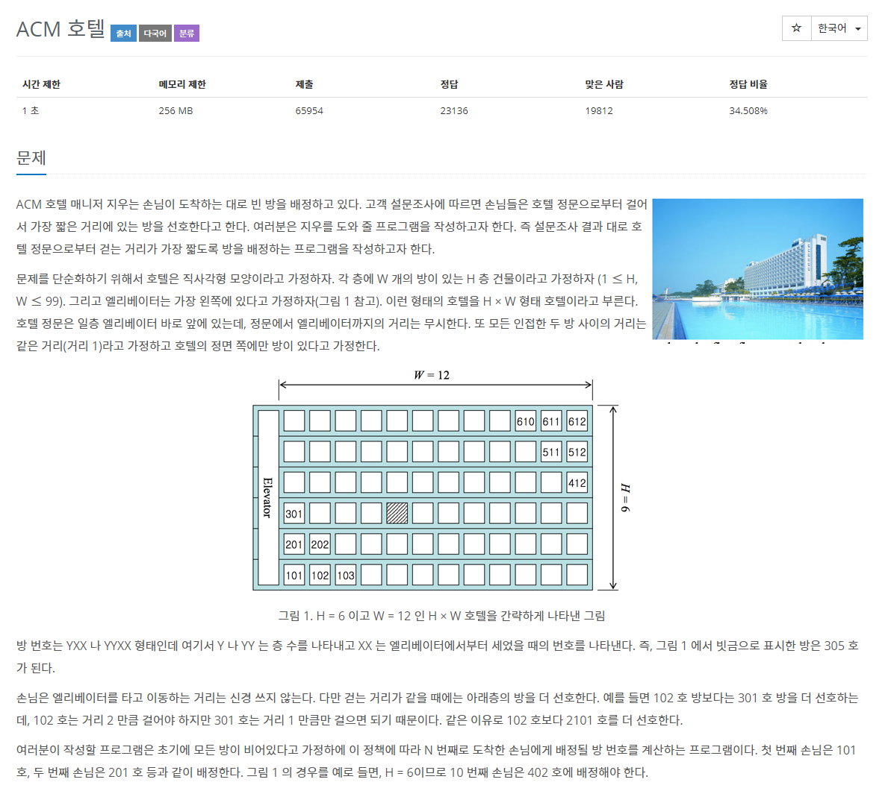
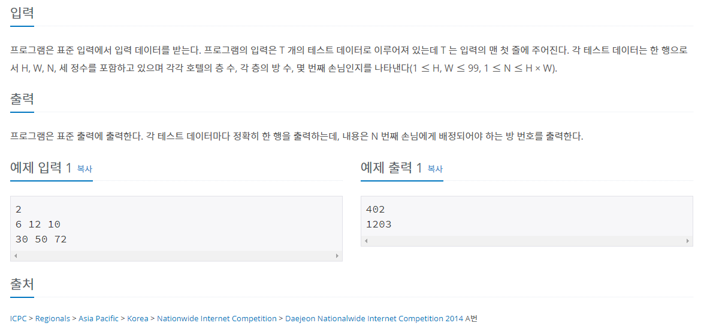

# 문제





## 풀이

먼저 T 번에 걸쳐 H, W, N 을 입력 받아야 하므로 반복문을 사용하였고,

BufferedReader로 입력받고 StringTokenizer로 문자열을 나눠 int변수 H, W, N 으로 선언하였다.

```java
	BufferedReader br = new BufferedReader(new InputStreamReader(System.in));
		int T = Integer.parseInt(br.readLine()); // 테스트 데이터 개수
		int H = 0;
		int W = 0;
		int N = 0;

		for (int i = 0; i < T; i++) { // (1 ≤ H, W ≤ 99, 1 ≤ N ≤ H × W)
			StringTokenizer st = new StringTokenizer(br.readLine());
			H = Integer.parseInt(st.nextToken()); // 호텔의 층 수
			W = Integer.parseInt(st.nextToken()); // 각 층의 방 수
			N = Integer.parseInt(st.nextToken()); // 몇 번째 손님
```

제일 처음에는 방번호의 앞자리와 뒷자리를 나눠서 코드를 짯지만 (for문 2개 사용) 짜고나니 for문이 중복되고 조건 또한 똑같아서 하나로 ans변수에 합쳤다. 

```java
int[] front = new int[H * W];
			int[] back = new int[H * W];
			for (int j = 0; j < H * W; j++) {
				if ((j + 1) % H != 0) {
					front[j] = (((j + 1) % H) * 100);
				} else {
					front[j] = H * 100;
				}

				if ((1 + j) % H != 0) {
					back[j] = (1 + j) / H + 1;
				} else {
					back[j] = (1 + j) / H;
				}
			}
			System.out.println(front[N - 1] + back[N - 1]);
```

## 알고리즘 풀이

먼저 앞자리를 보면 1~H가 반복된다. (101~601, 102~602, ... ) 따라서 (j+1) % H로 계산하였다. (각 손님의 방 번호를 배열에 저장하고 출력하려고 했다. 배열은 index가 0부터 이므로 j+1을 해주었다. ) 

그런데 (j+1 % H)가 0일때 원하는 결과값이 아닌 0이 나오게 되어 if else조건문을 사용하였다. (삼항연산자로도 가능할 것이다)

```java
	if ((j + 1) % H != 0) {
					ans[j] = (((j + 1) % H) * 100) + (1 + j) / H + 1;
				} else {
					ans[j] = H * 100 + (1 + j) / H;
				}
```

완성된 풀이는 이렇다. 코드가 복잡하고 느려서 정리가 필요해보인다.

```java
import java.io.*;
import java.util.StringTokenizer;

public class Main { // ACM 호텔

	public static void main(String[] args) throws IOException {
		BufferedReader br = new BufferedReader(new InputStreamReader(System.in));
		int T = Integer.parseInt(br.readLine()); // 테스트 데이터 개수
		int H = 0;
		int W = 0;
		int N = 0;

		for (int i = 0; i < T; i++) { // (1 ≤ H, W ≤ 99, 1 ≤ N ≤ H × W)
			StringTokenizer st = new StringTokenizer(br.readLine());
			H = Integer.parseInt(st.nextToken()); // 호텔의 층 수
			W = Integer.parseInt(st.nextToken()); // 각 층의 방 수
			N = Integer.parseInt(st.nextToken()); // 몇 번째 손님

			int[] ans = new int[H * W];
			for (int j = 0; j < H * W; j++) {
				if ((j + 1) % H != 0) {
					ans[j] = (((j + 1) % H) * 100) + (1 + j) / H + 1;
				} else {
					ans[j] = H * 100 + (1 + j) / H;
				}
			}
			System.out.println(ans[N - 1]);
		}
		br.close();

	}

}
```

### 코드 정리

1. 불필요한 for문과 배열을 삭제하였다. (j+1 은 N으로)

```java
import java.io.*;
import java.util.StringTokenizer;

public class test { // ACM 호텔

	public static void main(String[] args) throws IOException {
		BufferedReader br = new BufferedReader(new InputStreamReader(System.in));
		int T = Integer.parseInt(br.readLine()); // 테스트 데이터 개수
		int H = 0;
		int W = 0;
		int N = 0;
		int ans = 0;
		for (int i = 0; i < T; i++) { // (1 ≤ H, W ≤ 99, 1 ≤ N ≤ H × W)
			StringTokenizer st = new StringTokenizer(br.readLine());
			H = Integer.parseInt(st.nextToken()); // 호텔의 층 수
			W = Integer.parseInt(st.nextToken()); // 각 층의 방 수
			N = Integer.parseInt(st.nextToken()); // 몇 번째 손님

			if (N % H != 0) {
				ans = (N % H * 100) + (N / H + 1);
			} else {
				ans = (H * 100) + (N / H);
			}

			System.out.println(ans);
		}
		br.close();

	}

}
```

2. BufferedWriter사용하여 반응시간을 줄이고 int 변수를 정리했다.

```java
import java.io.*;
import java.util.StringTokenizer;

public class test { // ACM 호텔

	public static void main(String[] args) throws IOException {
		BufferedReader br = new BufferedReader(new InputStreamReader(System.in));
		BufferedWriter bw = new BufferedWriter(new OutputStreamWriter(System.out));
		int T = Integer.parseInt(br.readLine()); // 테스트 데이터 개수	
		
		for (int i = 0; i < T; i++) { // (1 ≤ H, W ≤ 99, 1 ≤ N ≤ H × W)
			StringTokenizer st = new StringTokenizer(br.readLine());
			int H = Integer.parseInt(st.nextToken()); // 호텔의 층 수
			int W = Integer.parseInt(st.nextToken()); // 각 층의 방 수
			int N = Integer.parseInt(st.nextToken()); // 손님 순서

			if (N % H != 0) {
				bw.write(String.valueOf((N % H * 100) + (N / H + 1)));
			} else {
				bw.write(String.valueOf((H * 100) + (N / H)));
			}
			bw.write("\n");
		}
		bw.flush();
		br.close();
		bw.close();

	}

}
```

하고 보니 W 변수는 전혀 사용되지 않았다. 관점에 따라 처음에 짠 코드처럼 for문을 사용하여 방 개수의 범위를 정해주는게 더 좋은 코드라고 생각할 수 도 있을 것 같다. 그래도 나는 짧은 코드가 아름답다. (추가 코드 작업이 이뤄진다면 필요할 수도 있을 것이다)

### 삼항연산자 사용

만약 삼항연산자를 사용해 표현해 보았다.

```java
N % H != 0 ? N % H * 100 + N / H + 1 : H * 100 + N / H
```

하지만 오히려 반응 시간은 조금 늘어났다. 136ms > 140ms

### 숏코딩

삼항 연산자와 Scanner를 사용해 숏코딩 도전해보았다.

```java
import java.util.*;

public class test {
	public static void main(String[] args) {
		Scanner sc = new Scanner(System.in);
		int T = sc.nextInt();
		for (int i = 0; i < T; i++) {
			int H = sc.nextInt();
			int W = sc.nextInt();
			int N = sc.nextInt();
			System.out.println(N % H != 0 ? N % H * 100 + N / H + 1 : H * 100 + N / H);
		}
	}
}
```

### 알고리즘 추가 답 (아이디 vs970517 님의 코드)

```java
import java.util.*;

public class test {
	public static void main(String[] args) {
		Scanner sc = new Scanner(System.in);
		int T = sc.nextInt();
		for (int i = 0; i < T; i++) {
			int H = sc.nextInt();
			int W = sc.nextInt();
			int N = sc.nextInt();
			System.out.println( ((N - 1) % H + 1) * 100 + ((N - 1) / H + 1);
		}
	}
}
```

이렇게 하면 조건문 또는 삼항연산자를 사용하지 않아도 된다. wow

N-1을 H와 나누면 N%H ≠0 이라는 조건문이 필요가 없다!