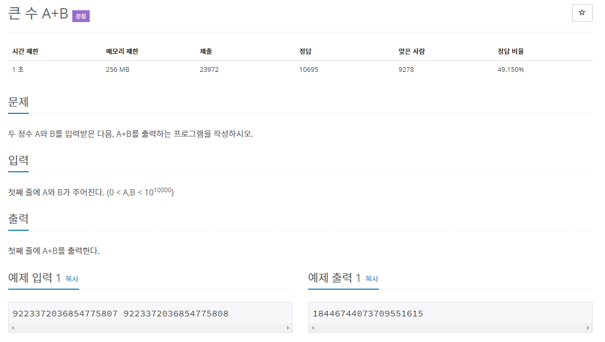

# 문제



입력값 : 9223372036854775807 9223372036854775808

int는 메모리는 4byte, 범위는 -2,147,483,648 ~ 2,147,483,647

long은 메모리는 8byte로 범위는 -9,223,372,036,854,775,808 ~ 9,223,372,036,854,775,807

뒤의 입력값과 합한 값이 long의 범위를 넘어 간다.

BigInteger를 사용하면 쉽게 해결된다.

# data type size

>참고 : [doc.oracle](https://docs.oracle.com/cd/E19253-01/817-6223/chp-typeopexpr-2/index.html)

```java
import java.io.IOException;
import java.math.BigInteger;
import java.util.Scanner;

public class Main {

	public static void main(String[] args) throws IOException {

		Scanner sc = new Scanner(System.in);
		BigInteger A = sc.nextBigInteger();
		BigInteger B = sc.nextBigInteger();

		BigInteger sum = A.add(B);
		System.out.println(sum);

	}

}
```

```java
import java.io.BufferedReader;
import java.io.IOException;
import java.io.InputStreamReader;
import java.math.BigInteger;

public class Main {

	public static void main(String[] args) throws IOException {
			
		BufferedReader br = new BufferedReader(new InputStreamReader(System.in));		
		String[] strArr = br.readLine().split(" ");		
		BigInteger A = new BigInteger(strArr[0]);
		BigInteger B = new BigInteger(strArr[1]);	

		BigInteger sum = A.add(B);
		System.out.println(sum);

		
	}

}
```