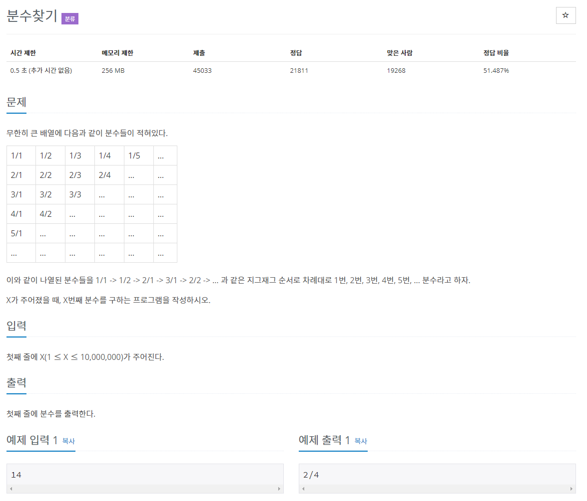

# 문제


# 풀이
```java
//		1/1 -> 1/2 -> 2/1 -> 3/1 -> 2/2 -> 1/3 -> 1/4 -> 2/3 -> 3/2 -> 4/1 -> 5/1 -> 4/2 -> 3/3 -> 2/4 (14번쨰) -> 1/5
//		번호 1 2 3 4 5 6 7 8 9 10 11 12 13 14 15 ...
//		분자 1 1 2 3 2 1 1 2 3 4  5  4  3  2  1 ...
//		분모 1 2 1 1 2 3 4 3 2 1  1  2  3  4  5 ...

//		분자 1 // 1 2 3 2 1 // 1 2 3 4 5 4 3 2 1 // 1 2 3 4 5 6 7 6 5 4 3 2 1 ...
//		분모 1 2 1 // 1 2 3 4 3 2 1 // 1 2 3 4 5 6 5 4 3 2 1 ...
//		분자 소그룹 당 개수 1 / 5 / 9 / 13 ...
//		분모 소그룹 당 개수 3 / 7 / 11 / 15 ...
//		가운데 수 홀수 1 3 5 7... , 짝수 2 4 6 8...
		
//		// 분자 소그룹 당 개수 배열 // { 1, 5, 9, 13 ... }
//		int sum = 0;
//		int[] molGroupCnt = new int[2237];
//		for (int i = 1; i < molGroupCnt.length; i++) {
//			molGroupCnt[0] = 1;
//			molGroupCnt[i] = molGroupCnt[i - 1] + 4;
//
//			sum += molGroupCnt[i - 1];
//			if (sum > 10000000) {
//				break;
//			}
//
//		}			
```
## 답 1
```java
package basicMath1;

import java.io.BufferedReader;
import java.io.IOException;
import java.io.InputStreamReader;

public class N1193 {

	public static void main(String[] args) throws NumberFormatException, IOException {
		BufferedReader br = new BufferedReader(new InputStreamReader(System.in));
		int X = Integer.parseInt(br.readLine());
		
		int rangeMax = 10000000; // 1 ≤ X ≤ 10,000,000
		int[] mol = new int[rangeMax]; // 분자 molecular
		int[] den = new int[rangeMax]; // 분모 denominator
		int maxOdd = 1; // maxOdd에 홀수 최고값 저장
		int maxEven = 0; // maxEven에 짝수 최고값 저장

		// X번째 분자 찾기
//		System.out.print("분자 : ");
		for (int i = 1; i <= mol.length; i++) {
			mol[0] = 1;
			mol[1] = 1;

			if (mol[i] == 1) {
				if (mol[i - 1] == 1) {
					mol[i + 1] = 2;
				} else {
					mol[i + 1] = 1;
				}
			} else {
				// 홀수일 때
				if (mol[i] % 2 != 0 && mol[i] > maxOdd) {
					maxOdd = mol[i];
					mol[i + 1] = mol[i] - 1;
				} else if (mol[i] % 2 != 0 && mol[i] <= maxOdd) {
					if (mol[i] > mol[i - 1]) {
						mol[i + 1] = mol[i] + 1;
					} else {
						mol[i + 1] = mol[i] - 1;
					}
					// 짝수일 때
				} else if (mol[i] % 2 == 0 && mol[i] > mol[i - 1]) {
					mol[i + 1] = mol[i] + 1;
				} else if (mol[i] % 2 == 0 && mol[i] < mol[i - 1]) {
					mol[i + 1] = mol[i] - 1;
				}
			}
//			System.out.print(mol[i-1]+" ");
		}
//		System.out.println();

		// X번째 분모 찾기
//		System.out.print("분모 : ");
		for (int i = 1; i <= den.length; i++) {			
			den[0] = 1;
			den[1] = 2;

			if (den[i] == 1) {
				if (den[i - 1] == 1) {
					den[i + 1] = 2;
				} else {
					den[i + 1] = 1;
				}				
			} else {
				// 짝수일 때
				if (den[i] % 2 == 0 && den[i] > maxEven) {
					maxEven = den[i];
					den[i + 1] = den[i] - 1;
				} else if (den[i] % 2 == 0 && den[i] <= maxEven) {
					if (den[i] > den[i - 1]) {
						den[i + 1] = den[i] + 1;
					} else {
						den[i + 1] = den[i] - 1;
					}		
				// 홀수일 때	
				} else if (den[i] % 2 != 0 && den[i] > den[i - 1]) {
					den[i + 1] = den[i] + 1;
				} else if (den[i] % 2 != 0 && den[i] < den[i - 1]) {
					den[i + 1] = den[i] - 1;
				}
			}
			
//			System.out.print(den[i-1]+" ");
		}

		System.out.println(mol[i]+"/"+den[i]);
		
	}

}
```

## 답 2 
```java
import java.util.Scanner;

public class Main {
	public static void main(String[] args) {
		Scanner scan = new Scanner(System.in);
		int X = scan.nextInt();
		int i = 0;
		for (i = 0; i < X; i++) {
			X -= i;		
		}
		System.out.println("i : "+i+", X : "+X);
		if (i % 2 == 0) {
			System.out.println(X + "/" + (i - X + 1));
		} else {
			System.out.println((i - X + 1) + "/" + X);
		}
	}
}
```
## 답 3
```java
import java.util.Scanner;

public class Main {
	public static void main(String[] args) {
		Scanner scan = new Scanner(System.in);
		int X = scan.nextInt();
		int n = 0;
		while (X > n) { // 14>0 4<5
			X -= n; // 14-1 13-2 11-3 8-4
			n++;
		} // X = 4, n = 5
		if (n % 2 == 0) {
			System.out.printf("%d/%d", X, n - X + 1);
		} else {
			System.out.printf("%d/%d", (n - X + 1), n);
		}
	}
}
```