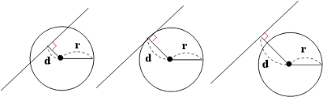
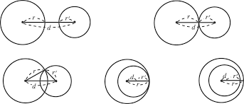

# 문제


# 풀이

두 원의 교점의 개수를 구하는 문제이다.

직선과 원의 교점을 개수를 구하는 것과 동일하게 생각해도 된다.



원의 중심과 직선의 수직거리(d)와 반지름을 비교하여 구한다

d < r 일 때 교점이 2개 

d = r 일 때 교점이 1개

d > r 일 때 교점이 0개

두 원의 교점의 개수를 구하는 경우는 다음과 같다.

1. 두 원이 만나지 않을 때(원 밖에 원, 원 안의 원, 동심원)
2. 두 원이 한 점에서 만날 때(내접, 외접)
3. 두 원이 두 점에서 만날 때(작은 원의 반지름보다 가까운 거리에서 만나고, 큰 원의 반지름에서 작은 원의 반지름을 뺀 것이 중심거리보다 작아야 함)
4. 두 원이 무수히 많은 점에서 만날 때(완벽하게 동일한 원)



따라서 원의 중심사이의 거리(d)와 반지름 r1, r2로 조건을 구해보자.

1. 교점이 0개

    d > r1+r2 (원 밖에 원 )

    d < r1-r2 (원 안의 원)

    d = 0, r1≠r2 (동심원)

2. 교점이 1개

    d = r1+r2 (외접)

    d = r1-r2 (내접)

3. 교점이 2개

    r1-r2 < d < r1+r2

4. 교점이 무한대

    d=0, r1=r2

### 위의 조건들을 d(중심 사이의 거리)와 R, r로 자바에서 표현

```java
			// 위치의 개수가
			// 무한대
			if (d == 0 && R == r) {
				sb.append(-1).append("\n");
			}
			// 0개
			else if (d > R + r || d < R - r || d == 0 && R != r) {
				sb.append(0).append("\n");
			}
			// 한 개
			else if (d == R + r || d == R - r) {
				sb.append(1).append("\n");
			}
			// 두 개
			else if (d < R + r && d > R - r) {
				sb.append(2).append("\n");
			}
```

무한대의 조건 d=0, r1=r2 는 교점이 1개인 조건 d = r1+r2 (외접), d = r1-r2 (내접)에서 걸러질 수 있으므로 위에서 미리 빼 주었다. 또는 조건을 추가해서 해결할 수 있다.

```java
			// 0개
if (d!=0){
	if (d > R + r || d < R - r || d == 0 && R != r) {
		sb.append(0).append("\n");
	}
}
```

또한 Math.abs(); 를 이용해 R, r을 구할 필요 없이(정렬할 필요없이) r1+r1와 r1-r2의 절대값을 구할 수 있다.

### 코드

```java
package basicMath2;

import java.io.BufferedReader;
import java.io.IOException;
import java.io.InputStreamReader;

public class N1002 { // 터렛

	public static void main(String[] args) throws NumberFormatException, IOException {

		BufferedReader br = new BufferedReader(new InputStreamReader(System.in));
		int T = Integer.parseInt(br.readLine());
		StringBuilder sb = new StringBuilder();

		// T번 입력, 계산, 저장
		for (int i = 0; i < T; i++) {
			String[] strArr = br.readLine().split(" ");
			// 입력데이터 변수에 저장
			int x1 = Integer.parseInt(strArr[0]);
			int y1 = Integer.parseInt(strArr[1]);
			int r1 = Integer.parseInt(strArr[2]);
			int x2 = Integer.parseInt(strArr[3]);
			int y2 = Integer.parseInt(strArr[4]);
			int r2 = Integer.parseInt(strArr[5]);

			int R = 0; // 큰 반지름
			int r = 0; // 작은 반지름
			double d = 0; // 중심 사이의 거리

			// r2, r1 크기 비교
			if (r2 >= r1) {
				R = r2;
				r = r1;
			} else {
				R = r1;
				r = r2;
			}
			// 중심 사이의 거리
			d = Math.sqrt(Math.pow(x2 - x1, 2) + Math.pow(y2 - y1, 2));

			// 위치의 개수가
			// 무한대
			if (d == 0 && R == r) {
				sb.append(-1).append("\n");
			}
			// 0개
			else if (d > R + r || d < R - r || d == 0 && R != r) {
				sb.append(0).append("\n");
			}
			// 한 개
			else if (d == R + r || d == R - r) {
				sb.append(1).append("\n");
			}
			// 두 개
			else if (d < R + r && d > R - r) {
				sb.append(2).append("\n");
			}

		}
		// 출력
		System.out.println(sb);
	}

}
```

주의해야할 점이 있다. 자바에서 double형은 ==연산자와 같이 쓰면 오류가 날 수 있다. (부동소수점)

위의 코드는 

> x1, y1, x2, y2는 -10,000보다 크거나 같고, 10,000보다 작거나 같은 정수이고, r1, r2는 10,000보다 작거나 같은 자연수이다.

라는 조건문이 없이 실수를 적용한다면 오류가 날 것 이다.

따라서 아래의 3가지 방법 중 하나를 사용하는 것이 좋다.

1. == 연산자와 double값을 같이 쓰지 않거나 
2. BIgdecimal을 사용하거나 
3. 조건 수식을 다시 세워야 한다. 
(밑의 타인의 답에 해당)

>참고 [https://www.notion.so/584ef3907e6647949099e1e966cd66ff](https://www.notion.so/584ef3907e6647949099e1e966cd66ff)

>[https://st-lab.tistory.com/90](https://st-lab.tistory.com/90)

### 타인의 답

```java
import java.io.BufferedReader;
import java.io.InputStreamReader;
import java.io.IOException;
import java.util.StringTokenizer;
 
public class Main {
 
	public static void main(String[] args) throws IOException {
 
		BufferedReader br = new BufferedReader(new InputStreamReader(System.in));
		StringBuilder sb = new StringBuilder();
 
		int T = Integer.parseInt(br.readLine());
 
		while (T-- > 0) {
			StringTokenizer st = new StringTokenizer(br.readLine(), " ");
 
			int x1 = Integer.parseInt(st.nextToken());
			int y1 = Integer.parseInt(st.nextToken());
			int r1 = Integer.parseInt(st.nextToken());
 
			int x2 = Integer.parseInt(st.nextToken());
			int y2 = Integer.parseInt(st.nextToken());
			int r2 = Integer.parseInt(st.nextToken());
			
			sb.append(tangent_point(x1, y1, r1, x2, y2, r2)).append('\n');
		}
		System.out.println(sb);
 
	}
 
 
	// 접점 개수 구하는 함수
	public static int tangent_point(int x1, int y1, int r1, int x2, int y2, int r2) {
    
		int distance_pow = (int)(Math.pow(x2 - x1, 2) + Math.pow(y2 - y1, 2));	// 중점간 거리 distance의 제곱 
 
 
		// case 1 : 중점이 같으면서 반지름도 같을 경우
		if(x1 == x2 && y1 == y2 && r1 == r2) {
			return -1;
		}
		
		// case 2-1 : 두 원의 반지름 합보다 중점간 거리가 더 길 때 
		else if(distance_pow > Math.pow(r1 + r2, 2)) {
			return 0;
		}
 
		// case 2-2 : 원 안에 원이 있으나 내접하지 않을 때 
		else if(distance_pow < Math.pow(r2 - r1, 2)) {
			return 0;
		}
		
		// case 3-1 : 내접할 때 
		else if(distance_pow == Math.pow(r2 - r1, 2)) {
			return 1;
		}
        
		
		// case 3-2 : 외접할 때 
		else if(distance_pow == Math.pow(r1 + r2, 2)) {
			return 1;
		}
		
		else {
			return 2;
		}
		
	}
 
}
```

중심사이의 거리를 구할 때 Math.sqrt()를 쓰지 않았고 부등식 양 변에 제곱을 해서 조건식을 만들었다.

>[https://st-lab.tistory.com/90](https://st-lab.tistory.com/90)

## 풀이 - python

### 복습
* 두 원의 가능한 교점의 개수를 구하는 문제

### 교점의 개수 
* d는 두 원 중심 사이의 거리, r1, r2는 반지름
1. 교점이 0개

    d > r1+r2 (원 밖에 원 )

    d < r1-r2 (원 안의 원)

    d = 0, r1≠r2 (동심원)

2. 교점이 1개

    d = r1+r2 (외접)

    d = r1-r2 (내접)

3. 교점이 2개

    r1-r2 < d < r1+r2

4. 교점이 무한대

    d=0, r1=r2

### 구현
```py
import math
T = int(input())
for _ in range(T) : 
    x1, y1, r1, x2, y2, r2 = map(int, input().split())
    d = math.sqrt((x1-x2)**2 + (y1-y2)**2)
    if d == 0 and r1 == r2:
        print(-1)
    elif abs(r1-r2) < d < (r1+r2) :
        print(2)
    elif d == r1+r2 or d == r1-r2:
        print(1)
    else : 
        print(0)
```
* d, 즉 두원 사이의 거리를 공식과 math()를 이용해 구한다
* 교점의 개수를 구하는 조건을 if, elif, else문을 이용해 교점의 개수를 print한다.