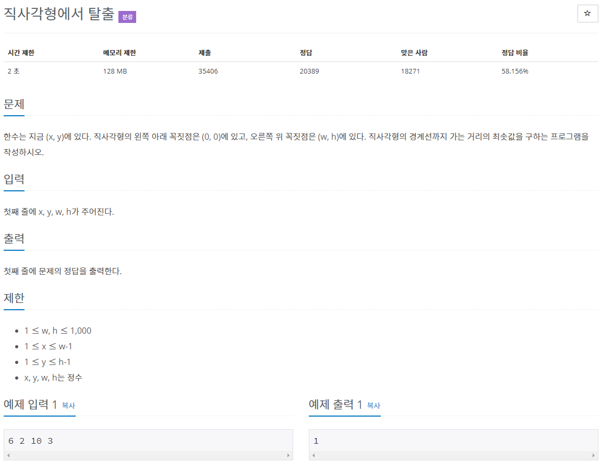

# 문제



# 풀이

```java
package basicMath2;

import java.io.BufferedReader;
import java.io.IOException;
import java.io.InputStreamReader;

public class N1085 { // 직사각형에서 탈출

	public static void main(String[] args) throws IOException {
		
		BufferedReader br = new BufferedReader(new InputStreamReader(System.in));
		int x, y, w, h;
		// 입력한 x, y, w, h를 str배열을 이용해 저장
		String[] str = br.readLine().split(" "); 
		x = Integer.parseInt(str[0]);
		y = Integer.parseInt(str[1]);
		w = Integer.parseInt(str[2]);
		h = Integer.parseInt(str[3]);

		// arr배열에 x축, y축의 거리 4개 저장
		int arr[] = new int[4];
		arr[0] = w - x;
		arr[1] = h - y;
		arr[2] = y - 0;
		arr[3] = x - 0;

		// 4개의 거리를 비교해 최솟값 산출
		int min = arr[0];
		for (int i = 0; i < arr.length; i++) {
			if (min > arr[i]) {
				min = arr[i];
			}
		}

		System.out.println(min);

	}

}
```

x, y ,w, h 를 bufferedReader로 입력받아 str배열로 이용해 저장하였다 그리고 arr배열에 각 거리를 저장하고 for문과 if문을 이용해 최솟값을 구하였다.

# 타인의 답

```java
import java.io.BufferedReader;
import java.io.InputStreamReader;
import java.io.IOException;
import java.util.StringTokenizer;

public class Main {
	public static void main(String[] args) throws IOException{
		BufferedReader br = new BufferedReader(new InputStreamReader(System.in));
		StringTokenizer st = new StringTokenizer(br.readLine(), " ");
		
		int x = Integer.parseInt(st.nextToken());
		int y = Integer.parseInt(st.nextToken());
		int w = Integer.parseInt(st.nextToken());
		int h = Integer.parseInt(st.nextToken());
		
		int H = Math.min(x, w-x);; 
		int V = Math.min(y, h-y);
		
		System.out.print(Math.min(H, V));
		
	}
}
```

입력에는 BufferedReader와 StringTokenizer를 사용하였고 인자 두 개를 비교하여 더 작은 값을 산출하는 Math.min을 사용하였다.

비교도 x축 좌우의 거리와 y축 좌우의 거리를 비교한 다음에 출력시에 한번 더 비교하는 방식을 사용하였다.

성능의 차이는 거의 없지만 비교하는 데이터가 많아지면 Math.min을 사용하는 것이 빠를 것.