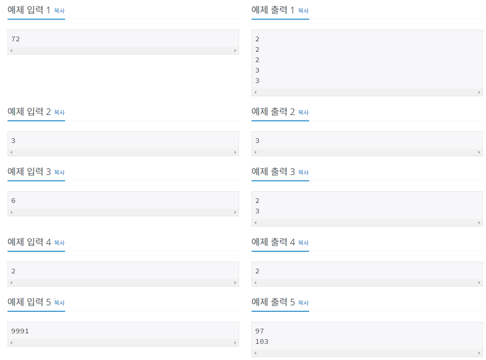

# 문제




# 풀이

N을 2부터 N까지 나눠떨어지지 않을 때까지 나눠서 1이 남으면 출력하면 된다.

```java
import java.io.*;

public class Main { // 소인수분해

	public static void main(String[] args) throws IOException {

		BufferedReader br = new BufferedReader(new InputStreamReader(System.in));
		int N = Integer.parseInt(br.readLine());
		br.close();
		StringBuffer sb = new StringBuffer();
		int temp = N;
		// 2부터 N까지 검사
		for (int i = 2; i <= N; i++) {
			// i가 temp의 소인수면 i로 나누고 append
			while (temp % i == 0) {				
				temp = temp / i;
				sb.append(i + "\n");
			}
			// temp가 1이 되면 break
			if (temp == 1)
				break;
		}

		System.out.println(sb);

	}
}
```

## 타인의 답1

```java
BufferedReader br = new BufferedReader(new InputStreamReader(System.in));

			StringBuilder sb = new StringBuilder();
			int N = Integer.parseInt(br.readLine());

			for (int i = 2; i <= Math.sqrt(N); i++) {
				while (N % i == 0) {
					sb.append(i).append('\n');
					N /= i;
				}
			}
			if (N != 1) {
				sb.append(N);
			}

			System.out.println(sb);
```

기본적인 원리는 비슷하지만 다른 점이 있는 코드다.

첫 번째 다른 점은 for문의 범위가 N까지가 아니라 Math.sqrt(N)까지다. 

여기서 Math.sqrt()함수는 double루트값이 올바르게 반올림된 양의 int루트값이다. 

```java
for (int i = 2; i <= Math.sqrt(N); i++) {
...
```

또한 N이 1이 아니면 N을 append했다. 루트값보다 작은 수로 안나눠질 경우 나머지수를 소인수로 보고 append했다. 또한, 루트값이 2보다 작아서 반복문에서 값을 얻을 수 없는 작은 수인 3의 경우도 해당된다.

```java
if (N != 1) {
				sb.append(N);
			}
```

# 참고 - 위키피디아
>https://ko.wikipedia.org/wiki/%EC%86%8C%EC%9D%B8%EC%88%98%EB%B6%84%ED%95%B4
## **소인수분해 알고리즘**

현대의 전자기 기반 컴퓨터상에서 소인수분해에 대한 [다항식 시간 알고리즘](https://ko.wikipedia.org/w/index.php?title=%EB%8B%A4%ED%95%AD%EC%8B%9D_%EC%8B%9C%EA%B0%84_%EC%95%8C%EA%B3%A0%EB%A6%AC%EC%A6%98&action=edit&redlink=1)은 알려져 있지 않다. 단, 이론적인 [양자컴퓨터](https://ko.wikipedia.org/wiki/%EC%96%91%EC%9E%90%EC%BB%B4%ED%93%A8%ED%84%B0)에서의 [다항식 시간 소인수분해 알고리즘](https://ko.wikipedia.org/wiki/%EC%87%BC%EC%96%B4_%EC%95%8C%EA%B3%A0%EB%A6%AC%EC%A6%98) ([쇼어의 알고리즘](https://ko.wikipedia.org/wiki/%EC%87%BC%EC%96%B4_%EC%95%8C%EA%B3%A0%EB%A6%AC%EC%A6%98))은 존재한다. 하지만 아직까지 어떤 합성수를 [다항 시간](https://ko.wikipedia.org/wiki/%EB%8B%A4%ED%95%AD_%EC%8B%9C%EA%B0%84) 안에 소인수분해하기는 어려운 문제이며, 예를 들어 193자리 수(RSA-640)는 5개월간 30개의 2.2 GHz 옵테론 CPU를 동원하여 소인수분해 되었다. 소인수분해의 난해함은 RSA와 같은 현대 암호의 핵심적 부분이 된다.

### **고전적 알고리즘**

고전적인 소인수분해 알고리즘은 대부분 [페르마 소정리](https://ko.wikipedia.org/wiki/%ED%8E%98%EB%A5%B4%EB%A7%88_%EC%86%8C%EC%A0%95%EB%A6%AC)를 확장한 것을 이용한다. 그중 자주 사용되는 알고리즘은 아래와 같다.

- [윌리엄의 p+1 알고리즘](https://ko.wikipedia.org/w/index.php?title=%EC%9C%8C%EB%A6%AC%EC%97%84%EC%9D%98_p%2B1_%EB%B0%A9%EB%B2%95&action=edit&redlink=1)
  
- [폴라드의 p-1 알고리즘](https://ko.wikipedia.org/wiki/%ED%8F%B4%EB%9D%BC%EB%93%9C%EC%9D%98_P-1_%EC%95%8C%EA%B3%A0%EB%A6%AC%EC%A6%98)
- 폴라드 로 알고리즘
- 페르마의 알고리즘

### **알고리즘의 발전**

[암호학](https://ko.wikipedia.org/wiki/%EC%95%94%ED%98%B8%ED%95%99)의 발달과 함께 소인수분해 방법도 발전해 왔으며 그중 가장 효율적인 알고리즘들을 간추리면 아래와 같다.

- [렌스트라의 타원곡선 알고리즘](https://ko.wikipedia.org/wiki/%EB%A0%8C%EC%8A%A4%ED%8A%B8%EB%9D%BC%EC%9D%98_%ED%83%80%EC%9B%90%EA%B3%A1%EC%84%A0_%EC%95%8C%EA%B3%A0%EB%A6%AC%EC%A6%98) (Elliptic Curve Method, ECM): 타원곡선의 성질을 이용하여 어떤 수를 소인수분해하는 알고리즘으로, 가장 작은 소인수의 크기에 따라서 실행 시간이 결정된다. 이 알고리즘의 실행 시간은 로 이전의 [잉여체](https://ko.wikipedia.org/w/index.php?title=%EC%9E%89%EC%97%AC%EC%B2%B4&action=edit&redlink=1)의 성질을 이용한 알고리즘에 비해 매우 우수하다.
  
- [수체 체](https://ko.wikipedia.org/wiki/%EC%88%98%EC%B2%B4_%EC%B2%B4)(General Number Field Sieve, GNFS) 알고리즘은 이차 체 알고리즘을 발전시킨 것으로 일반 컴퓨터로 실행시킬 수 있는 알고리즘 중에서는 가장 빠른 알고리즘이다. b가 합성수의 비트수일 때, 이 알고리즘은 의 시간복잡도를 가진다.
- 특수 수체 체 (Special Number Field Sieve, SNFS) 알고리즘은 r, e, s가 자연수일 때, r의 e승 ± s 꼴인 자연수에 대해서 작동하는 알고리즘이다. 여기서 r, s의 값이 커지면 속도가 급속도로 느려지기 때문에 r, s가 작은 자연수에 대해서만 잘 작동하며 사용할 수 있다.
  
- [다중 다항식 이차체](https://ko.wikipedia.org/w/index.php?title=%EB%8B%A4%EC%A4%91_%EB%8B%A4%ED%95%AD%EC%8B%9D_%EC%9D%B4%EC%B0%A8%EC%B2%B4&action=edit&redlink=1) (Multiple Polynomial Quadratic Sieve, MPQS) 알고리즘은 이차 체 알고리즘을 확장시킨 알고리즘으로, 한 개의 함수를 이용하는 이차 체와는 달리 여러 개의 함수를 이용하는 알고리즘이다.
  
- [이차 체](https://ko.wikipedia.org/wiki/%EC%9D%B4%EC%B0%A8_%EC%B2%B4) (Quadratic Sieve, QS) 알고리즘은 100자리 이하의 자연수를 소인수분해할 때 적합하며, 보통 어떤 합성수의 소인수들의 크기가 비슷할 때 잘 작동한다.