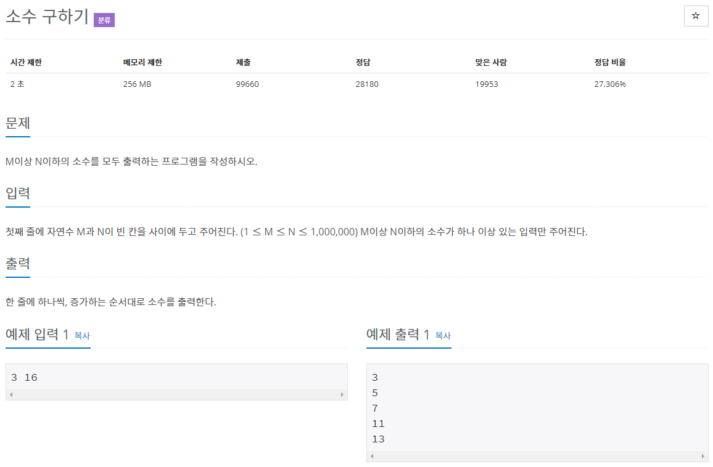

# 문제



문제 소개에 "에라토스테네스의 체로 풀어 봅시다."라고 써있다 앞서 있었던 소수찾기와 소수(합과 최솟값을 구하는 문제)와 같은 문제.

# 풀이

```java
import java.io.*;
import java.util.ArrayList;

public class Main { // 소수 구하기
	// 에라토스테네스의 체
	public static void main(String[] args) throws IOException {

		// 입력
		BufferedReader br = new BufferedReader(new InputStreamReader(System.in));
		String[] strArr = br.readLine().split(" ");
		int M = Integer.parseInt(strArr[0]);
		int N = Integer.parseInt(strArr[1]);

		// 블리언 ArrayList로 구현
		ArrayList<Boolean> primeList;
		// N + 1 만큼 할당 (0 ~ N)
		primeList = new ArrayList<Boolean>(N);
		
		// 0, 1은 소수아님 처리
		primeList.add(0, false);
		primeList.add(1, false);
		
		// 2 ~ N까지 소수 처리
		for (int i = 2; i <= N; i++)
			primeList.add(i, true);
		
		// 2 부터 ~ i*i <= N
		// 각각의 배수들 false 처리
		for (int i = 2; (i * i) <= N; i++) {
			if (primeList.get(i) == true) { // 중복처리 배제
				for (int j = i * i; j <= N; j += i)
					primeList.set(j, false);
				// i*i 미만은 이미 처리되었으므로 j의 시작값은 i*i로 최적화할 수 있다.
			}
		}
		// 데이터 저장
		StringBuffer sb = new StringBuffer();
		// 출력
		for (int i = M; i <= N; i++) {
			if (primeList.get(i) == true) {
				sb.append(i + "\n");
			}
		}
		System.out.println(sb);
		
	}
}
```

저번 소수 문제에서  sum, min을 구하는 코드를 지우고 출력만 다르게 했다.

# 풀이 - python
파이썬 풀이 추가
## 소수 알고리즘 복습
1. 소수 : 1, -1과 자기 자신, 자기 자신의 반수로밖에 나누어 떨어지지 않는 1 이외의 정수로, 즉 양의 약수가 단 2개 뿐인 수를 의미.
2. 에라토스테네스의 체 : 소수를 찾는 방법
   1. 2부터 소수를 구하고자하는 구간의 모든 수를 나열
   2. 2부터 자기 자신을 제외한 모든 배수를 지운다.
   3. 지워지지 않은 수, 즉 소수들의 모든 배수를 지우는 과정을 반복한다.
3. 소수 구하기 팁 : sqrt(), i+i
   * 구하고자 하는 소수의 범위를 n이라 할때 sqrt(n)으로 계산하면 빠르다.
     * 예를들어 120까지의 소수를 구한다고 했을 때 11*11은 121이므로 int(sqrt(120)) = 은 10이므로 10의 배수까지만 지워도 120까지의 소수를 모두 구할 수 있다.
   * i+i로 배수를 지우면 편리하다.
		```
		for i in range(i+i, n, i):
			sieve[i] = False
		```

## 내 코드
```py
def solution() :
i = input().split(" ")
M = int(i[0])
N = int(i[1])

def prime_number(M, N):
    s = [True] * (N//2)  
    
    # sqrt()/i+i
    sqrt_N = int(N ** 0.5)
    for i in range(2, sqrt_N+1) :
        if s[i] == True:
            for j in range(i+i, N, i):
                s[j] = False
                
    return [i for i in range(M, N) if s[i] == True]

for i in prime_number(M,N):
    print(i)
```
### 실행 결과
```
3 16
3
5
7
11
13
10
```

## 참고 코드
```py
m, n = map(int, input().split())
li = [False] + [True] * ((n - 1) // 2)
for x in range(1, int(n**.5/2+1)):
  if li[x]:
    li[2*x*(x+1)::x*2+1] = [False] * ((((n + 1) // 2) - x * x * 2) // (x * 2 + 1))
if m <= 2:
  print(2)
print('\n'.join([f'{x}' for x, val in zip(range(m+(m&1==0), n+1, 2), li[m//2:]) if val]))
```
* map을 이용해 입력값을 받는다
* n**.5가 sqrt(n)보다 빠르다.
  * (**)은 제곱, (.5)는 0.5