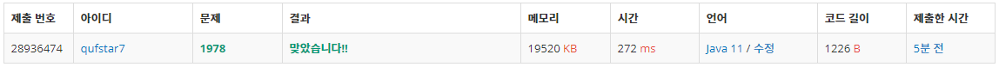

# 문제


## 소수란?

**소수**(prime number)는 1보다 큰 자연수 중 1과 자기 자신만을 약수로 가지는 수다. 예를 들어, 5는 1×5 또는 5×1로 수를 곱한 결과를 적는 유일한 방법이 그 수 자신을 포함하기 때문에 5는 소수이다. 1과 그 수 자신 이외의 자연수로는 나눌 수 없는 자연수로 정의하기도 한다.산술의 기본 정리의 '1보다 큰 모든 자연수는 그 자체가 소수이거나, 순서를 무시하고 유일한 소인수의 조합을 갖는다'는 내용을 바탕으로 정수론에서는 매우 중요한 주제로 다루어진다. 또한 현대에는 암호 분야에서의 기술적 사용으로 그 중요성이 부각되고 있다.

## **소수 찾기**

현재까지 알려진 가장 간단한 방법으로 [에라토스테네스의 체](https://ko.wikipedia.org/wiki/%EC%97%90%EB%9D%BC%ED%86%A0%EC%8A%A4%ED%85%8C%EB%84%A4%EC%8A%A4%EC%9D%98_%EC%B2%B4)가 있다. 방법은 다음과 같다.

1. 찾고자 하는 범위의 자연수를 나열한다.
2. 2부터 시작하여, 2의 배수를 지워나간다.
3. 다음 소수의 배수를 모두 지운다.

이를 반복하여 마지막까지 지우면, 남는 수들이 소수가 된다. 이 과정은 사실 어떤 자연수 n이 소수임을 판정하기 위해서 루트n까지만 진행하면 되는데, 수가 수를 나누기 위해서는 그 몫이 항상 필요하며 나누는 수와 몫 중 어느 하나는 반드시 루트n이하이기 때문이다.

소수를 골라내기 위한 방법은 다음과 같다. 이 방법을 이용해 소수를 어느 정도 골라낼 수 있다.

1. 2와 5를 제외하면, 모든 소수의 일의 자리 수는 1, 3, 7, 9이다.
2. 어떤 자연수 n이 소수임을 판정하기 위해선 루트n까지의 수 중 1을 제외하고 그 자연수의 약수가 있는지 확인하면 된다.
3. [배수](https://ko.wikipedia.org/wiki/%EB%B0%B0%EC%88%98)의 성질을 이용하면 쉽게 구할 수도 있다.

그 외에도 다양하고 복잡한 판정법이 존재하지만, 위의 세 가지는 당연하고 간단한 것들이다.

>출처 [https://ko.wikipedia.org/wiki/소수_(수론)](https://ko.wikipedia.org/wiki/%EC%86%8C%EC%88%98_(%EC%88%98%EB%A1%A0))

## 에라토스테네스의 체

### 알고리즘

1. 2부터 소수를 구하고자 하는 구간의 모든 수를 나열한다. 그림에서 회색 사각형으로 두른 수들이 여기에 해당한다.
2. 2는 소수이므로 오른쪽에 2를 쓴다. (빨간색)
3. 자기 자신을 제외한 2의 배수를 모두 지운다.
4. 남아있는 수 가운데 3은 소수이므로 오른쪽에 3을 쓴다. (초록색)
5. 자기 자신을 제외한 3의 배수를 모두 지운다.
6. 남아있는 수 가운데 5는 소수이므로 오른쪽에 5를 쓴다. (파란색)
7. 자기 자신을 제외한 5의 배수를 모두 지운다.
8. 남아있는 수 가운데 7은 소수이므로 오른쪽에 7을 쓴다. (노란색)
9. 자기 자신을 제외한 7의 배수를 모두 지운다.
10. 위의 과정을 반복하면 구하는 구간의 모든 소수가 남는다.
11. 그림의 경우, 11의제곱>120이므로 11보다 작은 수의 배수들만 지워도 충분하다. 즉, 120보다 작거나 같은 수 가운데 2, 3, 5, 7의 배수를 지우고 남는 수는 모두 소수이다.

### java로 구현

```java
public class Eratos {
	public static void main(String[] args) {
		// ArrayList로 구현
		ArrayList<Boolean> primeList;

		// 사용자로부터의 콘솔 입력
		Scanner scan = new Scanner(System.in);
		int n = scan.nextInt();

		// n <= 1 일 때 종료
		if(n <= 1) return;

		// n+1만큼 할당
		primeList = new ArrayList<Boolean>(n+1);
		// 0번째와 1번째를 소수 아님으로 처리
		primeList.add(false);
		primeList.add(false);
		// 2~ n 까지 소수로 설정
		for(int i=2; i<=n; i++ )
			primeList.add(i, true);

		// 2 부터  ~ i*i <= n
		// 각각의 배수들을 지워간다.
		for(int i=2; (i*i)<=n; i++){
			if(primeList.get(i)){
				for(int j = i*i; j<=n; j+=i) primeList.set(j, false);
				//i*i 미만은 이미 처리되었으므로 j의 시작값은 i*i로 최적화할 수 있다.
			}
		}
		StringBuffer sb = new StringBuffer();
		sb.append("{");
		for(int i=0; i<=n; i++){
			if(primeList.get(i) == true){
				sb.append(i);
				sb.append(",");
			}
		}
		sb.setCharAt(sb.length()-1, '}');

		System.out.println(sb.toString());

	}
}
```

>출처 [https://ko.wikipedia.org/wiki/에라토스테네스의_체](https://ko.wikipedia.org/wiki/%EC%97%90%EB%9D%BC%ED%86%A0%EC%8A%A4%ED%85%8C%EB%84%A4%EC%8A%A4%EC%9D%98_%EC%B2%B4)

### 콘솔 입출력값 (100까지 소수구하기)

```java
100
{2,3,5,7,11,13,17,19,23,29,31,37,41,43,47,53,59,61,67,71,73,79,83,89,97}
```

## 1 코드를 분석해보자

```java
		// ArrayList로 구현
		ArrayList<Boolean> primeList;

		// 사용자로부터의 콘솔 입력
		Scanner scan = new Scanner(System.in);
		int n = scan.nextInt();
```

primeList라는 boolean배열을 선언하고 Scanner를 이용해 n을 입력받았다. 입력받은 정수 n은 배열의 길이를 지정하고(n+1) 구하고자 하는 소수의 최대 범위를 의미한다.

```java
		// n <= 1 일 때 종료
		if (n <= 1)
			return;

		// n+1만큼 할당
		primeList = new ArrayList<Boolean>(n + 1);
		// 0번째와 1번째를 소수 아님으로 처리
		primeList.add(false);
		primeList.add(false);
		// 2~ n 까지 소수로 설정
		for (int i = 2; i <= n; i++)
			primeList.add(i, true);
```

0과 1은 소수가 아니므로 `primeList.add(false)`  로 처리하고 2부터 n까지 소수로 설정한다.

```java
		// 2 부터 ~ i*i <= n
		// 각각의 배수들을 지워간다.
		for (int i = 2; (i * i) <= n; i++) {
			if (primeList.get(i)) {
				for (int j = i * i; j <= n; j += i)
					primeList.set(j, false);
				// i*i 미만은 이미 처리되었으므로 j의 시작값은 i*i로 최적화할 수 있다.
			}
		}
```

이제 에라토스테네스의 체를 이용해 배수들을 지운다. 

2의 배수를 예로 보면 i=2일때 4≤n이면 i는 ++, 반복문. 만약 primeList배열의 2번째 인자를 get, 는 true. 조건이 true이므로 j = 2*2일때 4 ≤ n이면 j += 2, 반복문.(j = 6, 8, 10, 12, ... ) pirmeList.set(j, false) j(4, 6, 8, 10, 12, ...)를 false로.

i가 3일때 3*3 ≤n이면 i++ 만약 primeList의 인자 3을 get, 는 true. j = 3*3일때 9 ≤ n 이면 j += 2, 반복3의 배수 전부 false로.

이런식으로 2부터 제곱수가 n보다 작거나 같을 때까지 반복.

`if (primeList.get(i))` 은 중복된 배수의 반복을 방지 예를들어 4는 2의 배수이므로 이미 false

```java
		StringBuffer sb = new StringBuffer();
		sb.append("{");
		for (int i = 0; i <= n; i++) {
			if (primeList.get(i) == true) {
				sb.append(i);
				sb.append(",");
			}
		}
		sb.setCharAt(sb.length() - 1, '}');

		System.out.println(sb.toString());
```

StringBuffer변수 sb에 0부터 n까지 `primeList.get(i)==true` 즉, 소수이면 append

`sb.setCharAt(sb.length() - 1, '}');` 은 출력값의 맨 끝에 sb.length()-1이 "," 을 }로

## 2 문제에 맞게 수정해보자

```java
import java.util.ArrayList;
import java.util.Scanner;

public class Main {

	public static void main(String[] args) {

		// 입력
		Scanner scan = new Scanner(System.in);
		// 범위, (1000이하의 자연수)
		int n = 1000;		
		int N = scan.nextInt();
		int count = 0;
		StringBuffer sb = new StringBuffer();
		for (int a = 0; a < N; a++) {
			int num = scan.nextInt();
			// ArrayList로 구현
			ArrayList<Boolean> primeList;
			// n+1만큼 할당
			primeList = new ArrayList<Boolean>(n + 1);
			// 0번째와 1번째를 소수 아님으로 처리
			primeList.add(false);
			primeList.add(false);
			// 2 ~ n 까지 소수로 설정
			for (int i = 2; i <= n; i++)
				primeList.add(i, true);
			// 2 부터 ~ i*i <= n
			// 각각의 배수들을 지워간다.
			for (int i = 2; (i * i) <= n; i++) {
				if (primeList.get(i)) { // 중복처리 배제
					for (int j = i * i; j <= n; j += i)
						primeList.set(j, false);
					// i*i 미만은 이미 처리되었으므로 j의 시작값은 i*i로 최적화할 수 있다.
				}
			}
			// count에 소수의 갯수 저장
			if (primeList.get(num) == true) {
				count++;
			}
		}
		scan.close();
		// 출력
		sb.append(count);
		System.out.println(sb);

	}

}
```

기존에 입력받던 n값을 1000으로 지정해주고 N값을 입력받았다. N번만큼 num을 입력받고 primeList.get(num) == true 이면 count++ 반복. 숫자 입력 모두 끝나고 count 출력

### 문제점



1000까지 소수를 모두 블리언 배열에 저장하고 입력한 숫자를 하나하나 카운트하는 방식이라 성능이 좋지 않았다. 다른 사람들의 답을 살펴보자

### 타인의 답 1

```java
import java.io.BufferedReader;
import java.io.InputStreamReader;
import java.util.StringTokenizer;

public class Main {

	static int N, ans;
	static int P[] = new int[1001];

	public static void main(String[] args) throws Exception {
		
		BufferedReader br = new BufferedReader(new InputStreamReader(System.in));

		P[0] = 1;
		P[1] = 1;
		for (int i = 2; i < 1001; i++) {

			if (P[i] == 0) {
				for (int j = i + i; j < 1001; j = j + i) {
					P[j] = 1;
				}
			}

		}

		N = Integer.parseInt(br.readLine());

		StringTokenizer st = new StringTokenizer(br.readLine());

		// count
		ans = 0;
		for (int i = 0; i < N; i++) {

			int j = Integer.parseInt(st.nextToken());

			if (P[j] == 0)
				ans++;

		}

		System.out.println(ans);

	}

}
```

[https://www.acmicpc.net/source/24314263](https://www.acmicpc.net/source/24314263)

소수구하기와 카운팅, 입출력을 분리. 입력 시 StringTokenizer를 사용.

### 타인의 답 2

```java
import java.io.*;

public class Main {

	public static void main(String[] args) throws IOException{
		BufferedReader br = new BufferedReader(new InputStreamReader(System.in));
		//문제 입력
		int N = Integer.parseInt(br.readLine());
		String[] sP = br.readLine().split(" ");
		int[] P = new int[N];
		for(int i=0;i<N;i++) {
			P[i]=Integer.parseInt(sP[i]);
		}
		//숫자 갯수 N -> 입력된 N개 숫자 배열 P[]
		int count=0;
		for(int i : P) {
			boolean cow = true;
			for(int j=1;j<=i;j++) {
				if(i==1) {
					cow=false;
					break;
				}else if(i%j==0&&i!=j&&j!=1) {
					cow=false;
					break;
				}
			}
			if(cow==true) {
				count++;
			}		
		}
		System.out.println(count);
		
		
	}

}
```

입력 시 bufferedReader 사용. 블리언 변수 cow사용. 조건 (i%j==0&&i!=j&&j!=1)  나눈 나머지가 0이고(i가 j의 배수일 때), i ≠ j 이고 j ≠ 1일때 false