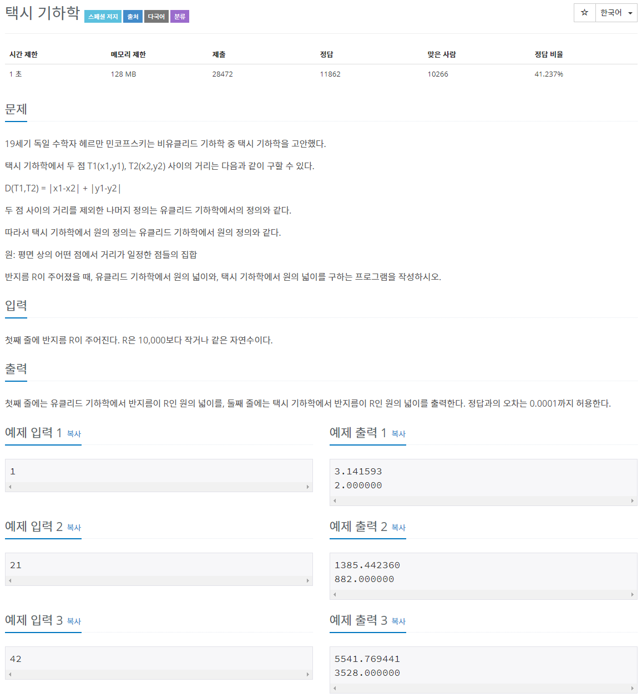
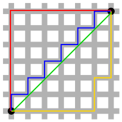
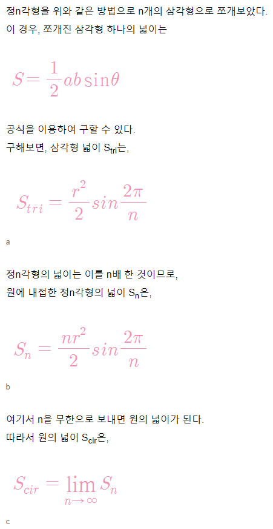
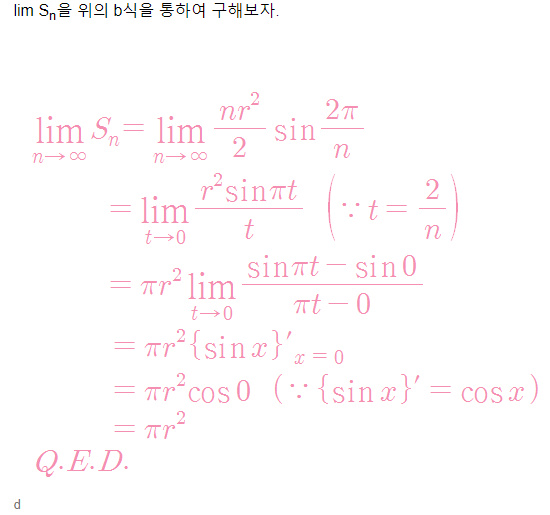
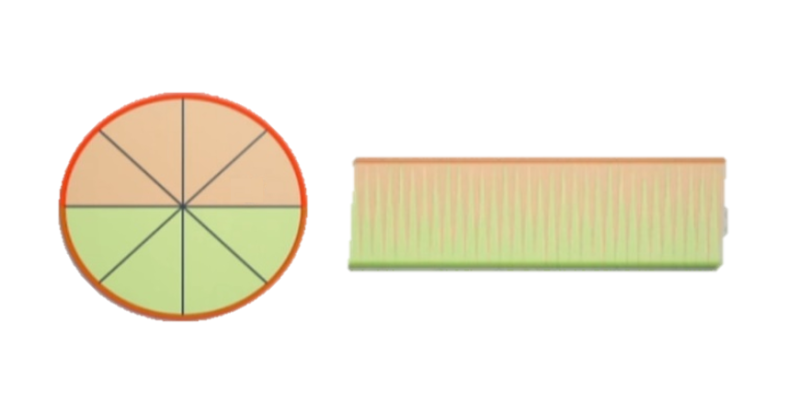
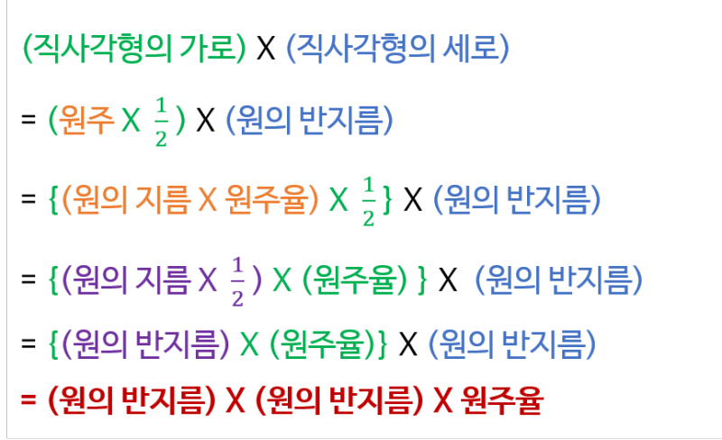
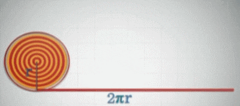

# 문제



택시 기하학은 쉽게 말해 최단거리를 구하는 문제와 같다. 실생활에 유효한 거리를 구하는 것으로

실제 도시에서는 빌딩으로 막혀 있기 때문에 가로질러 갈 수 없다. 따라서 최단거리는 직각으로 가는 거리, 즉 가로거리+세로거리 라고 생각하면 쉽다.



그리고 택시 기하학에서 원의 넓이는 

> 두 점 사이의 거리를 제외한 나머지 정의는 유클리드 기하학에서의 정의와 같다.
따라서 택시 기하학에서 원의 정의는 유클리드 기하학에서 원의 정의와 같다.
원: 평면 상의 어떤 점에서 거리가 일정한 점들의 집합

이라는 문제의 내용을 참고해서 생각해보면

원안에 들어간 정사각형(또는 마름모)의 넓이라고 생각하면 된다.


# 풀이

```java
package basicMath2;

import java.io.BufferedReader;
import java.io.IOException;
import java.io.InputStreamReader;

public class N3053 { // 택시 기하학

	public static void main(String[] args) throws NumberFormatException, IOException {

		BufferedReader br = new BufferedReader(new InputStreamReader(System.in));
		double R = Integer.parseInt(br.readLine());
		StringBuilder sb = new StringBuilder();
		sb.append(R * R * 3.141593).append("\n").append(R * R * 2);
		System.out.println(sb);
	
	}

}
```

>> '틀렸습니다'

원주율을 직접 기입하면 안되고 Math.PI를 써야 '맞았습니다'가 뜬다...

반지름이 커질수록 기입한 원주율에서 짤린 소수점 아래가 의미가 커지고 오차가 커지게 되는 것.

예를 들어 반지름 R이 1억이면 0.000001이라도 원의 넓이를 구하면 1억*1억*0.000001의 오차가 생기는 것.. 

```java
package basicMath2;

import java.io.BufferedReader;
import java.io.IOException;
import java.io.InputStreamReader;

public class N3053 { // 택시 기하학

	public static void main(String[] args) throws NumberFormatException, IOException {

		BufferedReader br = new BufferedReader(new InputStreamReader(System.in));
		double R = Integer.parseInt(br.readLine());
		StringBuilder sb = new StringBuilder();
		sb.append(R * R * Math.PI).append("\n").append(R * R * 2);
		System.out.println(sb);
	
	}

}
```

# 참고

## 원의 넓이

반지름의 제곱 * 원주율

사실 밑의 자료는 원주율을 구하는 Math.PI하나면 의미가 없다.

Math.PI를 어떻게 만들지 원주율을 구하는 알고리즘을 짤때 의미있을듯.










> 참고 [https://m.blog.naver.com/PostView.nhn?blogId=ky12304&logNo=221015148975&proxyReferer=https:%2F%2Fwww.google.com%2F](https://m.blog.naver.com/PostView.nhn?blogId=ky12304&logNo=221015148975&proxyReferer=https:%2F%2Fwww.google.com%2F)

> [https://m.blog.naver.com/naverschool/220998347701](https://m.blog.naver.com/naverschool/220998347701)

### 0.000000 출력

```java
final DecimalFormat df = new DecimalFormat("#0.000000");
df.format(value)
```

> 참고 [https://stackoverflow.com/questions/18946388/double-value-with-specific-precision-in-java](https://stackoverflow.com/questions/18946388/double-value-with-specific-precision-in-java)