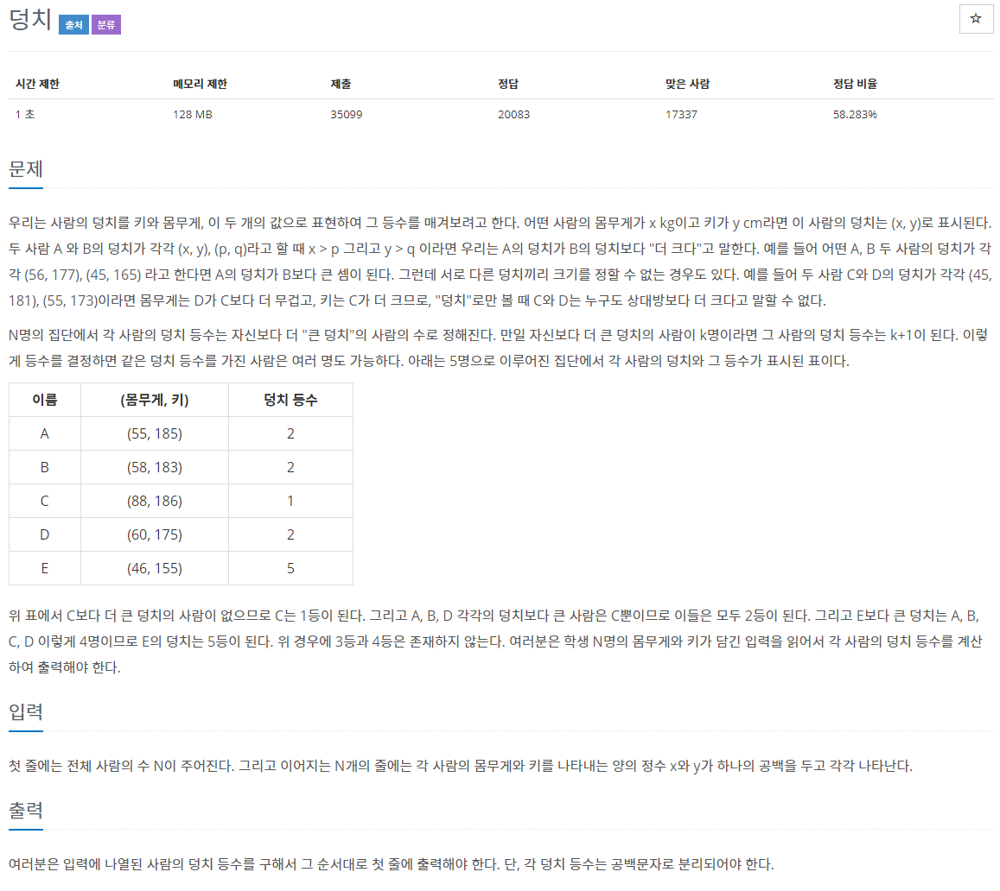
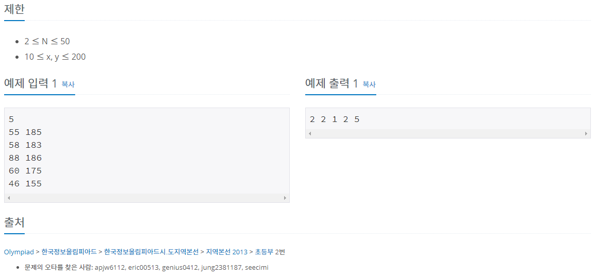

> 백준 알고리즘 - '단계별로 풀어보기'를 기준으로 학습, 정리하였습니다.(https://www.acmicpc.net/)
# 단계 
## bruteforce

# N7568 덩치

## 문제





주어진 N명의 사람들의 몸무게와 키를 비교하여 몸무게와 키가 모두 클 경우에만 덩치가 더 크다고 여겨 낮은 등수를 매기고 덩치를 비교하기 힘든 경우 동일한 등수를 출력하게 하는 문제

## 풀이

각각의 사람들의 데이터를 person[]배열에 넣고 split으로 문자열을 분리해 weight[]와 height[]배열에 저장하였다.

ranking[]을 생성하고 1로 초기화 하였다

중첩반복문을 사용해 weight[]과 height[]배열을 각각 모든 범위에서 무차별 대입하여 비교하였다. (weight[0]부터 weight[N-1]까지를 weight[0]부터 weight[N-1]까지 비교)

비교시 조건문을 사용하여 몸무게와 키 (weight,height) 모두 작을 경우 ranking을 증가시켰다.

출력은 0부터 N-1까지 ranking[]+" "을 출력해 공백으로 분리하여 한 줄에 출력하였다.

## 코드

```java
package bruteForce;

import java.io.BufferedReader;
import java.io.IOException;
import java.io.InputStreamReader;
import java.util.Scanner;

public class N7568 { // 덩치

	public static void main(String[] args) throws NumberFormatException, IOException {
		BufferedReader br = new BufferedReader(new InputStreamReader(System.in));
		int N = Integer.parseInt(br.readLine());

		// record each person's data
		String[] person = new String[N];
		int[] weight = new int[N];
		int[] height = new int[N];
		for (int i = 0; i < N; i++) {
			person[i] = br.readLine();
			String[] perSplit = person[i].split(" ");
			weight[i] = Integer.parseInt(perSplit[0]);
			height[i] = Integer.parseInt(perSplit[1]);
		}
		// initialize ranking to 1
		int[] ranking = new int[N];
		for (int i = 0; i < ranking.length; i++) {
			ranking[i] = 1;
		}
		// brute force all data and print ranking
		for (int i = 0; i < N; i++) {
			for (int j = 0; j < N; j++) {
				if (weight[i] < weight[j] & height[i] < height[j]) {
					ranking[i]++;
				}
			}
			System.out.println(ranking[i]+" ");
		}

	}

}
```

## 출력 결과

```
2 2 1 2 5
```

## 타인의 답
```java
import java.io.BufferedReader;
import java.io.IOException;
import java.io.InputStreamReader;
import java.util.StringTokenizer;

public class Main {

	public static void main(String[] args) throws IOException{
		BufferedReader br = new BufferedReader(new InputStreamReader(System.in));
		StringBuilder sb = new StringBuilder();
		int n = Integer.parseInt(br.readLine());
		
		int[][] members = new int[n][2];
		
		for(int i=0; i<n; i++) {
			StringTokenizer st = new StringTokenizer(br.readLine());
			members[i][0] = Integer.parseInt(st.nextToken());
			members[i][1] = Integer.parseInt(st.nextToken());
		}
		
		for(int i=0; i<n; i++) {
			int rank = 1;
			int w1 = members[i][0];
			int h1 = members[i][1];
			for(int j=0; j<n; j++) {
				if(i == j) continue;
				int w2 = members[j][0];
				int h2 = members[j][1];
				if((w1 < w2 && h1 < h2))
					rank++;
			}
			sb.append(rank).append(" ");
		}
		System.out.println(sb);
	}
}
```
* N명의 사람들의 데이터를 N * 2의 2차원배열에 저장하였다.
* BufferedReader와 StringTokenizer로 몸무게와 키를 입력받았다.
* 각각의 사람들의 덩치의 등수를 배열에 저장하지 않고 `int rank`에 저장한 뒤 비교(대입)이 끝날때마다 rank를 조정하였다(더 작을경우 ++;) 
* StringBuilder를 통해 출력하였다.

## 코드 비교 및 자체 피드백
### 입출력
* BufferedReader를 사용하여 입력을 한 것은 같지만 StringTokenizer를 사용하여 코드의 계산 시간, 길이를 줄였다(문제 특성상 계산의 양이 적기 때문에 더 빠르다)
* StringBuilder로 더 빠른 출력
  
### 알고리즘
* 2차원 배열을 사용하는 방식은 비교해야할 데이터(입력받는 데이터의 양)가 몸무게, 키 2개가 아니라 더 많을 경우 효용성이 높아질 것이다.

### 2차원 배열
* 컴퓨터에서의 배열은 같은 형태를 가진 데이터를 모아서 저장해 놓는 것으로 변수마다 변수 이름을 따로 두지 않고 배열 이름 하나로 같은 집합인 것을 의미하기 때문에 유용하다.
* 2차원 배열 또한 같은 카테고리(같은 형태의 같이 다루는 데이터의 집합)의 데이터를 다루는 경우 유용하게 다양한 변수를 생성하지 않고도 사용할 수 있다.

### 2차원 배열의 효용성
  * 중첩반복문을 사용하지 않고서도 행렬을 표현할 수 있다.
  * 많은 데이터를 다루는 경우 1차원배열+여러 개의 변수 선언 보다 효율적 
