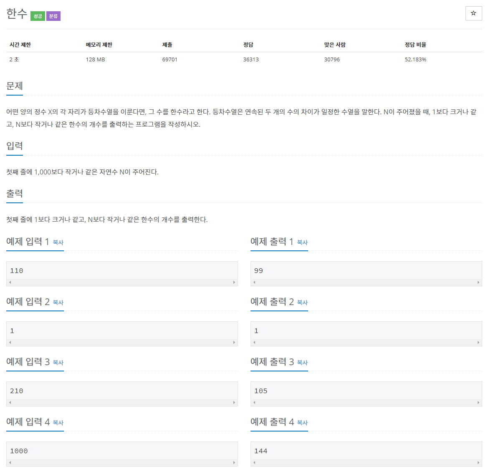

# 문제


## 풀이

1부터 numberRange 까지의 수 중에 각 자리가 등차수열을 이루는 수인 한수를 구한다.

예제처럼 1부터 99까지는 등차가 0인 한수로 취급한다. ~~(수열은 3개부터 가능한거 아닌가..?)~~

즉 100~999까지의 한수를 count한다. (1000은 한수가 아니다.)

1. 세 자리 수를 기준으로 1의 자리, 10의 자리, 100의 자리를 각각 tableOne, tableTen, tableHundred로 이름 붙이고 각 자리의 수를 /, %연산자로 구하였다.
2. checkHundreds라는 boolean타입 변수에 등차를 비교하고 등차가 같으면 count++하였다.
3. 세 자리 수가 아니면 count++ 하였다.

### 코드
```java
import java.io.BufferedReader;
import java.io.IOException;
import java.io.InputStreamReader;

public class N1065 {

	public static void main(String[] args) throws NumberFormatException, IOException {
		BufferedReader br = new BufferedReader(new InputStreamReader(System.in));

		int numberRange = Integer.parseInt(br.readLine());
		int number = 0;
		int count = 0;

		for (int i = 1; i <= numberRange; i++) {
			number = i;
			int tableOne = (number % 10);
			int tableTen = ((number % 100) / 10);
			int tableHundred = (number / 100);

			if (number >= 100) {
				// 세 자리 수
				boolean checkHundreds = ((tableTen - tableOne) == (tableHundred - tableTen));
				if (checkHundreds) {
					count++;
				}
			} else { //1, 2자리 수는 모두 한수
				count++;
			}
		}
		System.out.println(count);
	}
}
```

## 네 자리 수 한수 구하기

네 자리 수 까지 한수를 구하는 프로그램도 작성해 보았다. 

* number가 1000 이상일 때 조건문을 앞에 작성하고 &&논리연산자를 이용해 등차비교하였다.

```java
import java.io.BufferedReader;
import java.io.IOException;
import java.io.InputStreamReader;

public class hanNumber {

	public static void main(String[] args) throws NumberFormatException, IOException {
		BufferedReader br = new BufferedReader(new InputStreamReader(System.in));

		int numberRange = Integer.parseInt(br.readLine());
		int number = 0;
		int count = 0;

		for (int i = 1; i <= numberRange; i++) {
			number = i;
			int tableOne = (number % 10);
			int tableTen = ((number % 100) / 10);
			int tableHundred;

			// 네 자리
			if (number >= 1000) {
				int tableThousand = (number / 1000);
				tableHundred = ((number / 100) % 10);

				boolean checkThousands = (((tableTen - tableOne) == (tableHundred - tableTen))
						&& ((tableHundred - tableTen) == (tableThousand - tableHundred)));
				if (checkThousands) {
					count++;
				}
				// 세 자리 수
			} else if (1000 > number && number >= 100) {
				tableHundred = (number / 100);
				boolean checkHundreds = ((tableTen - tableOne) == (tableHundred - tableTen));
				if (checkHundreds) {
					count++;
				}
				// 1~99
			} else if (100 > number) {
				count++;
			}
		}
		System.out.println(count);
	}
}
```

구하려는 범위의 자리수가 늘어날 때마다 자리 수 변수를 바꿔줘야 하는 단점이 있다.

이런 불편함을 해결하기 위해선 아마도 /와 %를 사용하여 자리수를 구하는 방식에서 벗어나야 한다.

String 타입으로 숫자를 입력하고 각 자리를 split이나 subString이나 tokenizer로 나누고

배열로 출력하는 방식일 것이다.
