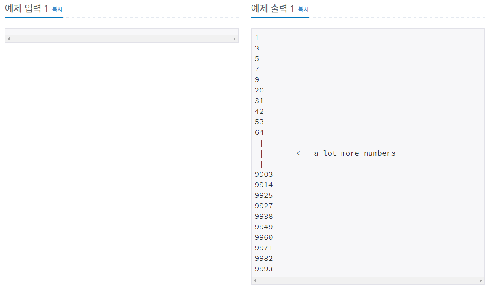

# 문제




인도 수학자가 이름 붙인 셀프넘버. 셀프넘버는 생성자가 없는 숫자.

생성자란 어떤 수A가 양의 정수 n과 n의 각 자리 수를 더한 숫자일 때 n이 A의 생성자다

10000보다 작거나 같은 셀프넘버를 한줄에 하나 씩 출력하는 프로그램을 만들어보자.
## 풀이
```java
public class Test {

	static int[] Int_to_array(int n) {
		int j = 0;
		int len = Integer.toString(n).length();
		int[] arr = new int[len];
		while (n != 0) {
			arr[len - j - 1] = n % 10;
			n = n / 10;
			j++;
		}
		return arr;
	}

	public static void main(String[] args) {
		int num = 0;
		for (int i = 0; i < 10; i++) {
			num++;

			int[] index = Int_to_array(num);

			long indexSum = 0;
			long sum = 0;
			for (int j = 0; j < index.length; j++) {
				indexSum += index[j];
				sum = num + indexSum;	
			}
			System.out.println(num + "은 " + sum + "의 생성자");

		}

	}

}
```

생성자가 있는 수 nonSelfNumber는 구했지만 selfnumber는 구하지 못했다.

## 환기 후 재도전

셀프넘버를 설명하면서 코드 설계

'셀프넘버는 생성자가 없는 숫자이다. 생성자는 A라는 숫자가 있을 때 A자신과 A의 각 자리의 수를 더한 값이 B면 A가 B의 생성자다. 예를 들어 33은 33+3+3=39니까 39의 생성자다. 셀프넘버를 구하기 위해선 1부터 차례로 nonSelfNumber (생성자가 있는 숫자)를 구해서 전체 범위(1~10000)에서 빼줘야 된다. '

### 즉 nonselfnumber를 구하고 전체 범위에서 빼면 남는 수가 selfnumber다.

변수를 정의하고 nonselfnumber를 구하는 메소드를 만들었다. 그리고 nonselfnumber인지 체크하는 

boolean 배열을 통해 selfnumber를 구할 수 있었다.

```java
public class selfNumber {

	static int numberRange = 10000;
	static int number;
	static int selfNumber;
	static int nonSelfNumber;

	public static void main(String[] args) {
		StringBuilder sb = new StringBuilder();
		boolean[] checkNonSelfNumber = new boolean[10001];
		
		// number ~ numberRange 사이의 nonSelfNumber를 구한다
		for (number = 1; number <= numberRange; number++) {
			nonSelfNumber = nonSelfNumber(number);

			// NonSelfNumber(false)인지 selfNumber(false)인지 체크한다.
			if (nonSelfNumber <= 10000) {
				checkNonSelfNumber[nonSelfNumber] = true;
			}
		}

		// selfNumber만 출력		
		for (number = 1; number <= numberRange; number++) {
			if (!checkNonSelfNumber[number]) {
				selfNumber = number;
				sb.append(selfNumber).append('\n');
			}			
		}		
		System.out.println(sb);
	}

	// nonSelfNumber를 구하는 함수
	public static int nonSelfNumber(int number) {
		int sum = number;
		while (number != 0) {
			sum = sum + number % 10;
			number = number / 10;
			nonSelfNumber = sum;
		}
		return nonSelfNumber;
	}
}
```

## 정리

1. 변수의 이름을 명확히 하고 코드를 짜니 코드 분석이 쉬워져 문제해결이 쉬워졌다. 앞으로 i, j, A, N 같은 변수명은 쓰지 않고 최대한 명확하되 간결하게 변수명을 써야겠다. [https://www.curioustore.com/#!/](https://www.curioustore.com/#!/) 변수명 지어주는 사이트도 찾았다.
2. 생각을 정리하고 개념을 설명하는 시간을 가져본다. 자연스럽게 코드를 설계할 수 있다.
3. 잘 안풀릴 때는 충분한 환기를 하자.