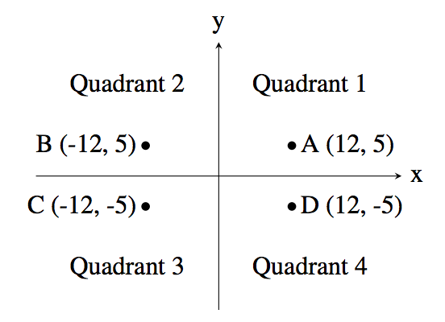

# 14681 사분면 고르기

## 문제
흔한 수학 문제 중 하나는 주어진 점이 어느 사분면에 속하는지 알아내는 것이다. 사분면은 아래 그림처럼 1부터 4까지 번호를 갖는다. "Quadrant n"은 "제n사분면"이라는 뜻이다.



예를 들어, 좌표가 (12, 5)인 점 A는 x좌표와 y좌표가 모두 양수이므로 제1사분면에 속한다. 점 B는 x좌표가 음수이고 y좌표가 양수이므로 제2사분면에 속한다.
점의 좌표를 입력받아 그 점이 어느 사분면에 속하는지 알아내는 프로그램을 작성하시오. 단, x좌표와 y좌표는 모두 양수나 음수라고 가정한다.
## 입력
첫 줄에는 정수 x가 주어진다. (−1000 ≤ x ≤ 1000; x ≠ 0) 다음 줄에는 정수 y가 주어진다. (−1000 ≤ y ≤ 1000; y ≠ 0)
## 출력
점 (x, y)의 사분면 번호(1, 2, 3, 4 중 하나)를 출력한다.
## 예제 입력 1 복사
```
12
5
```
## 예제 출력 1 복사
```
1
```
## 예제 입력 2 복사
```
9
```
-13
## 예제 출력 2 복사
```
4
```

>출처: <https://www.acmicpc.net/problem/14681> 


# 풀이

## 답안1)
```java	
		Scanner sc = new Scanner(System.in);
		double X = sc.nextDouble();
		double Y = sc.nextDouble();
		if (X>0) {
			if (Y>0) {
				System.out.println("1");
			} else {
				System.out.println("4");
			}
		} else if (Y>0){
			System.out.println("2");
		} else {
			System.out.println("3");
```


## 답안2)
```java
   BufferedReader br = new BufferedReader(new InputStreamReader(System.in));
 
        int x = Integer.parseInt(br.readLine());
        int y = Integer.parseInt(br.readLine());
        
        if(x>0){
            if(y>0){
                System.out.print(1);
            }
            else{
                System.out.print(4);
            }
        }
        else
            if(y>0){
                System.out.print(2);
            }
            else{
                System.out.print(3);
            }
```


## 숏코딩)
```java	
		Scanner sc = new Scanner(System.in);
		int i;
   	     i = (0 < sc.nextInt() ? 1 : 2);
		System.out.println((0 < sc.nextInt()) ? i : 5 - i);
```	
	
```java	
		Scanner sc = new Scanner(System.in);
		int x = sc.nextInt();
		int y = sc.nextInt();
		System.out.println((x>0)? (y>0)? "1":"4":(y>0)? "2":"3");
```