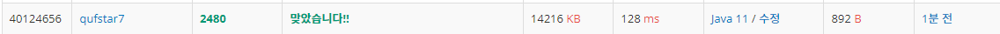

# N2480 주사위 세개
## 문제

## 알고리즘
* 주사위 3개를 던져 같은 눈이 나오는 만큼 주어진 규칙에 따라 상금을 계산하는 문제이다.
* 같은 눈이 각각 3개, 2개, 0개 일 경우에 따라 조건문으로 계산을 달리 한다.
## 풀이
```java
package ifStatement;

import java.io.BufferedReader;
import java.io.IOException;
import java.io.InputStreamReader;
import java.util.StringTokenizer;

public class N2480 { // 주사위 세개

	public static void main(String[] args) throws IOException {
		
		BufferedReader br = new BufferedReader(new InputStreamReader(System.in));
		StringTokenizer st = new StringTokenizer(br.readLine());
		
		int A = Integer.parseInt(st.nextToken()); 
		int B = Integer.parseInt(st.nextToken()); 
		int C = Integer.parseInt(st.nextToken()); 

		int result = 0;
        // 같은 눈이 3개
		if (A == B && A == C) { 
			result = 10000 + A * 1000;

        // 같은 눈이 2개
		} else if (A == B && B != C) {
			result = 1000 + A * 100;
		} else if (A != B && A == C) {
			result = 1000 + A * 100;
		} else if (A != B && B == C) {
			result = 1000 + B * 100;

        // 같은 눈이 0개
		} else if (A != B && A != C && B != C) {
			if (A > B && A > C) {
				result = A * 100;
			} else if (B > A && B > C) {
				result = B * 100;
			} else if (C > A && C > B) {
				result = C * 100;
			}
		}
		
		System.out.println(result);		
		
	}
}
```

## 풀이 2
* 더 간결하게 조건문 수정
* 같은 눈이 0개일 경우를 계산하기 위해 배열을 만들어 Arrays.sort()를 이용해 가장 큰 값을 쉽게 구하고 코드를 더 간결하게 할 수 있다.
```java            
        // 같은 눈이 0개
		} else {
			Arrays.sort(arr);
			result = arr[2] * 100;
		}
		
		System.out.println(result);		
		
	}
}
```


## 풀이 3
* 추가적으로 같은 눈이 2개인 경우 `result = 1000 + A *100` 이 코드가 중복되므로 하나로 합쳐 더 간결하게 코딩할 수 있다.
```java
        // 같은 눈이 2개
		} else if (A == B || A == C) {
			result = 1000 + A * 100;
		} else if (B == C) {
			result = 1000 + B * 100;
```

## 풀이 4
* 주사위 배열을 만들어 입력값(3개의 주사위 값)을 카운팅 배열로 활용한다.
* 같은 수가 2개인 경우 주사위 배열에서 값이 2, 인덱스는 해당 주사위 값 의미
* 같은 수가 3개인 경우 주사위 배열에서 값이 3, 인덱스는 해당 주사위 값 의미
```java
        int[] dice = new int[6];
        dice[Integer.parseInt(st.nextToken())-1]++;
        dice[Integer.parseInt(st.nextToken())-1]++;
        dice[Integer.parseInt(st.nextToken())-1]++;
        
        int max = 0;
        int result = 0;
        for(int i = 0; i < 6; i++) {
            // 같은 값이 3개
            if(dice[i] == 3) {
                result = ( 10000 + (i + 1) * 1000 );
            }

            // 같은 값이 2개
            if(dice[i] == 2) {
                result = ( 1000 + (i + 1) * 100 );
            }

            // 같은 값이 0개
            if(dice[i] == 1) {
                max = i + 1;
            } 
        }
        System.out.print( result > 0 ? result : max * 100 );
``` 
* 주사위 숫자는 `1 ~ 6`이고 크기 6짜리 배열의 인덱스 값은 `0 ~ 5`이므로 카운팅 시 인덱스 값에 -1을 해준다.
* 같은 값이 0개인 경우 max에는 값이 1인 인덱스 + 1 이 차례로 입력되며 반복문 종료 후 가장 큰 값이 저장되게 된다. (가장 큰 값 (max)를 계산한다.)
* 반복문 종료 시점에서 같은 값이 0개인 경우는 result가 아직 0이므로 삼항연산자를 이용해 출력한다.

