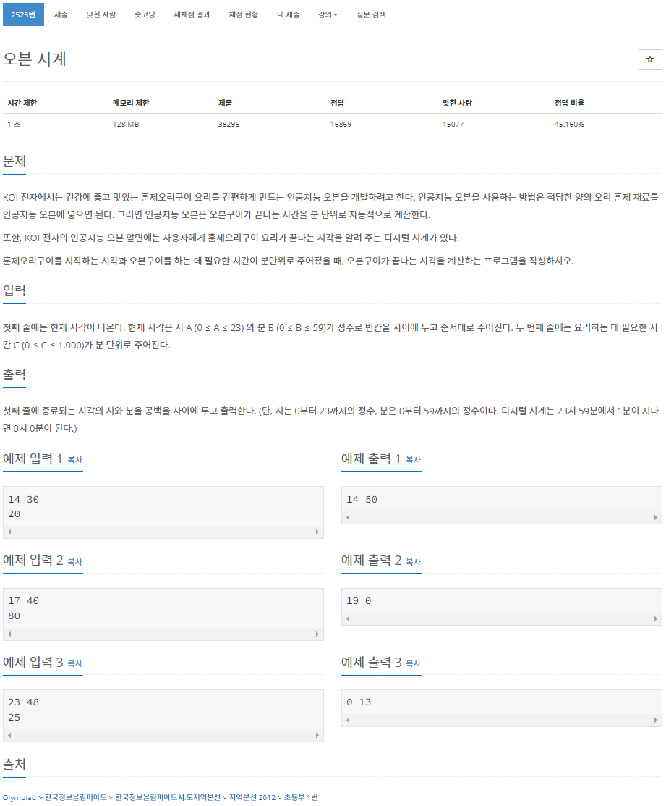
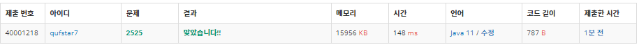
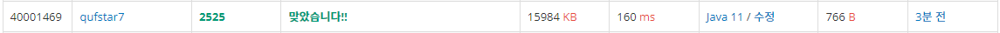

# N2525 오븐 시계
## 문제


## 알고리즘
* 시간의 합산을 묻는 문제
* 분 합산의 값이 60이상이면 시 + 1
* 23시 59분을 지나면 0시 0분

## 풀이 1
```java
package ifStatement;

import java.io.BufferedReader;
import java.io.IOException;
import java.io.InputStreamReader;

public class N2525 {

	public static void main(String[] args) throws NumberFormatException, IOException {
		BufferedReader br = new BufferedReader(new InputStreamReader(System.in));
		String[] inputLine1 = br.readLine().split(" ");
		int A = Integer.parseInt(inputLine1[0]);
		int B = Integer.parseInt(inputLine1[1]);
		int C = Integer.parseInt(br.readLine());

		// 1. 분 합산
		// 2. 조건 추가
		// 2-1. 분 60 이상 시 1추가
		// 2-2. 23시 59분 에서 분 합산 시 0시 0분

		int hour = A;
		int minute = B + C;

		while (minute >= 60) {
			hour += 1;
			minute -= 60;
		}
		while (hour >= 24) {
			hour = hour - 24;			
		}	
		System.out.println(hour + " " + minute);
	}

}
```


* BufferedReader으로 입력 받았다.
  * split()과 Integer.parseInt 활용
  * while문을 사용하여 시간의 형식을 맞추는 조건을 만들었다.

## 풀이 2
* 성능향상을 위해 StringTokenizer를 이용해 분자열 분리
* 시, 분 계산에 조건문을 사용하지 않고 계산하였다.
```java
package ifStatement;

import java.io.BufferedReader;
import java.io.IOException;
import java.io.InputStreamReader;
import java.util.StringTokenizer;

public class N2525 { // 오븐시계

	public static void main(String[] args) throws NumberFormatException, IOException {

		// 1. 분 합산
		// 2. 조건 추가
		// 2-1. 분 60 이상 시 1추가
		// 2-2. 23시 59분 에서 분 합산 시 0시 0분

		BufferedReader br = new BufferedReader(new InputStreamReader(System.in));
		StringTokenizer st = new StringTokenizer(br.readLine());

		int A = Integer.parseInt(st.nextToken());
		int B = Integer.parseInt(st.nextToken());
		int C = Integer.parseInt(br.readLine());

		int hour = (A + (B + C) / 60) % 24;
		int minute = (B + C) % 60;

		System.out.println(hour + " " + minute);
	}

}
```

* 오히려 조금 느려졌다. 당연한것이 조건문이 없어 모든 경우에 시, 분 계산을 수행하기 때문이다.
* 입력 문자열의 분리는 성능에 큰 차이가 없었다. 
  * 하지만 StringTokenizer가 성능이 더 좋다고 한다.
  * 정확한 분리에는 split()에 정규표현식을 사용하는 것이 좋다고 한다.
    > [split과 StringTokenizer](https://library1008.tistory.com/16)