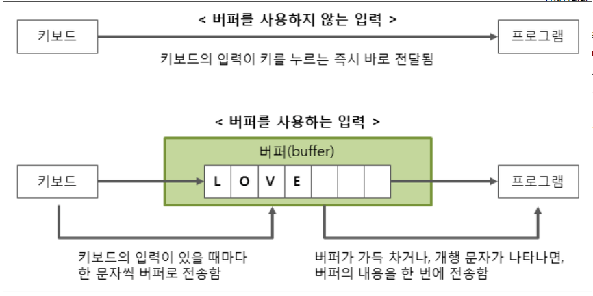

# N1008 A/B 
## 문제
두 정수 A와 B를 입력받은 다음, A/B를 출력하는 프로그램을 작성하시오.
## 입력
첫째 줄에 A와 B가 주어진다. (0 < A, B < 10)
## 출력
첫째 줄에 A/B를 출력한다. 실제 정답과 출력값의 절대오차 또는 상대오차가 10-9 이하이면 정답이다.
## 예제 입력 1 복사
1 3
## 예제 출력 1 복사
0.33333333333333333333333333333333

10-9 이하의 오차를 허용한다는 말은 꼭 소수 9번째 자리까지만 출력하라는 뜻이 아니다.
## 예제 입력 2 복사
4 5
## 예제 출력 2 복사
0.8

>출처: <https://www.acmicpc.net/problem/1008> 

# 풀이
## 내 답안)
```java
import java.util.Scanner;

public class N1008 {

	public static void main(String[] args) {
		Scanner sc = new Scanner(System.in);
		double A, B;
		A = sc.nextInt();
		B = sc.nextInt();

		System.out.println(A/B);

	}

}
```
* 어느쪽이든 하나만 double이면 소수점 이하로 결과가 나온다.


## 다른 답안)
A,B 변수 설정x 코드 길이 줄임
```java
import java.util.Scanner;

public class Main {

	public static void main(String[] args) {
		Scanner s = new Scanner(System.in);
		System.out.println(s.nextDouble() / s.nextDouble());
	}

}
```


```java
import java.io.BufferedReader;
import java.io.IOException;
import java.io.InputStreamReader;

public class Main {
    public static void main(String args[]) throws IOException {
    	BufferedReader br = new BufferedReader(new InputStreamReader(System.in));
		String[] line = br.readLine().split(" ");
		int a = Integer.parseInt(line[0]);
		int b = Integer.parseInt(line[1]);
		double c = (double)a/(double)b;
		System.out.print(c);
    }
}
```

## 추가학습) java.doc
### java.io.BufferedReader
* 문자, 배열 및 행을 효율적으로 읽을 수 있도록 문자를 버퍼링하여 문자 입력 스트림에서 텍스트를 읽습니다.
* 버퍼 크기를 지정하거나 기본 크기를 사용할 수 있습니다.
* 기본값은 대부분의 목적에 충분히 큽니다.
* 일반적으로 Reader의 각 읽기 요청은 해당 읽기 요청이 기본 문자 또는 바이트 스트림으로 이루어 지도록합니다. 
* 따라서 FileReaders 및 InputStreamReaders와 같이 read () 작업에 비용이 많이들 수있는 판독기 주위에 BufferedReader를 래핑하는 것이 좋습니다. 
* ex)
	```java
	BufferedReader in
	= new BufferedReader(new FileReader("foo.in"));
	```
* 지정된 파일의 입력을 버퍼링합니다. * 버퍼링이 없으면 read () 또는 readLine ()을 호출 할 때마다 파일에서 바이트를 읽고 문자로 변환 한 다음 반환 할 수 있습니다. 이는 매우 비효율적 일 수 있습니다.
* 텍스트 입력에 DataInputStreams를 사용하는 프로그램은 각 DataInputStream을 적절한 BufferedReader로 대체하여 지역화 할 수 있습니다.

### java.io.IOException
* 일종의 I / O 예외가 발생했음을 알립니다. 
* 클래스는 실패하거나 인터럽트 된 I / O 작업에 의해 생성되는 일반적인 예외 클래스

### java.io.InputStreamReader
* InputStreamReader는 바이트 스트림에서 문자 스트림으로의 다리입니다. 
* 바이트를 읽고 지정된 문자 집합을 사용하여 문자로 디코딩합니다. 
* 사용하는 문자 집합은 이름으로 지정하거나 명시 적으로 지정하거나 플랫폼의 기본 문자 집합을 수락 할 수 있습니다.
* InputStreamReader의 read () 메서드 중 하나를 호출 할 때마다 기본 바이트 입력 스트림에서 하나 이상의 바이트를 읽을 수 있습니다.
* 바이트를 문자로 효율적으로 변환하려면 현재 읽기 작업을 충족하는 데 필요한 것보다 더 많은 바이트를 기본 스트림에서 미리 읽을 수 있습니다.
* 효율성을 극대화하려면 BufferedReader 내에서 InputStreamReader를 래핑하는 것이 좋습니다.
* ex)
	```java
	BufferedReader in
	= new BufferedReader(new InputStreamReader(System.in));
	```

### BufferedReader/BufferedWriter
자바 입출력 함수로 버퍼를 이용해 읽고 쓰는 함수

* 버퍼를 이용해 입출력의 효율을 높인다.
* 키보드의 입력을 한 문자씩 버퍼로 전송 후
* 버퍼가 가득 차거나 개행 문자가 나타나면 저장한 버퍼의 내용을 한 번에 전송함.
* 외부 장치를 통해 바로 출력하는 형태는 생각보다 시간이 오래걸림 그 이유는 하드디스크가 속도가 느린 저장매체이기 때문
* 메모리를 하나씩 바로바로 보내는 것보다 버퍼에 저장 후 큰 단위로 묶어서 전송하는 것이 더 효율적
  * 비유 - 삽으로 그때그때퍼서 옮기는 것vs 포크레인이 모여있는 흙을 한번에 퍼서 옮김
* buffer
  * 데이터를 일시적으로 보관하는 임시 메모리 영역
  * buffer flush : 버퍼에 남아있는 데이터를 출력시킴(버퍼를 비우는 동작)
  * 사이즈를 지정할 수 도 있지만 디폴트를 사용해도 된다.
  
### Buffer~정리
코드를 사용하는데에 번거로울 수 있으나 속도는 Scanner에 비해 상대적으로 훨씬 빠르다.

> 출처 : https://jhnyang.tistory.com/92