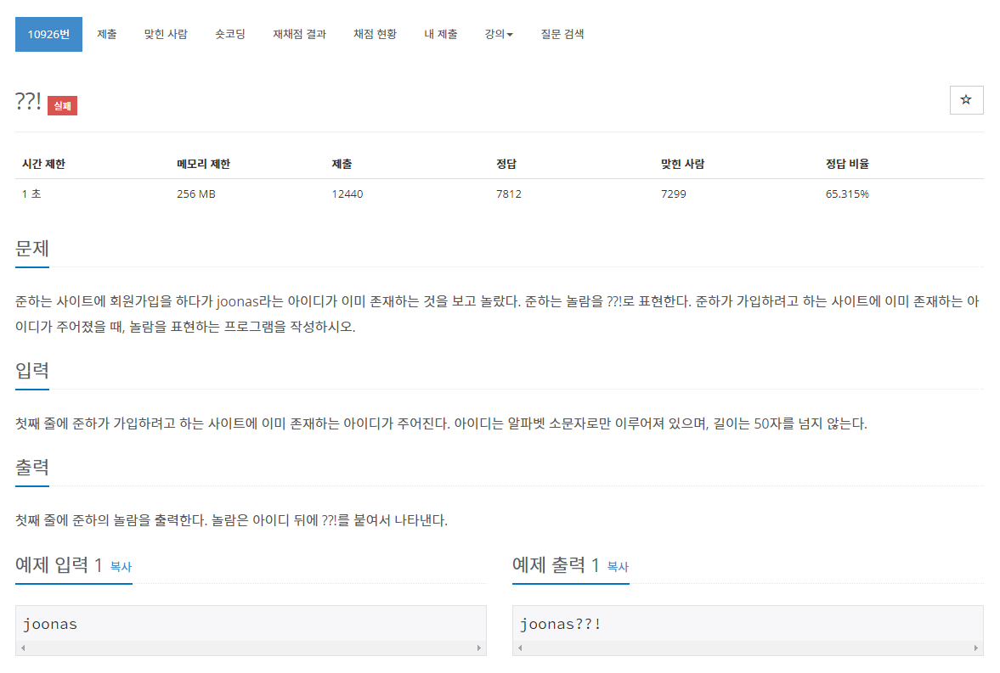

## 문제
  
> https://www.acmicpc.net/problem/10926

# 풀이
* 입력값에 ??! 를 붙여 출력

## 자바 풀이
```java
import java.io.BufferedReader;
import java.io.IOException;
import java.io.InputStreamReader;

public class Main {

	public static void main(String[] args) throws IOException {
		BufferedReader br = new BufferedReader(new InputStreamReader(System.in));
		String s = br.readLine();
		System.out.println(s+"??!");
		
	}
}
```

## 파이썬 풀이
```py
i = input()
print(i+'??!')
```