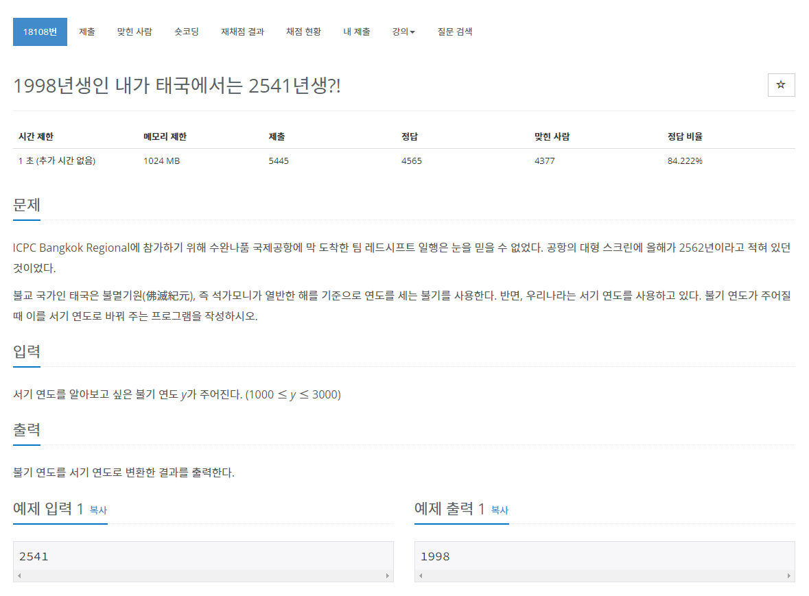

## 문제
 
> https://www.acmicpc.net/problem/18108

# 풀이
* 입력값에 543을 뺀 숫자를 출력한다.

## 자바 풀이
```java
import java.io.BufferedReader;
import java.io.IOException;
import java.io.InputStreamReader;

public class Main {

	public static void main(String[] args) throws NumberFormatException, IOException {
		BufferedReader br = new BufferedReader(new InputStreamReader(System.in));
		int i = Integer.parseInt(br.readLine());
		System.out.println(i-543);
	}

}
```

## 파이썬 풀이
```py
i = int(input())
print(i-543)
```