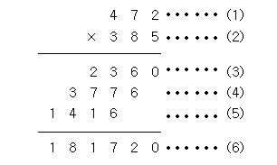

# N2588 곱셈
## 문제
(세 자리 수) × (세 자리 수)는 다음과 같은 과정을 통하여 이루어진다.



(1)과 (2)위치에 들어갈 세 자리 자연수가 주어질 때 (3), (4), (5), (6)위치에 들어갈 값을 구하는 프로그램을 작성하시오.
## 입력
첫째 줄에 (1)의 위치에 들어갈 세 자리 자연수가, 둘째 줄에 (2)의 위치에 들어갈 세자리 자연수가 주어진다.
## 출력
첫째 줄부터 넷째 줄까지 차례대로 (3), (4), (5), (6)에 들어갈 값을 출력한다.
## 예제 입력 1 복사
```
472
385
```
## 예제 출력 1 복사
```
2360
3776
1416
181720
```
>출처: <https://www.acmicpc.net/problem/2588> 

# 풀이
## 내 답)

```java
package BAEKJOON;

import java.util.Scanner;

public class Main {

	public static void main(String[] args) {
		
		Scanner sc = new Scanner(System.in);
		int A, B, one, two, three ;
		A = sc.nextInt(); 
		B = sc.nextInt();

		one = B%10;
		two = (B%100)/10;
		three = B/100;
	
		System.out.println(one*A);
		System.out.println(two*A);
		System.out.println(three*A);
		System.out.println(A*B);
	
	}

}
```


### 파싱(문자열을 정수로변환) 사용
```java
package BAEKJOON;

import java.io.BufferedReader;
import java.io.IOException;
import java.io.InputStreamReader;

public class N2588 {

	public static void main(String[] args) {

		BufferedReader br = new BufferedReader(new InputStreamReader(System.in));

		try {
			int A = Integer.parseInt(br.readLine());
			String B = br.readLine();
			int num_B = Integer.parseInt(B);
			
			System.out.println(A * Integer.parseInt(B.substring(2)));
			System.out.println(A * Integer.parseInt(B.substring(1, 2)));
			System.out.println(A * Integer.parseInt(B.substring(0, 1)));
			System.out.println(A * num_B);
			
		} catch (IOException e) {
			System.out.println("io err");
			e.printStackTrace(); // 모든 추가 오류
			e.getMessage(); // 오류 종류
		}
	}
}
```

## 추가공부)

## SubString 
문자열 자르기하면 가장먼저 생각나는 함수

### 실습 예제
  1. 마지막 3글자 자르기
  2. 특정문자 이후의 문자열자르기
  3. 특정(단어) 부분만 자르기

  * index값 확인(문자열 배치구조)

  * String = char배열

### 사용법
```java
String.substring(start) //문자열  start위치부터 끝까지 문자열 자르기
String.substring(start,end) //문자열  start위치 부터 end전까지 문자열 발췌
```		
### 예제
```java
String str = "ABCDEFG"; //대상 문자열
/*A=0 B=1 C=2 D=3 E=4 F=5 G=6의 index를 가진다.*/
```
```java
str.substring(3); 
/*substring(시작위치) 결과값 = DEFG*/
str.substring(3, 6); 
/*substring(시작위치,끝위치) 결과값 = DEF*/
```
### 활용예제
```java
//1. 마지막 3글자 자르기
String str = "ABCDEFG"; 
String result = str.substring(str.length()-3, str.length());
System.out.println(result)
 //결과값EFG
```
```java
//2. 특정문자 이후의 문자열 제거
String str = "ABCD/DEFGH";
String result = str.substring(str.lastIndexOf("/")+1);
System.out.println(result); 
//결과값 DEFGH
```
```java
//3. 특정단어(부분)만 자르기
String str = "바나나 : 1000원, 사과 : 2000원, 배 : 3000원";
String target = "사과";
int target_num = str.indexOf(target); 
String result; result = str.substring(target_num,(str.substring(target_num).indexOf("원")+target_num));
System.out.println(result+"원"); 
//결과값 : 사과 : 2000원
```

## Split 
자바에서 특정문자를 기준으로 문자열을 잘라서 배열에 넣어주는 함수 

일부러 데이터베이스에 +#이런식으로 문장끝에 특수기호를 넣어주고 나중에 데이터베이스에서 값을 꺼낼때는 #으로 Split해서 사용하는 등 아주 활용도가 높다

* *Split 함수는 String값을 특수기호로 끊어서 배열에 저장
### 활용예제
1. 쉼표(,)로 문자열 잘라서 배열에 넣기
2. 공백으로 문자열 잘라서 배열에 넣기

### 사용법
* 문법
	```
	문자열배열 = 대상문자열.split("기준문자");
	```
* 예제
	```
	String str = "";
	for(int i=0;i<5;i++) {
	str += i+"#";
	}
	
	String[] array = str.split("#");
			
	for(int i=0;i<array.length;i++) {
	System.out.println(array[i]);
	}
	//결과값 
	//array[0] = 1
	//array[1] = 2
	//array[2] = 3
	//array[3] = 4
	```	

### 활용예제
1. 쉼표(,)로 문자열 잘라서 배열에 넣기
String str = "A,B,C,D";
String[] array = str.split(",");
		    
	* 출력		
	```java
	for(int i=0;i<array.length;i++) {
		System.out.println(array[i]);
	}
			
	//결과값 
	//array[0] = A
	//array[1] = B
	//array[2] = C
	//array[3] = D
	/*---------------------------------------------------------------------------------------------*/
	```

2. 공백(" ")으로 문자열 잘라서 배열에 넣기
```java
String str = "동해물과 백두산이 마르고 닳도록 하나님이 보우하사 우리나라 만세";
String[] array = str.split(" ");
```		    
* 출력	
```java			
for(int i=0;i<array.length;i++) {
	System.out.println(array[i]);
}
	  
//결과값 
//array[0] = 동해물과
//array[1] = 백두산이
//array[2] = 마르고
//array[3] = 닳도록
//array[4] = 하나님이
//array[5] = 보우하사
//array[6] = 우리나라
//array[7] = 만세
```	
>출처: <https://coding-factory.tistory.com/126> 

## 파싱
컴퓨터 과학에서 파싱((syntactic) parsing)은 일련의 문자열을 의미있는 토큰(token)으로 분해하고 이들로 이루어진 파스 트리(parse tree)를 만드는 과정을 말한다.

>출처: <https://ko.wikipedia.org/wiki/%EA%B5%AC%EB%AC%B8_%EB%B6%84%EC%84%9D> 


```java
Byte.parseByte();
Short.parseShort();
Integer.parseInt();
Long.parseLong();
Float.parseFloat();
Double.parseDouble();
```
(`char`는 `parseChar()`가 아니라 이 전에 알아봤던 `charAt()`)

>출처 : <https://colossus-java-practice.tistory.com/32> 


* integer.parseInt :  String 타입의 숫자를 int타입으로 변환 
* String 타입인 1111 +2222 은 11112222 로 출력
* parseInt로 int타입 으로 바꾸고 출력하면
1111+2222는 3333으로 출력.
* parse를 사용할 때에는 **문자열이 꼭 숫자로만 되어 있어야 한다**

>출처 : https://colossus-java-practice.tistory.com/32
