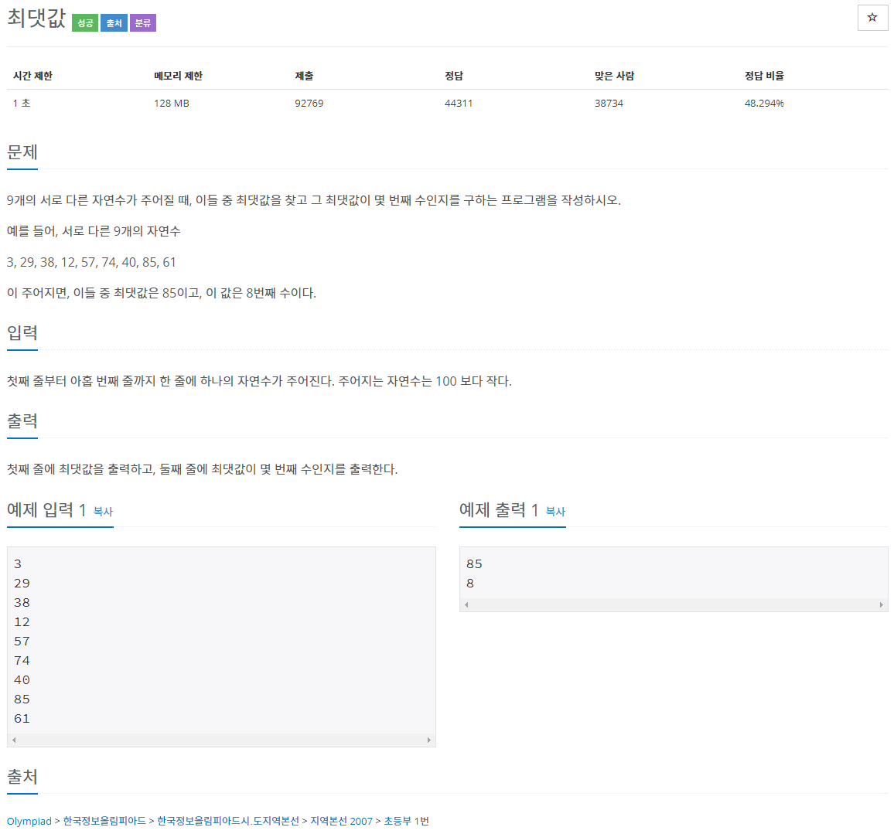

# 문제

## 풀이
### 답 1
```java
import java.io.BufferedReader;
import java.io.BufferedWriter;
import java.io.IOException;
import java.io.InputStreamReader;
import java.io.OutputStreamWriter;

public class N2562 { // 최대값

	public static void main(String[] args) {
		BufferedReader br = new BufferedReader(new InputStreamReader(System.in));
		BufferedWriter bw = new BufferedWriter(new OutputStreamWriter(System.out));

		int idx = 0;
		int value = 0;
		
		try {
			for(int i= 0 ; i<9;i++){
				int input = Integer.parseInt(br.readLine());
				if(i==0){ //처음에 입력된 값을 저장
					idx = i;
					value = input;
				}else{
					if(value<input){// 저장한 값와 다음에 입력된 값을 비교 후 입력된 값이 클경우에 입력된 값을 저장합니다.
						value = input;
						idx=i; //배열의 번호를 저장
					}
				}
			}
			
			bw.write(String.valueOf(value));
			bw.newLine();
			bw.write(String.valueOf(idx+1)); //배열의 번호가 0부터 시작함으로 +1을 하여줍니다.
		} catch (IOException e) {			
			e.printStackTrace();
		} finally {
			try {
				if (br != null) {
					br.close();
				}
				if (bw != null) {
					bw.flush();
					bw.close();
				}
			} catch (IOException e) {
				e.printStackTrace();
			}
		}
	}
}
```

### 답 2
```java
import java.util.Scanner;
public class N2562 {
	public static void main(String[] args) {
		Scanner sc = new Scanner(System.in);		
		int[] arr = new int[9];
		int max = arr[0];
		int counter = -1;		
		for (int i = 0; i < arr.length; i++) {	
			arr[i] = sc.nextInt();
			if (max < arr[i]) {
				max = arr[i];
			}
			counter++;
		}
		sc.close();
		System.out.println(max);
		System.out.println(counter);
	}
}
```