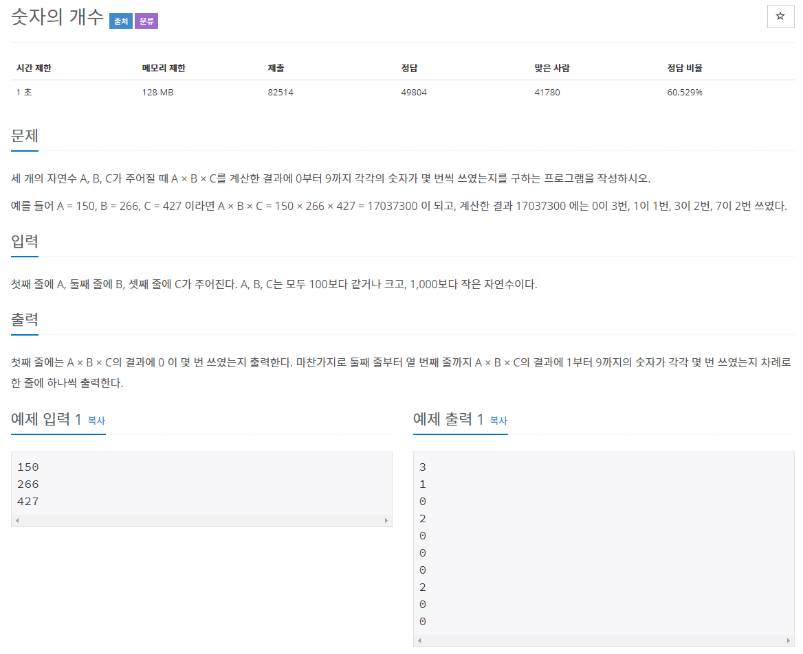

# 문제

## 풀이
### BufferWriter 사용법
```java
	BufferedWriter bw = new BufferedWriter(new OutputStreamWriter(System.out));//선언
	String s = "abcdefg";//출력할 문자열
	bw.write(s);//출력
	bw.newLine(); //줄바꿈
	bw.flush();//남아있는 데이터를 모두 출력시킴
	bw.close();//스트림을 닫음
```
### BufferedReader 사용법
```java
	BufferedReader bf = new BufferedReader(new InputStreamReader(System.in)); //선언
	String s = bf.readLine(); //String
	int i = Integer.parseInt(bf.readLine()); //Int
```
### how to array split 
```java
	String array[] = s.split(" ");
```
### int to string
```java
	String to = Integer.toString(from);
```
### how to equals at array
```java
	!s1[i].equals(s2[i]))
```
### 문자열 배열 - charAt
```java
	for(int i = 0; i < numbers.length; i++) {
		   // Store amount of 0's in numbers[] to occurrences[0]
		   // Store amount of 1's in numbers[] to occurrences[1]
		}
	for (int a : numbers) {
	    occurrences[a]++;
	}
	(str.charAt(j) - '0') == i
```
# 코드
### 답 1
```java
import java.util.Scanner; 
public class Main {
	public static void main(String[] args) { 
		Scanner in = new Scanner(System.in); 
		int value = (in.nextInt() * in.nextInt() * in.nextInt());
		String str = Integer.toString(value);
		in.close();		
		for (int i = 0; i < 10; i++) {
			int count = 0;
			for (int j = 0; j < str.length(); j++) {
				if ((str.charAt(j) - '0') == i) {
					count++;
				}
			}
			System.out.println(count);
		}		
	}
}
```
### 답 2
```java
			BufferedReader br = new BufferedReader(new InputStreamReader(System.in));
			int a, b, c, result;
			a = Integer.parseInt(br.readLine());
			b = Integer.parseInt(br.readLine());
			c = Integer.parseInt(br.readLine());
			result = a*b*c;
			String resultStr = "";
			resultStr = String.valueOf(result);
			int arr[] = new int[10];
			for (int i = 0; i < resultStr.length(); i++) {
				int num = Integer.parseInt(resultStr.substring(i, i + 1));
				for (int j = 0; j < arr.length; j++) {
					if (num == j) {
						arr[j]++;
					}
				}
			}
			for (int k = 0; k < arr.length; k++) {
				System.out.println(arr[k]);
			}
		}
	}
```
### 타인의 답
```java
	int [] arr = new int [10];
	BufferedReader br = new BufferedReader(new InputStreamReader(System.in));
	int N = Integer.parseInt(br.readLine()) * Integer.parseInt(br.readLine()) * Integer.parseInt(br.readLine());
	while(N != 0) {
		arr[N % 10]++;
		N /= 10;
	}
	for(int x : arr) {
		System.out.println(x);
	}
```
>소스출처 https://www.acmicpc.net/source/28031182
