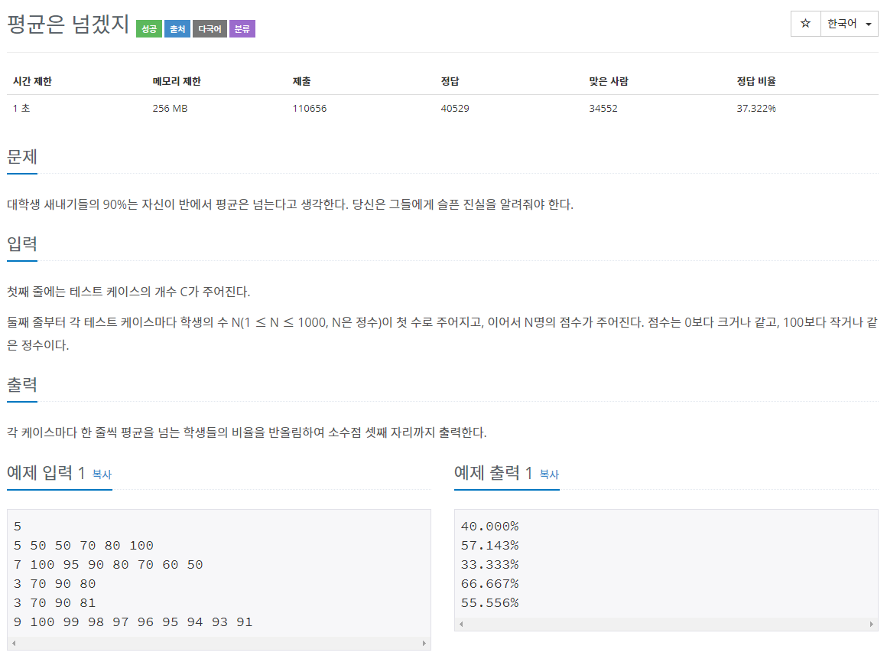

# 문제

## 풀이
```java
import java.io.BufferedReader;
import java.io.IOException;
import java.io.InputStreamReader;

public class Main {

    public static void main(String[] args) throws IOException {

        BufferedReader br = new BufferedReader(new InputStreamReader(System.in));

        int cnt = Integer.parseInt(br.readLine());
        StringBuilder sb = new StringBuilder();

        for(int i = 0; i < cnt; i++){

            String temp = br.readLine();
            int sum = 0;
            int tempSum = 0;
            for(int j = 0; j < temp.length(); j++){

                if(temp.charAt(j) == 'O'){
                    tempSum += 1;
                } else {
                    tempSum = 0;
                }
                sum += tempSum;

            }
            sb.append(sum).append('\n');
        }

        System.out.println(sb);

    }
}
```